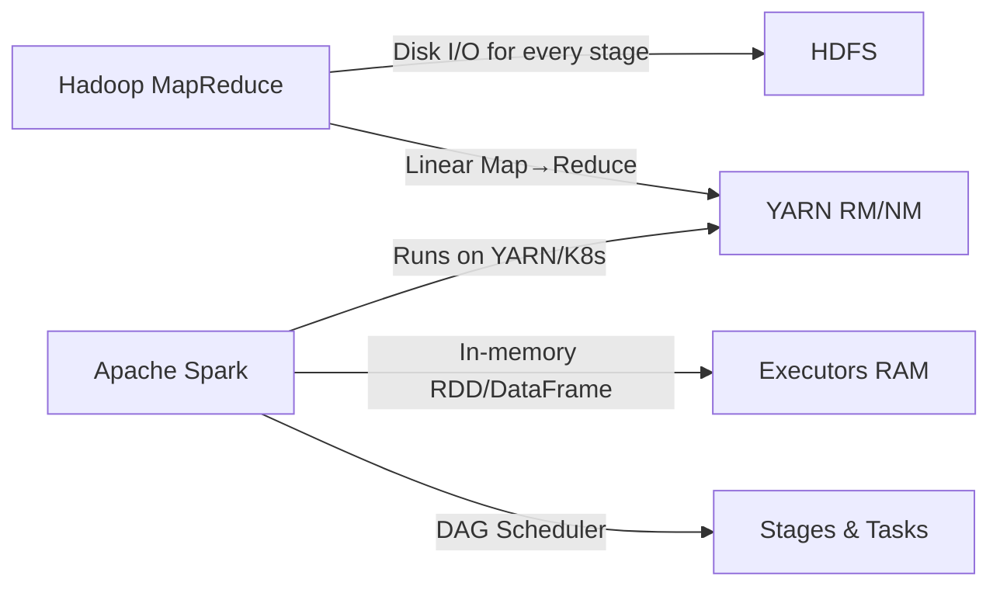

Below is a **concise, to-the-point** explanation of the **architectural changes from Hadoop MapReduce to Apache Spark**, following all your formatting rules.

### Shift from Disk-Based to Memory-Based Processing

Hadoop MapReduce uses **HDFS + disk I/O** for every map & reduce stage.
Spark introduces the **RDD in-memory abstraction** storing intermediate results in RAM.
This reduces latency drastically for iterative and streaming workloads.

### Execution Model Change: MapReduce Jobs vs DAG Scheduler

Hadoop executes **linear map → reduce jobs**, each writing to HDFS.
Spark uses a **DAG (Directed Acyclic Graph)** built by the **DAG Scheduler** inside the Spark Driver.
The DAG is optimized, pipelined, and executed via **Stages** and **Tasks** on Executors.

### Cluster Resource Change: YARN/Standalone vs Unified Cluster Manager

Hadoop MapReduce uses **YARN NodeManager & ResourceManager**.
Spark supports **YARN, Kubernetes, Mesos, Standalone**, with executors being long-running processes optimizing reuse of JVM and memory.

### Iterative Processing Improvement

Hadoop rereads data from HDFS every iteration (e.g., ML loops).
Spark keeps data **cached in Executors’ memory** using RDD/DataFrame cache, making iterative ML algorithms feasible.

### Execution Engine Improvements

Hadoop MapReduce:

* JVM spin-up per task
* No pipelining
* Disk barriers

Spark Engine:

* Long-running executors
* Vectorized processing (Tungsten)
* Catalyst optimizer for SQL
* Columnar execution

### Streaming Differences

Hadoop has **no native real-time streaming engine**.
Spark provides **Structured Streaming** with micro-batching on the same execution engine.

### Diagram of Architecture Change

### Summary Table

| Aspect            | Hadoop MapReduce       | Apache Spark          |
| ----------------- | ---------------------- | --------------------- |
| Processing        | Disk-based             | Memory-first          |
| Execution Model   | Map → Reduce jobs      | DAG of stages         |
| Intermediate Data | Always written to HDFS | Stored in RAM         |
| JVM Model         | New JVM per task       | Reused executors      |
| SQL Engine        | Hive (MapReduce)       | Spark SQL + Catalyst  |
| ML Support        | Slow iterative loops   | Fast in-memory loops  |
| Streaming         | None                   | Structured Streaming  |
| Resource Managers | YARN                   | YARN, K8s, Standalone |

If you want, I can also provide **pseudo code comparing a Hadoop job vs Spark job** or **explain Spark vs Flink**.
