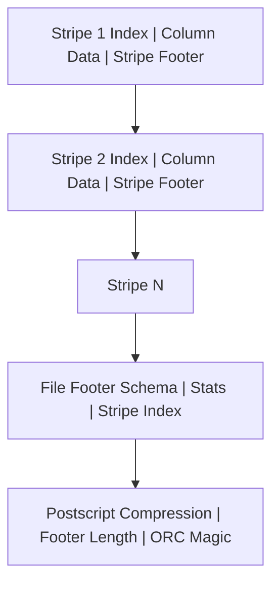
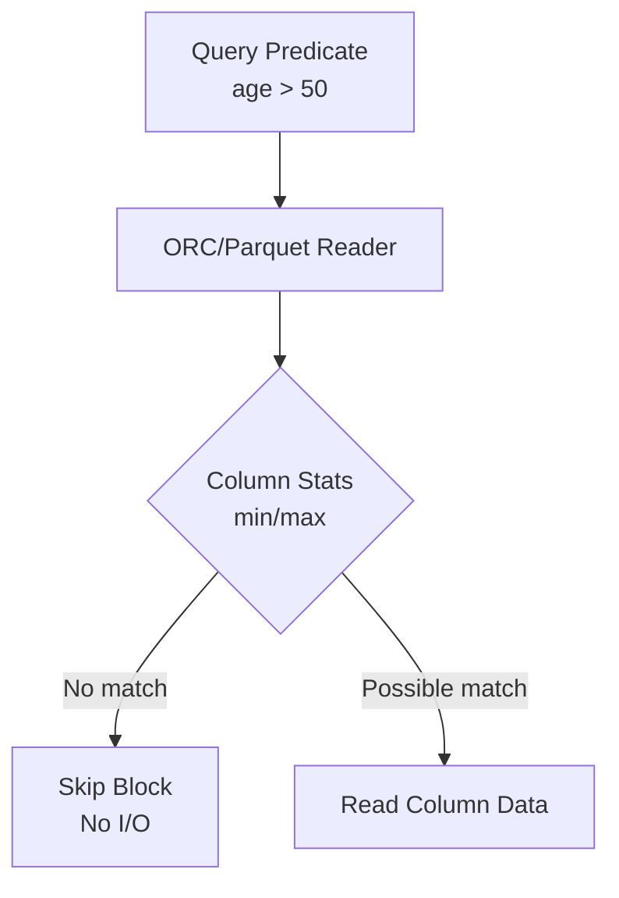

# ORC 

ORC (Optimized Row Columnar) is a **columnar storage file format** designed for big-data analytics. It provides **high compression**, **fast predicate pushdown**, **type-aware encoding**, and **splittable column stripes**, making reads and scans efficient.


An ORC file has:

* **Stripes**: Large horizontal chunks (e.g., 64–256 MB) containing rows.
* **Indexes**: Min/max value per column chunk for predicate pushdown.
* **Column Data**: Encoded values (RLE, dictionary, bit-packing).
* **Footer**: Schema, statistics, stripe metadata.
* **Postscript**: Compression info and version.

This is **not a real ORC binary**, but a **conceptual representation** showing what exists inside an ORC file.

###  Illustration

```
+=======================================================================+
|                                STRIPE 1                               |
+=======================================================================+
| 1. Index Data                                                         |
|    - For each column:                                                 |
|        min / max values                                               |
|        row positions                                                  |
|        bloom filters (optional)                                       |
|                                                                       |
| 2. Column Data (Row Groups)                                           |
|    - Encoded values using:                                            |
|        RLE / dictionary / bit-packing                                 |
|    - Split by columns (columnar layout)                               |
|                                                                       |
| 3. Stripe Footer                                                      |
|    - List of streams                                                  |
|    - Encodings for each column                                        |
|    - Column and stream lengths                                        |
+=======================================================================+


+=======================================================================+
|                                STRIPE 2                               |
+=======================================================================+
| Same structure as STRIPE 1                                            |
| 1. Index Data                                                         |
| 2. Column Data                                                        |
| 3. Stripe Footer                                                      |
+=======================================================================+


+=======================================================================+
|                               FILE FOOTER                             |
+=======================================================================+
| Contains metadata for all stripes:                                    |
|   - Number of rows                                                    |
|   - Stripe locations (offsets, lengths)                               |
|   - Type information (schema tree)                                    |
|   - Column statistics (global min/max, null counts)                   |
|   - File-level metadata (custom key/value)                            |
+=======================================================================+


+=======================================================================+
|                               POSTSCRIPT                              |
+=======================================================================+
| - Compression kind (NONE / ZLIB / SNAPPY / LZO)                       |
| - Compression block size                                              |
| - File footer length                                                  |
| - ORC version                                                         |
| - Magic bytes: "ORC"                                                  |
+=======================================================================+
```

### Summary of Key ORC Components

#### Stripes

* Large chunks (default ~64–256MB)
* Each stripe contains:

  * **Index Section**: per-column min/max, bloom filters
  * **Data Section**: encoded column data
  * **Stripe Footer**: stream types, encoding info

#### File Footer

* Global metadata for:

  * All stripes
  * Schema tree
  * Column-level statistics
  * Row count

#### Postscript

* Compression details
* Footer length
* Magic bytes `"ORC"`

 



More :

* ORC vs Parquet vs Avro comparison
* ORC internals (encodings, bloom filters, index layout)
* Python / Spark code to read/write ORC

 

### Features

* Highly optimized for **analytical workloads**
* Efficient for **columnar reads**, skipping unnecessary columns
* Built-in **compression and statistics**
* Great for **Spark**, **Hive**, **Presto/Trino**, **AWS EMR**
* Ideal for periodic **append-only or batch updates**

### Primary Use Cases

* Data lake storage in Hadoop/S3
* ETL pipelines (Spark, Hive, AWS Glue, EMR)
* Large fact tables requiring predicate pushdown
* High-performance OLAP queries
* Storing tables before querying with Presto/Trino/Athena

```
pip install pyorc
```

Writing an ORC File 

```python
import pyorc

with open("employees.orc", "wb") as f:
    writer = pyorc.Writer(
        f,
        "struct<id:int,name:string,salary:double>"
    )
    writer.write((1, "Alice", 90000.0))
    writer.write((2, "Bob", 85000.0))
    writer.close()
```

 Reading an ORC File

```python
import pyorc

with open("employees.orc", "rb") as f:
    reader = pyorc.Reader(f)
    for row in reader:
        print(row)
```

Using ORC With Pandas (Convert DataFrame to ORC)

Pandas does not directly write ORC, so we use **pyarrow**.

```shell
pip install pyarrow
```

```python
import pandas as pd
import pyarrow as pa
import pyarrow.orc as orc

df = pd.DataFrame({
    "id": [1, 2, 3],
    "name": ["Alice", "Bob", "Charlie"],
    "age": [30, 28, 25]
})

table = pa.Table.from_pandas(df)

with open("people.orc", "wb") as f:
    orc.write_table(table, f)
```

Reading ORC With PyArrow

```python
import pyarrow.orc as orc

with open("people.orc", "rb") as f:
    table = orc.ORCFile(f).read()
    df = table.to_pandas()

print(df)
```

### When to Prefer ORC Over Parquet

Use ORC when:

* You use **Hive**, **Presto**, **Trino**, **EMR**
* You need **fast predicate pushdown** on numeric columns
* You need **intensive compression** for large tables
* Schema rarely changes

Parquet may be preferred for streaming or ML pipelines.

More :  also compare **ORC vs Parquet vs Avro** or show **Spark read/write examples**.


### How Fast Predicate Pushdown Works

Engines like **Spark**, **Presto/Trino**, **Hive** read **column-level statistics** stored in ORC/Parquet files (min, max, count, null count, bloom filters).
Before scanning data, the engine checks the metadata to **skip entire blocks** (stripes/row groups) when the predicate cannot match.

Example predicate:

```
salary > 50000
```

If a block stores:

```
min(salary) = 2000
max(salary) = 40000
```

→ The engine **skips** it without decompression or deserialization.


### Fast Predicate Pushdown in ORC

How ORC Stores Stats

Components involved:

* **Stripe Footer** (column encodings)
* **Index Section** (column-level stats)
* **File Footer** (global stats)

Per column, ORC stores:

* min
* max
* sum
* number of values
* bloom filters (optional)
* presence bits (null count)

These are tightly optimized for numeric comparisons.

#### How ORC Pushdown Executes

* In **Spark**, predicate filtering happens in the **DataSourceV2 ORC reader** before reading streams.
* The reader examines **Stripe Statistics** and **Row Group Indexes**.
* If numeric predicate cannot match:

  * skip entire stripe
  * skip row groups
  * avoid reading column streams
  * skip decompression
  * skip decoding

#### Why Numeric Columns Are Extremely Fast

Numeric encodings (RLEv2, bit-packing) tightly compress min/max.
Comparisons are simple integer or double comparisons → extremely fast.


### Fast Predicate Pushdown in Parquet

#### How Parquet Stores Stats

Stored in:

* **Row Group Metadata**
* **Column Chunk Metadata**
* **Page Statistics** (for finer skipping)

Parquet maintains:

* min
* max
* null count
* distinct count (optional)
* bloom filters (newer versions)

#### How Parquet Pushdown Executes

* Spark uses the **ParquetMetadata** via VectorizedParquetReader.
* For each row group:

  * check min/max for predicate match
  * skip entire row group if condition fails
  * skip column chunk read
  * skip decompression
  * skip decoding

Parquet’s page-level stats allow even **partial row group skipping**.

#### Why Numeric Columns Are Fast

Numeric types use:

* dictionary encoding
* delta encoding
* bit-packed encoding

These yield very accurate min/max, improving skipping efficiency.

 

### ORC vs Parquet: Predicate Pushdown Efficiency

| Feature                  | ORC                              | Parquet                  |
| ------------------------ | -------------------------------- | ------------------------ |
| Numeric min/max accuracy | Very high                        | High                     |
| Bloom filters            | Strong (optional)                | Optional/newer           |
| Skip granularity         | Stripe → Row Group               | Row Group → Page         |
| Pushdown efficiency      | Best for large analytical tables | Best for mixed workloads |

ORC tends to skip **larger blocks** (stripes), reducing I/O for large datasets.

Parquet tends to skip **more fine-grained pages**, improving mixed workloads.

 

###   Filter Evaluation (Numeric)

Predicate:

```
age BETWEEN 30 AND 40
```

Block stats:

```
ORC Stripe:
  min(age) = 5
  max(age) = 20
```

Spark ORC reader:

```
20 < 30 → no possible match
SKIP stripe
```

Parquet Row Group:

```
min(age) = 12
max(age) = 38
```

Partial overlap:

* Spark reads only **pages** whose max ≥ 30.

 


 

More :

* Actual Spark physical plan explaining pushdown
* ORC vs Parquet min/max examples with hex-level metadata
* How bloom filters accelerate numeric lookups

