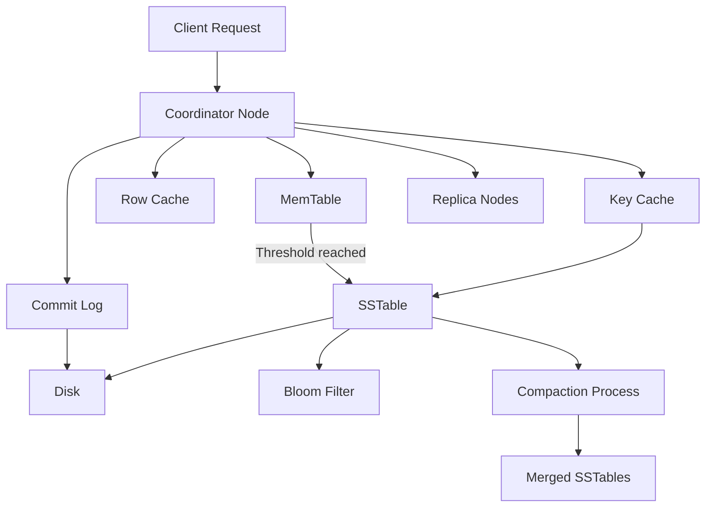

 
# Cassandra

##  Architecture (LSM-based)
> *Cassandra uses an LSM-tree architecture where writes go to a commit log and MemTable, are flushed as immutable SSTables on disk, and periodically compacted to maintain read efficiency.*


 
 
###   Write path (fast writes)

1. Client sends write to **Coordinator**
2. Write is appended to **Commit Log** (durability)
3. Data written to **MemTable** (in-memory, sorted)
4. When MemTable fills:

   * Flushed to disk as **immutable SSTable**

✔ Sequential writes only
✔ Very high write throughput

 

###   Read path (multi-layered)

1. Coordinator checks **Row Cache** (if enabled)
2. Checks **Key Cache** for SSTable locations
3. Uses **Bloom Filters** to skip SSTables
4. Reads from multiple SSTables + MemTable
5. Merges results (latest timestamp wins)

 

###   SSTables (core LSM structure)

* Immutable
* Sorted by partition key
* Multiple SSTables may exist per table
* No in-place updates

 

###   Compaction (LSM tree maintenance)

* Periodically merges SSTables
* Removes deleted / obsolete data
* Improves read performance

```
SSTable1 + SSTable2 + SSTable3
        ↓
     SSTableMerged
```

 

### Cassandra vs PostgreSQL (storage model)

| Aspect        | Cassandra   | PostgreSQL         |
| ------------- | ----------- | ------------------ |
| Storage model | LSM Tree    | Heap + B-Tree      |
| Write pattern | Sequential  | Random             |
| Updates       | Append-only | In-place (MVCC)    |
| Disk files    | SSTables    | Heap pages         |
| Cleanup       | Compaction  | Vacuum             |
| Indexes       | Limited     | Rich (B-Tree, GIN) |
 
 

```
MemTable  →  SSTables  →  Compaction
```

This **is** the LSM tree.
 

 

 
 

More :

* Read vs write amplification explained
* Why Cassandra avoids random writes
* How secondary indexes work in Cassandra
* Compare Cassandra vs HBase vs RocksDB
