Excellent question — this is a **core design issue** when using Cassandra in an **auto-scaling, load-balanced architecture**.

Let’s break it down clearly 👇

---

## 🧩 1. Architecture Overview

You have:

```
Clients
   ↓
Load Balancer
   ↓
App Servers (3+ instances, auto-scaling)
   ↓
Cassandra Cluster (multi-node)
```

Each app server must connect to Cassandra in a way that remains **stateless, scalable, and fault tolerant**, even when:

* The app tier scales up or down.
* Cassandra nodes join/leave the cluster.

---

## ⚙️ 2. How to Connect Properly

Cassandra clients (like the **Java Driver**) are **cluster-aware**.
That means you do **not** need a load balancer in front of Cassandra — the driver handles that internally.

Here’s how to configure it correctly:

### ✅ Use a *Cluster-aware Driver*

For Java:

```java
CqlSession session = CqlSession.builder()
    .addContactPoint(new InetSocketAddress("cassandra-node1", 9042))
    .addContactPoint(new InetSocketAddress("cassandra-node2", 9042))
    .addContactPoint(new InetSocketAddress("cassandra-node3", 9042))
    .withLocalDatacenter("dc1")
    .build();
```

> The driver discovers all other nodes automatically using **gossip** and **system tables**.

---

## 💡 3. Best Practices for Auto-Scaling App Servers

### a. **Use Contact Points, Not a Load Balancer**

* The Cassandra driver needs to talk to **multiple seed nodes directly**, not via an HTTP/TCP load balancer.
* Using a load balancer hides node topology → driver can’t manage partition awareness or retries.

### b. **Let Each App Instance Have Its Own Driver Pool**

* Each new app server instance maintains its own connection pool to the Cassandra cluster.
* When autoscaling occurs, new app instances create their own driver sessions automatically.

### c. **Use DNS or Service Discovery**

* Instead of hard-coding IPs, use **DNS names** that resolve to seed nodes.

* Example:

  ```
  cassandra-seeds.internal.mycompany.com → [10.0.1.10, 10.0.1.11, 10.0.1.12]
  ```

* You can integrate with **Kubernetes Service**, **Consul**, or **AWS Route53** for dynamic discovery.

---

## 🧠 4. Scaling Cassandra Alongside Apps

If the application scales heavily:

* App tier may generate high query load → Cassandra may also need **auto-scaling** or **elastic nodes**.
* Use tools like:

  * **Kubernetes StatefulSets** (for Cassandra pods)
  * **AWS Keyspaces (managed Cassandra)** if you want auto-scaling and maintenance handled by AWS.

---

## 🔐 5. Recommended Config Summary

| Component       | Best Practice                                                                |
| --------------- | ---------------------------------------------------------------------------- |
| App Servers     | Connect directly to Cassandra nodes using cluster-aware driver               |
| Cassandra       | Expose contact points (seed nodes) via DNS                                   |
| Load Balancer   | Use only for app tier, **not** for Cassandra                                 |
| Auto-Scaling    | Each new app instance initializes its own CqlSession                         |
| Fault Tolerance | Use multiple contact points in different racks/regions                       |
| Security        | Use SSL (`.withSslContext()`), and authentication (`.withAuthCredentials()`) |

---

## ✅ Example with Spring Boot + Cassandra

If your app uses Spring Boot:

```yaml
spring:
  data:
    cassandra:
      contact-points: cassandra-node1,cassandra-node2,cassandra-node3
      port: 9042
      local-datacenter: dc1
      keyspace-name: mykeyspace
      username: myuser
      password: mypass
```

Spring Data Cassandra internally uses the same driver and auto-discovers new nodes.

---

### 🔄 In Short

| Do                                    | Don’t                                    |
| ------------------------------------- | ---------------------------------------- |
| Use multiple contact points           | Don’t put Cassandra behind load balancer |
| Let driver handle topology & retries  | Don’t manually route queries             |
| Use DNS for dynamic discovery         | Don’t hardcode IPs if nodes change       |
| Scale app and Cassandra independently | Don’t couple app scaling to single node  |

---

Would you like me to show a **diagram (text or mermaid)** of how the connections flow between the auto-scaled app servers and Cassandra nodes? It helps visualize why load balancers aren’t used for Cassandra.


Excellent question — this dives right into **how Cassandra achieves scalability and fault tolerance through partitioning and hashing**.
Let’s unpack it carefully 👇

---

## ⚙️ The Core Idea: Data Distribution in Cassandra

Cassandra **automatically distributes** your data across all nodes in the cluster using **consistent hashing**.
You **don’t** need to manually implement hashing — but you **should understand how it works** to configure it correctly for auto-scaling and fault tolerance.

---

## 🔹 1. How Cassandra Stores Data (Token Ring)

Each node in a Cassandra cluster is assigned a **token range** — a segment of the **hash space** produced by the **partitioner**.

When you insert data:

```sql
INSERT INTO employee (id, name, department) VALUES (101, 'Alice', 'HR');
```

Cassandra:

1. Takes the **partition key** (here `id`).
2. Hashes it using the **partitioner** (like `Murmur3Partitioner`).
3. Determines the **token range** where that hash value falls.
4. Routes the data to the **primary node** responsible for that range.

### 🧭 Example: Token Ring (Simplified)

| Node   | Token Range Start | Token Range End | Example Keys  |
| ------ | ----------------- | --------------- | ------------- |
| Node A | -900...           | -300...         | ids → 1–100   |
| Node B | -300...           | 300...          | ids → 101–200 |
| Node C | 300...            | 900...          | ids → 201–300 |

When `id=150` comes in → `hash(150)` falls in `B`’s range → stored in **Node B**.

---

## 🔹 2. Replication for Fault Tolerance

Each piece of data is also **replicated** to other nodes.

**Example:**
If your `replication_factor = 3`, and you have 3 nodes:

* Node A → stores primary + 2 replicas (A,B,C)
* Cassandra ensures all replicas are placed intelligently across nodes/racks.

So, **even though no node has the entire dataset**, Cassandra automatically ensures:

* Any node can **route** to the right data.
* Failures are tolerated (via replication).

---

## 🔹 3. Adding or Removing Nodes (Auto Scaling)

When you add a new node:

* It gets assigned a **new token range**.
* Existing nodes automatically **stream** some of their data to the new node.
* No manual redistribution or hashing is required.

When you remove a node:

* Its token range is **rebalanced** across other nodes.

✅ **Auto-scaling works seamlessly** because of this dynamic token assignment.

---

## 🔹 4. Hashing and Partitioner Configuration

Cassandra uses **partitioners** to hash your keys:

| Partitioner              | Hash Function       | Notes                            |
| ------------------------ | ------------------- | -------------------------------- |
| `Murmur3Partitioner`     | Murmur3             | Default, fast, balanced          |
| `RandomPartitioner`      | MD5                 | Older, slower                    |
| `ByteOrderedPartitioner` | None (ordered keys) | Rarely used (can cause hotspots) |

Set in `cassandra.yaml`:

```yaml
partitioner: org.apache.cassandra.dht.Murmur3Partitioner
```

---

## 🔹 5. How Clients Connect

Each of your **application servers (behind the load balancer)** should use the **same Cassandra cluster contact points**:

```java
CqlSession session = CqlSession.builder()
    .addContactPoint(new InetSocketAddress("cass-node-1", 9042))
    .addContactPoint(new InetSocketAddress("cass-node-2", 9042))
    .addContactPoint(new InetSocketAddress("cass-node-3", 9042))
    .withLocalDatacenter("dc1")
    .build();
```

💡 The **DataStax Java driver** automatically:

* Discovers all nodes.
* Routes queries to the right node (based on token range).
* Handles node up/down events for scaling.

---

## ✅ Final Architecture (Best Practice)

```text
                ┌─────────────────────────┐
                │    Load Balancer        │
                └──────────┬──────────────┘
                           │
        ┌──────────────────┼──────────────────┐
        │                  │                  │
 ┌────────────┐     ┌────────────┐     ┌────────────┐
 │ App Server │     │ App Server │     │ App Server │
 └────────────┘     └────────────┘     └────────────┘
        │                  │                  │
        └──────────────────┼──────────────────┘
                           │
                 ┌────────────────────┐
                 │ Cassandra Cluster  │
                 │ (N nodes)          │
                 └────────────────────┘
                           │
                 ┌────────────────────┐
                 │   Token Ring       │
                 └────────────────────┘
```

### Key Notes:

* You don’t implement hashing — Cassandra’s partitioner handles it.
* Each node stores a **subset of data** but can route any query.
* Adding/removing nodes automatically rebalances tokens.
* Clients connect via **contact points**, not through load balancer.

---

Would you like me to add a **Mermaid diagram** to visualize the token ring and replication process (with example token ranges and replicas)?


Perfect ✅ — here’s a **Mermaid diagram** that visualizes how Cassandra uses **consistent hashing** (token ring) for data partitioning, replication, and scaling.

---

### 🧭 **Cassandra Token Ring & Data Flow**

```mermaid
flowchart TD

    subgraph APP["Client / Application Layer"]
        A1["App Server 1"] 
        A2["App Server 2"] 
        A3["App Server 3"]
    end

    subgraph CLUSTER["Cassandra Cluster"]
        N1["Node A<br>(Token Range: -900 → -300)"]
        N2["Node B<br>(Token Range: -300 → 300)"]
        N3["Node C<br>(Token Range: 300 → 900)"]
    end

    subgraph TOKENS["Token Ring (Consistent Hashing)"]
        
        T1["Key = 101<br>hash→-400<br>➡ Node B"]
        T2["Key = 205<br>hash→500<br>➡ Node C"]
        T3["Key = 13<br>hash→-850<br>➡ Node A"]
    end

    A1 -->|INSERT id=13| N1
    A2 -->|INSERT id=101| N2
    A3 -->|INSERT id=205| N3

 

    N1 -.-> T3
    N2 -.-> T1
    N3 -.-> T2

    style APP fill:#e8f4ff,stroke:#1e90ff,stroke-width:1px
    style CLUSTER fill:#f6fff2,stroke:#4caf50,stroke-width:1px
    style TOKENS fill:#fffaf0,stroke:#ff9800,stroke-width:1px
```



---

### 🔍 **Explanation**

| Concept                | Description                                                                                                                                  |
| ---------------------- | -------------------------------------------------------------------------------------------------------------------------------------------- |
| **Consistent Hashing** | Each node is assigned a portion of the hash ring. A key’s hash determines which node stores it.                                              |
| **Token Range**        | Each node owns a range of hash values.                                                                                                       |
| **Replication**        | Data is replicated to the next `N` nodes in the ring (based on `replication_factor`).                                                        |
| **Scaling**            | When a new node joins, it’s assigned new token ranges, and existing nodes stream relevant data to it automatically.                          |
| **Client Awareness**   | Clients connect to any node using the **DataStax driver**, which routes queries to the correct node internally — no manual hashing required. |

---

### ⚙️ **Example Configuration (in `cassandra.yaml`):**

```yaml
partitioner: org.apache.cassandra.dht.Murmur3Partitioner
num_tokens: 256
endpoint_snitch: GossipingPropertyFileSnitch
```

✅ **`num_tokens`** helps each node own multiple token ranges → smoother data balancing when scaling.

---

Would you like me to extend this diagram to also show what happens when **a new node (Node D)** is added and how data rebalancing (streaming) occurs automatically?


