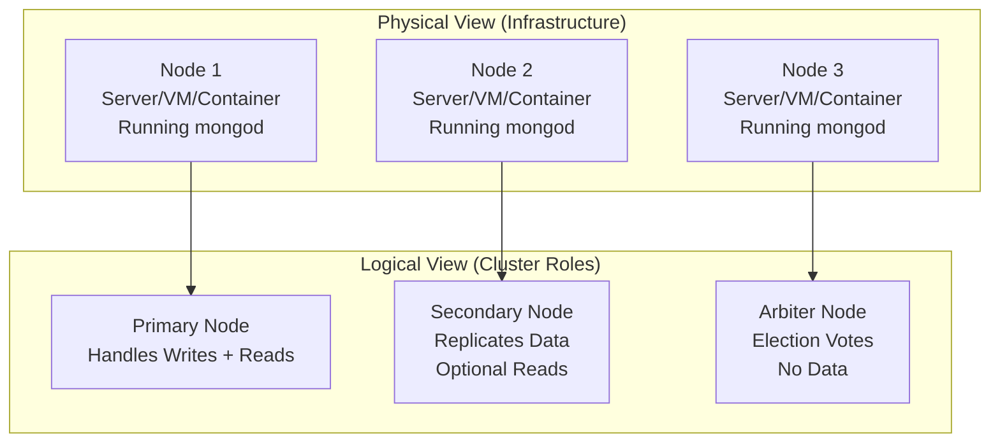
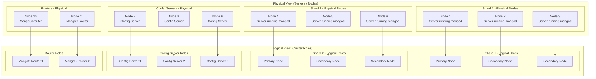
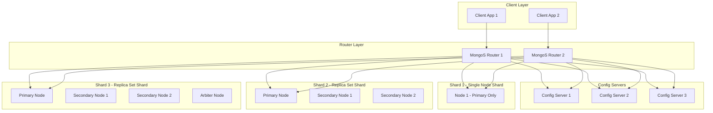
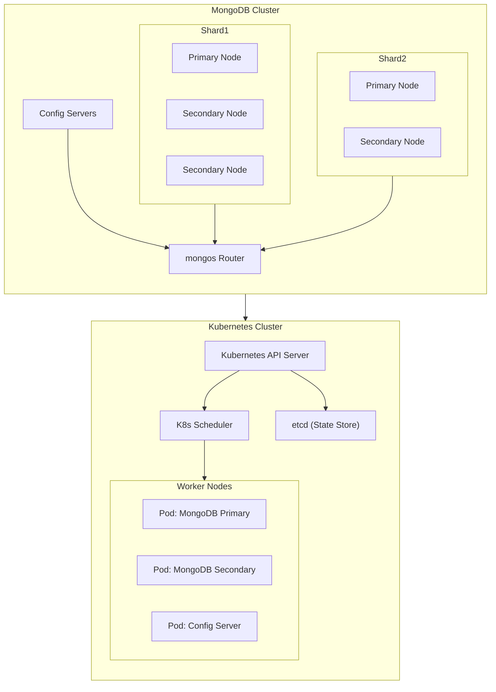

# Node

In MongoDB, a node is any single  process instance, while a shard is a logical partition of the dataset, typically composed of a replica set (a group of several nodes) that stores a slice of the total data. Sharding is a strategy for horizontal scaling, while nodes are the basic building blocks of any MongoDB deployment. [1, 2, 3, 4, 5]  
Node (Instance) 
A "node" (or instance) is a single physical or virtual server running the MongoDB database software ( process). Nodes are used in both standalone, replicated, and sharded environments and can perform different roles: 

• Primary: The node that receives all write operations in a replica set. 
• Secondary: A node that maintains a copy of the data from the primary for redundancy and high availability. 
• Query Router (): In a sharded cluster, this node acts as an interface for client applications, routing queries to the correct shards. 
• Config Server: A node that stores the cluster's metadata, including the routing table that maps data chunks to specific shards. [11, 12, 13]  

# Shard 
A "shard" is a component within a sharded cluster architecture, designed to distribute data and workload horizontally across multiple servers. 

• Data Partitioning: A sharded cluster breaks down the entire dataset into smaller, subdivided chunks, and each shard holds a unique subset of that data. 
• Scalability: Sharding is used to overcome the hardware limitations of a single server by allowing the database to scale out horizontally, handling very large datasets and high-throughput workloads. 
• High Availability: For production environments, each shard is implemented as a replica set (a group of nodes) to provide data redundancy and automatic failover within the shard. [1, 3, 15, 16, 17]  

Key Differences at a Glance 

| Feature   | Node | Shard  |
| --- | --- | --- |
| Definition | A single running instance of MongoDB (). | A logical partition of data, part of a sharded cluster.  |
| Composition | A single server instance. | Typically a replica set (a group of nodes).  |
| Data Storage | Stores either the entire dataset (in a replica set) or a copy of a data subset (as a secondary in a shard's replica set). | Stores only a portion or "slice" of the cluster's total data.  |
| Purpose | Provides processing power, storage, and memory; serves a specific role (primary, secondary, router, etc.). | Facilitates horizontal scaling, distributes read/write workloads, and increases total storage capacity for a large database.  |

In summary, a node is a physical or virtual machine running MongoDB, while a shard is a functional unit of a distributed system that comprises one or more nodes (in a replica set configuration) to hold a distinct part of the total database. [3, 6, 21, 22, 23]  

 

In **MongoDB**, the term **node** can be a bit confusing because it’s used in **different contexts**. 

---

## 🔹 1. Node in **Physical Sense**

* A **node** is a **physical or virtual server** (or container) running a **mongod** or **mongos** process.
* Example:

  * A replica set has **3 nodes**: 1 Primary + 2 Secondaries.
  * Each node = one machine (VM, bare metal, or container).
* In this sense, **Node = physical/infra concept**.

---

## 🔹 2. Node in **Logical Sense**

* In **cluster topology diagrams**, MongoDB docs often say "node" to mean **a role inside the cluster**:

  * **Primary node** → handles writes.
  * **Secondary node** → handles replication & reads (if enabled).
  * **Arbiter node** → participates in elections, no data.
  * **Config server node** → stores metadata in sharded clusters.
  * **Mongos node** → query router.

So here, **Node = logical role of a process in the cluster**.

---

## ✅ Key Answer

👉 A **MongoDB Node is physical in deployment (it’s a machine running mongod/mongos)**,
but it is **logical in architecture (role: primary, secondary, arbiter, config, router)**.

Think of it like this:

* **Physical Node = machine/container.**
* **Logical Node = its role inside replica set / cluster.**

---

**side-by-side diagram** that distinguishes **physical nodes** (machines/servers) from their **logical roles** (primary, secondary, arbiter, etc.) in MongoDB.

---

#  MongoDB Node: Physical vs Logical

---

## Explanation

* **Physical View**

  * Nodes are actual **servers, VMs, or containers**.
  * Each node runs a **mongod** (database server process).

* **Logical View**

  * The same physical nodes are assigned **roles in a replica set**:

    * **Primary** → accepts writes, replicates to secondaries.
    * **Secondary** → maintains copies, can serve reads.
    * **Arbiter** → participates in elections, no data storage.

* **Mapping** → A physical node hosts a logical role.

---

This way, a **MongoDB Node** is both:

* **Physical** (a server/container running a process).
* **Logical** (its role in replication/sharding architecture).

---

**full MongoDB sharded cluster** and show both **physical nodes** (machines/containers) and their **logical roles** (shards, replica set roles, config servers, routers).

---

# 📊 MongoDB Sharded Cluster – Physical vs Logical

---

# Explanation

### **Physical View**

* Real **servers, VMs, or containers** running `mongod` or `mongos`.
* Each shard has **multiple physical nodes** forming a replica set.
* Separate **config servers** store metadata.
* **Routers (mongos)** are entry points for clients.

### **Logical View**

* Within each shard (replica set):

  * **Primary Node** → accepts writes, replicates data.
  * **Secondary Nodes** → replicate and serve reads.
* **Config Servers** → coordinate sharding metadata.
* **Routers (mongos)** → route queries to the correct shard.

### **Mapping**

* Each **physical node** corresponds to a **logical role** in the cluster.

---

With this diagram, you can see how **MongoDB’s cluster topology** maps **infra-level nodes** (machines) to their **roles** (primary, secondary, config, router).

---

👉 Do you also want me to **add the data flow** (client query → router → config server → shard → primary/secondary → response)?

Perfect 🚀 Let’s draw a **full MongoDB sharded cluster diagram** showing:

* Multiple **shards** (some with a single node, some as replica sets).
* **Config servers**.
* **Mongos routers**.
* **Clients** connecting and querying.

---

# 📊 MongoDB Sharded Cluster – Mixed Shards (Single Node + Replica Set)

---

# 🔎 Explanation

* **Clients** → Connect to **mongos routers** (entry points).
* **Routers (mongos)** → Route queries to the correct shard.
* **Config Servers** → Store cluster metadata (shard key ranges, chunk info).
* **Shard 1** → A **single-node shard** (good for testing/dev, no HA).
* **Shard 2 & 3** → Proper **replica set shards** (high availability).

  * Shard 3 also includes an **arbiter node** for election purposes.

---

✅ This design shows how MongoDB supports **mixed shard setups** (single node or replica sets) in the same cluster.
👉 In **production**, **every shard should be a replica set** for reliability.

---

Do you want me to **add the query flow** (e.g., client issues `find()` → mongos → config servers → correct shard → primary/secondary → response back to client)?

Great question 👍

👉 **No**, a single MongoDB node **cannot belong to two shards at the same time**.

Here’s why:

### 1. **Definition of a Shard**

* A **shard** is essentially a **MongoDB deployment** (either a single mongod instance or a replica set).
* Each shard has its **own data set** and is responsible for a portion of the cluster’s data (defined by the shard key ranges or hash ranges).

If one node tried to be part of two shards, it would need to serve **two different data partitions and two replica set identities** at once — which MongoDB does not allow.

---

### 2. **Replica Set Identity**

* Every shard that’s a replica set has a **unique replica set name**.
* A single node (`mongod`) can only run as part of **one replica set** at a time.
* Therefore, a node can’t “double join” two replica sets (and thus can’t be in two shards).

---

### 3. **Possible but not Recommended Workaround**

* You *could* technically run **two separate mongod processes** on the same physical machine (different ports, different data directories).
* Each process would act as a **different node**, and you could assign each to a different shard.
* But that’s not the same as **one node being in two shards** — it’s just resource-sharing on the same machine.
* In production, this is discouraged because it creates resource contention and reduces isolation.

---

✅ **Conclusion:**

* A **single MongoDB node = only one shard**.
* A **physical machine** can host multiple nodes (via multiple mongod processes), and those can belong to different shards — but each node itself stays in exactly one shard.

---

Do you want me to extend the **Mermaid diagram** to show an example where a **single physical server runs two mongod instances** that belong to **different shards**?

Perfect 👍 Let’s compare **MongoDB cluster architecture** vs **Kubernetes cluster architecture**, so you can clearly see how terms like *node* and *deployment* differ.

Here’s the **Mermaid diagram**:

---

### 🔹 Explanation

#### MongoDB Cluster

* **Shard** → Can be one node or a replica set.
* **Replica Set** → Has 1 Primary + N Secondaries for redundancy.
* **Config Servers** → Store cluster metadata.
* **mongos Router** → Query router that directs requests to correct shard.

#### Kubernetes Cluster

* **Node (K8s)** → A physical/VM worker machine.
* **Pod** → Smallest unit in K8s; can run one MongoDB instance (`mongod`).
* **Deployment/StatefulSet** → Manages Pods. StatefulSet is usually used for MongoDB (because of stable identities).
* **etcd** → Stores cluster state.
* **Scheduler** → Assigns Pods to worker nodes.

---

👉 The key is:

* **MongoDB node ≠ Kubernetes node.**
* In K8s, a MongoDB *node* runs inside a **Pod**, which runs on a **K8s Node** (machine).

---

Would you like me to extend this and show **MongoDB sharded cluster running *on top of* Kubernetes** (tying Pods ↔ Replica Sets ↔ Shards)?

