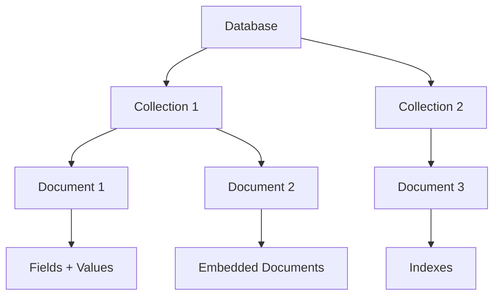
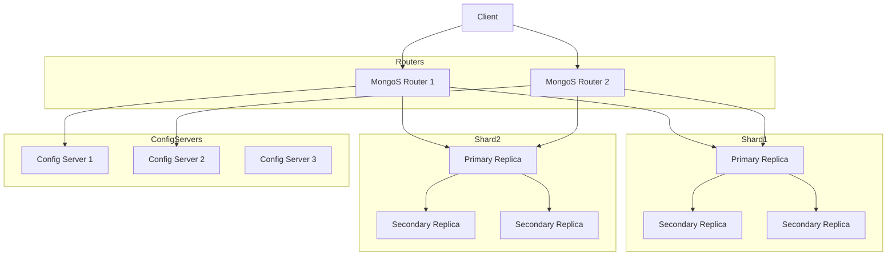
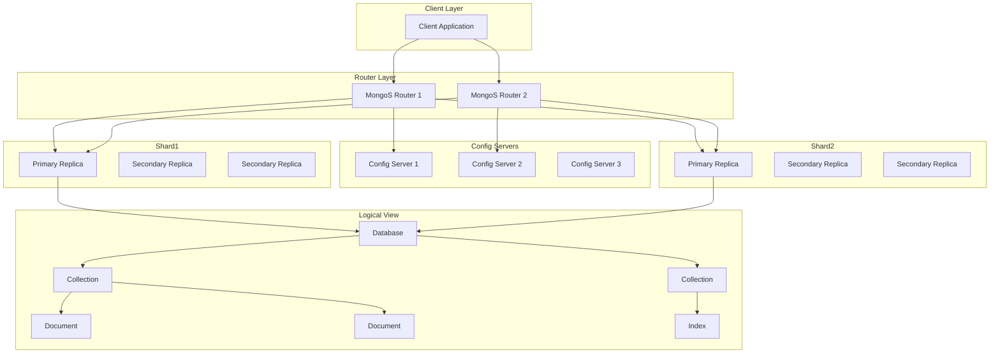

 # Mongo DB

1. **Logical View** → How data is organized/modeled (databases, collections, documents, indexes).
2. **Physical View** → How MongoDB is deployed and scaled (replica sets, shards, config servers, query routers).
 

##  Logical Architecture (Data Model)

 Explanation:

* **Database**: A container of collections.
* **Collection**: Group of documents (like tables in RDBMS).
* **Document**: JSON-like object (BSON internally).
* **Fields**: Key-value pairs.
* **Indexes**: Improve query performance.

 

## Physical Architecture (Deployment Model)

[Node and Shard](Nodes.md)
* **Replica Set**: Primary + Secondaries (HA + failover).
* **Sharding**: Distributes data across shards.
* **Config Servers**: Store metadata for sharding.
* **MongoS Routers**: Clients connect here; they route queries to the right shard.

 

### Logical + Physical Architecture

how a query from the **client** flows through **MongoS**, gets routed to the correct **shard**, and finally resolves to a **collection/document** inside the logical database.
 

- [CAP](CAP.md)
  MongoDB acts as AP , prioritize availability over correctness

### Operations 
- [Basic Queries](basic.md)
- [Map Reduce Queries](MapReduce.md)
 

1. **Client Layer** → Applications talk to MongoDB through **MongoS routers**.
2. **Router Layer (MongoS)** → Handles query routing, talks to config servers for shard metadata.
3. **Config Servers** → Store cluster metadata (shard mappings).
4. **Shards** → Each shard is a **replica set** (HA, scaling).
5. **Logical View inside Shards** → Each replica set stores **databases → collections → documents → indexes**.
 

