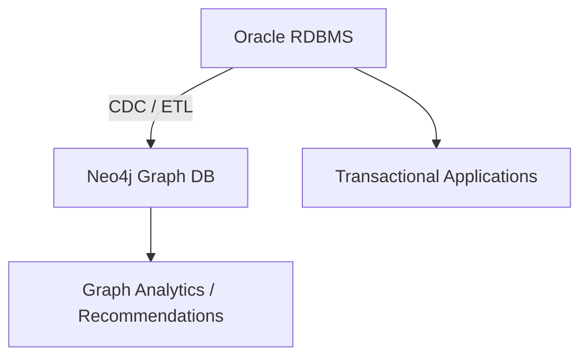

Excellent — this is a deep and very practical architectural question 👏

Let’s break it down carefully:

---

## 🧠 1. The Core Comparison

| Aspect                              | `CONNECT BY` (Oracle Hierarchical Query)                             | Graph Database (Neo4j, JanusGraph, etc.)                                   |
| :---------------------------------- | :------------------------------------------------------------------- | :------------------------------------------------------------------------- |
| **Type**                            | Relational feature (SQL extension)                                   | Native Graph Database                                                      |
| **Data Model**                      | Tables with foreign key relationships                                | Nodes, Relationships (Edges), and Properties                               |
| **Traversal Model**                 | Recursive SQL traversal using `CONNECT BY` or `WITH RECURSIVE`       | Graph traversal using patterns (`MATCH (a)-[r]->(b)`)                      |
| **Performance on Deep Hierarchies** | Degrades with depth and recursion complexity                         | Optimized for deep and irregular traversal                                 |
| **Schema**                          | Rigid (fixed columns, foreign keys)                                  | Flexible, schema-optional                                                  |
| **Query Language**                  | SQL                                                                  | Cypher (or Gremlin, GQL)                                                   |
| **Storage**                         | Row/column-based (Oracle RDBMS engine)                               | Graph-native adjacency lists, optimized for links                          |
| **Ideal Use Case**                  | Organizational hierarchies, bill of materials (BOM), directory trees | Social networks, recommendation systems, fraud detection, knowledge graphs |

---

## 🧩 2. Oracle’s `CONNECT BY` Explained

Oracle’s **`CONNECT BY`** is used for **hierarchical queries**, i.e., when one row refers to another via a parent-child relationship.

### Example

```sql
SELECT employee_id, manager_id, LEVEL
FROM employees
START WITH manager_id IS NULL
CONNECT BY PRIOR employee_id = manager_id;
```

**Key Features:**

* Uses `START WITH` and `CONNECT BY PRIOR` for recursion.
* Returns a *tree* structure (top-down or bottom-up).
* Good for **organizational hierarchies** and **BOMs** (Bill of Materials).

---

## 🔍 3. Limitations of `CONNECT BY`

| Limitation                      | Description                                                                                  |
| :------------------------------ | :------------------------------------------------------------------------------------------- |
| **Performance on Deep Graphs**  | Recursive joins are expensive for deep or irregular graphs.                                  |
| **Complex Relationships**       | Handles single parent-child type relations easily; complex multi-relational graphs are hard. |
| **Dynamic Queries**             | Hard to dynamically traverse variable-depth or cyclic relationships.                         |
| **Multiple Relationship Types** | Requires multiple tables or self-joins; not as expressive as graph queries.                  |
| **Analytics**                   | No native algorithms for centrality, clustering, path-finding, etc.                          |

---

## ⚡ 4. Why Graph Databases (like Neo4j) Exist

Graph databases are **built around relationships** as first-class citizens.

* Traversals (BFS/DFS) are **O(1)** for edge hops (no join overhead).
* Data is stored as **nodes and edges** (adjacency-based storage).
* Rich algorithms: shortest path, PageRank, community detection, etc.
* Cypher query language is expressive and human-readable.

### Example (Neo4j Cypher)

```cypher
MATCH (e:Employee)-[:MANAGES*]->(sub:Employee)
WHERE e.name = 'John'
RETURN sub.name;
```

This query can go **any depth** — efficiently — without recursion overhead.

---

## 🧮 5. When `CONNECT BY` Is Better

| Scenario                                   | Why Oracle is Fine                         |
| :----------------------------------------- | :----------------------------------------- |
| **Static organizational hierarchy**        | Predictable tree depth (e.g., 5–10 levels) |
| **Bill of materials**                      | Limited and well-structured                |
| **Small dataset**                          | Query cost acceptable                      |
| **Transactional system already in Oracle** | Avoids integration overhead                |

✅ Example:
Employee → Manager → Department → Region — all small, fixed hierarchies.

---

## 🌐 6. When Graph DB (Neo4j) Is Better

| Scenario                          | Why Graph is Better                                                |
| :-------------------------------- | :----------------------------------------------------------------- |
| **Dynamic, deep traversal**       | Paths of arbitrary length (e.g., “friends of friends of friends”)  |
| **Multiple relationship types**   | E.g., *works_with*, *reports_to*, *mentors*, *collaborates_with*   |
| **Network analytics**             | Shortest path, community detection, influence scoring              |
| **Schema evolution**              | Easy to evolve relationships without altering schema               |
| **Cross-domain knowledge graphs** | Combine multiple domains (people, projects, skills, assets) easily |

✅ Example:
Fraud detection across customers → cards → merchants → devices → IP addresses.

---

## 🧠 7. Performance Perspective

| Operation                      | Oracle `CONNECT BY`    | Neo4j                          |
| :----------------------------- | :--------------------- | :----------------------------- |
| Query depth (5 levels)         | Fast                   | Fast                           |
| Query depth (20+ levels)       | Slow (recursive joins) | Still efficient                |
| Relationship type diversity    | Hard                   | Natural                        |
| Pathfinding / graph algorithms | Manual coding          | Built-in functions             |
| Horizontal scaling             | Hard (shared RDBMS)    | Easier (sharding / clustering) |

---

## 🧩 8. Hybrid Pattern (Common in Enterprises)

Many enterprises use both:

* Keep **core transactional data** in Oracle.
* Build **graph layer** (Neo4j or AWS Neptune) for relationship analytics.

👉 Use **ETL or CDC (Change Data Capture)** to sync from Oracle → Graph DB.

Example architecture:



---

## 🧱 9. Summary

| Criterion                    | Oracle `CONNECT BY`  | Neo4j (Graph DB)                         |
| :--------------------------- | :------------------- | :--------------------------------------- |
| Architecture Type            | Relational           | Graph-native                             |
| Model                        | Tree / hierarchy     | General graph                            |
| Query Language               | SQL                  | Cypher                                   |
| Performance (deep traversal) | Medium/Slow          | Fast                                     |
| Schema flexibility           | Rigid                | Flexible                                 |
| Graph algorithms             | None                 | Built-in                                 |
| Typical Use Case             | HR hierarchies, BOMs | Recommendations, fraud, network analysis |

---

✅ **Bottom line:**

* If your data is **hierarchical and bounded**, Oracle `CONNECT BY` is perfectly fine.
* If your data is **networked, highly connected, or analytic in nature**, a **graph database like Neo4j** is far superior.

---

Would you like me to draw a **Mermaid architecture diagram** comparing how Oracle executes `CONNECT BY` queries (recursive joins) vs how Neo4j performs adjacency-based traversals?
