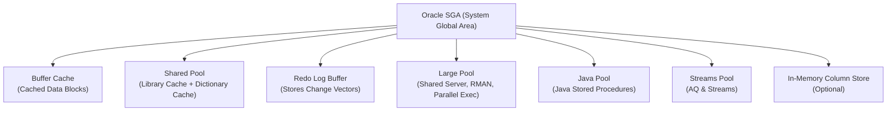

- [Up](..)

# Oracle 
- [Joins](joins.md)
- [Cursor](cursor)
- [Indexes](indexes)
- [Procedure](procedure)
- [Objects](objects.md)
- [ORA files](ora_files.md)
- [DB Link](db_link.md)


# Oracle Database 


The Oracle System Global Area (SGA) is a shared memory region that all Oracle background processes and user sessions access to manage database operations efficiently. It contains key memory structures such as the Buffer Cache (cached data blocks), Shared Pool (parsed SQL, execution plans, dictionary cache), Redo Log Buffer (change records before writing to redo logs), Large Pool, Java Pool, and Streams Pool. The SGA reduces disk I/O by caching frequently used data and SQL metadata, enabling faster query execution, efficient concurrency, and coordination between Oracle processes.



mapping of Oracle logical storage to physical storage using text/ASCII style. You can also represent it visually later.


### What Is an OS-Level Block in Linux

An **OS-level block** is the **smallest unit of data the operating system reads from or writes to a block device** (SSD, HDD, EBS, NVMe). It is managed by the **Linux Virtual File System (VFS)** and the **block layer** of the kernel, not by the database.

### Key Characteristics of OS-Level Block

1. **Physical Sector Size Based on Hardware**

   * Common sector sizes: **512 bytes** or **4096 bytes (4 KB)**.
   * The disk exports this size to the OS; the OS cannot change it.

2. **Managed by the Linux Kernel Block I/O Layer**

   * Components: **VFS → File System → Block Layer → Device Driver → Disk**.
   * Handles I/O scheduling (CFQ, MQ, BFQ), merging, alignment, and caching.

3. **Purpose**

   * To provide fast, aligned, low-level access to storage devices.
   * Higher-level structures (file system blocks, database blocks) sit on top of it.

4. **Completely Independent of Application-Level Blocks**

   * A database like Oracle may use 8K blocks, but the OS still writes in 4K physical blocks.

### OS-Level Block vs File System Block vs Database Block

| Layer                               | Example Size | Managed By               | Purpose                      |
| ----------------------------------- | ------------ | ------------------------ | ---------------------------- |
| **Database block**                  | 8 KB         | Oracle RDBMS             | Rows, indexes, SCN, undo     |
| **File system block**               | 4 KB         | EXT4, XFS                | File allocation & mapping    |
| **OS-level block (physical block)** | 512B or 4 KB | Linux kernel block layer | Lowest-level disk read/write |

### How OS-Level Blocks Work Internally

1. A process writes a file through the **VFS**.
2. The file system breaks it into **file system blocks**.
3. The Linux **block layer** splits or aligns that data into **physical blocks**.
4. The device driver sends those blocks to the **disk or cloud block storage**.
5. The device writes them as **sector-sized blocks**.

### Example: Oracle Database on Linux

* Oracle issues an 8 KB block write.
* File system breaks it into 4 KB chunks.
* OS writes two **4 KB** physical blocks to disk.
* AWS EBS stores those as its own internal 4 KB sectors.

### Why This Matters

* Incorrect block alignment causes **extra I/O**.
* Understanding block sizes helps optimize **IOPS**, **throughput**, and **latency**.
* Databases perform better when DB block size aligns with file system and OS block sizes.

If you want, I can also explain:

* Difference between logical block size and physical block size
* How Linux caches blocks in the page cache
* Why cloud storage (EBS) internally uses 4 KB sectors even if abstracted as 512 bytes

---

Oracle Storage Hierarchy

Physical Storage (Disk)
 ├── Datafiles (store tablespace data)
 │    ├── File: users01.dbf
 │    ├── File: users02.dbf
 │    └── File: system01.dbf
 ├── Redo Log Files (store changes for recovery)
 │    ├── redo01.log
 │    └── redo02.log
 ├── Undo Tablespace Files (store undo/rollback info)
 │    └── undotbs01.dbf
 └── Control Files (store metadata about database)
      └── control01.ctl

Logical Storage (within the database)
 └── Tablespace (mapped to one or more datafiles)
      ├── Segment (table, index, undo)
      │    ├── Extent (contiguous blocks)
      │    │    └── Block (smallest unit of storage)
      │    │         └── Row / Data
      │    └── Another Extent ...
      └── Another Segment ...


---

Explanation

1. Physical storage files are actual files on disk (datafiles, redo logs, undo tablespace files, control files).


2. Tablespaces are logical containers mapped to one or more datafiles.


3. Segments (tables, indexes) exist inside tablespaces.


4. Extents are contiguous blocks allocated for a segment.


5. Blocks are the smallest unit of I/O; they store rows/data.


---

Difference Between Logical Read and Physical Read in Oracle

A logical read (consistent get) occurs when Oracle accesses a block that is already available in the Buffer Cache (SGA). No disk I/O happens. Oracle may also reconstruct an older version of the block using undo to maintain read consistency.

A physical read happens when the required block is not found in the Buffer Cache, so Oracle must read the block from disk into memory. This is slower and done by the DBWR and OS I/O subsystem.


The Buffer Cache is a component of the Oracle SGA that stores recently accessed database blocks in memory to avoid repeated disk I/O. When a query needs data, Oracle first checks the Buffer Cache; if the block is found, it performs a fast logical read, and if not, it triggers a physical read from disk and loads the block into the cache. The Buffer Cache improves performance by caching frequently used blocks, supports consistent reads using undo data, and is managed by Oracle using an LRU-like algorithm to decide which blocks remain in memory.

The Library Cache stores parsed SQL statements, execution plans, and PL/SQL code so Oracle can reuse them without reparsing, reducing CPU usage and improving performance for repeated queries.

 The Data Dictionary Cache stores metadata about database objects—tables, indexes, users, privileges—so Oracle doesn’t need to read this information repeatedly from disk. Together, they speed up SQL execution: the Library Cache avoids hard parsing, and the Data Dictionary Cache avoids repeated metadata lookups.


A latch is a low-level, lightweight lock used inside the SGA to protect shared memory structures like the Buffer Cache and Shared Pool during very short critical operations. It provides fast, CPU-level mutual exclusion and is always held for a brief time, never queued, meaning sessions spin or retry if the latch is busy. 

An enqueue, on the other hand, is a high-level lock used to control access to database objects (tables, rows) and supports queuing, deadlock detection, and different lock modes. Latches protect internal memory structures, while enqueues manage transactional concurrency on database objects.


How Oracle Decides Which One to Use

1. Check Buffer Cache first:

If the block is in memory → logical read.

If block is not in memory → physical read.


2. Execution plan influences behavior:

Index scan → fewer blocks → more logical reads.

Full table scan → may trigger direct path read (bypass Buffer Cache).


3. Block versioning (undo):

For consistent reads, Oracle may use undo segments to reconstruct the block image.


---

Summary

Logical read = from memory (fast).

Physical read = from disk (slow).

Oracle always tries logical read first; physical read only when needed.


---


---


### **Oracle SELECT Query — Internal Execution Steps**

When you run:

```sql
SELECT * FROM employees WHERE dept_id = 10;
```

Oracle performs the following steps **in order**:


### **1. Parse Phase (SQL Parsing + Syntax + Semantics + Security)**

### Components involved:

* **Parser**
* **Semantic Checker**
* **Data Dictionary Cache**
* **Library Cache (Shared Pool)**
* **User privileges subsystem**

### What Oracle does:

1. Check SQL syntax.
2. Validate table/column names against data dictionary.
3. Check user privileges.
4. Generate a **parse tree**.

If a similar statement already exists in the shared pool (same text + same binds), Oracle may reuse it (soft parse).


### **2. Optimization Phase (Cost-Based Optimization)**

### Components:

* **Cost-Based Optimizer (CBO)**
* **Statistics subsystem**
* **Metadata: histograms, indexes, partition metadata**

### What happens:

Oracle tries many possible execution paths and chooses the lowest cost plan:

✔ Which index to use
✔ Whether to do full table scan or index scan
✔ Join order
✔ Join method: hash/merge/nested loop
✔ Partition pruning
✔ Predicate pushdown
✔ Whether to use parallel execution

Result → **Execution Plan**

Here is a **very clear, concise, but complete** explanation of **how Oracle’s Cost-Based Optimizer (CBO) finds the “best” execution plan**.


## **How Oracle CBO Chooses the Best Execution Plan**

Oracle’s CBO tries multiple possible ways to execute a query and **assigns a cost to each path**.
The plan with the **lowest cost** is selected.

It uses a 4-stage process:


### **1. Generate All Possible Plans (Search Space Exploration)**

Oracle enumerates all possible **logical and physical transformations**, such as:

### **Join orders**

* T1 → T2 → T3
* T2 → T3 → T1
* Bushy trees, left-deep trees

### **Join methods**

* Nested Loop Join
* Hash Join
* Merge Join

### **Access paths**

* Full table scan
* Index range scan
* Index skip scan
* Fast full index scan
* Partition pruning

### **Predicate pushdown & rewrite rules**

* Filter pushdown
* Subquery unnesting
* Predicate transitivity
* View merging
* Star transformation

These combinations form the **plan search space**.


### **2. Collect Statistics & Metadata (CBO Input Data)**

The optimizer uses metadata from:

### **Object Stats**

* Table row count
* Number of blocks
* Index leaf blocks
* Distinct values per column
* Column selectivity

### **Histograms**

* Frequency histograms (skewed data)
* Height-balanced histograms

### **System Stats**

* CPU speed
* I/O performance
* Multiblock read count

### **Partition Metadata**

* Prunable partitions
* Local/global index ranges

### **Optimizer Parameters**

* `optimizer_mode`
* `optimizer_index_cost_adj`
* `_query_execution_plan` flags

All this allows CBO to *estimate* work required.


### **3. Estimate Cost for Each Operator**

CBO assigns a cost to each step based on:

### **I/O Cost**

* How many table blocks must be read
* How many index leaf blocks
* Sequential read vs random read
* Partition scans vs full scans

### **CPU Cost**

* Predicate evaluation
* Sorting rows
* Hash table creation for hash joins
* Comparing rows in merge joins

### **Cardinality Estimates**

Estimate rows flowing between operators:

```
estimatedRows = totalRows * selectivity
```

Cardinality drives:

* join method selection
* memory allocation (PGA)
* ordering of filters


### **4. Choose Plan With the Lowest Total Cost**

Oracle uses a dynamic programming algorithm:

* Combine operator costs bottom-up
* Compare total cost of each possible plan
* Pick the cheapest plan

This cost is a unitless number representing **estimated work**, not time.

Example:

| Plan                        | Cost |
| --------------------------- | ---- |
| Index scan + nested loop    | 93   |
| Hash join + full table scan | 74   |
| Merge join + index scan     | 112  |

Oracle picks **hash join + full table scan** because **74 is lowest**.


### **What Makes CBO Extremely Powerful**

### ✔ Adaptive Optimization

During execution, Oracle can change the plan if cardinality estimates were wrong (adaptive plan).

### ✔ Bind Variable Peeking

Examines first bind value to adjust plan.

### ✔ Dynamic sampling

Collects sample statistics when needed.

### ✔ SQL Plan Baselines

Remembers stable plans to prevent regressions.


### **Oracle CBO chooses the best plan by:**

1. **Generating many candidate plans**
2. **Using statistics to estimate row counts and cost**
3. **Computing I/O + CPU cost per plan**
4. **Choosing the plan with the lowest estimated cost**

The chosen plan becomes the **execution plan** stored with the cursor.


> More :
📌 Why CBO sometimes picks a bad plan
📌 How to override CBO using hints
📌 How cardinality misestimation happens
📌 How adaptive plans fix the wrong choice

---


### **3. Row Source Generation (Plan → Operators)**

### Components:

* **Row Source Generator**
* **Cursor**

The optimizer’s plan is converted into a **row source tree**, where each node is an operator:

* TABLE ACCESS FULL
* INDEX RANGE SCAN
* HASH JOIN
* SORT
* GROUP BY
* FILTER
* VIEW MERGING nodes

This row source tree becomes the **cursor**, which Oracle will execute.


### **4. Execution Phase (Actual Data Retrieval)**

### Components:

* **Buffer Cache (DB Cache)**
* **Redo Log Buffer**
* **PGA (Private memory)**
* **Segments (Tables, Indexes)**
* **Direct Path mechanisms (if used)**

Steps:

1. Check if requested blocks are in **Buffer Cache** → if yes, return them.
2. If not, read blocks from datafiles (I/O) into buffer cache.
3. Apply filters, conditions, joins.
4. Return rows gradually using pipelining.

Important:

* Oracle uses **cursor iteration** to return rows in batches (fetch calls).
* Each row source operator pulls rows from its children (“demand pull model”).


### **5. Fetch Phase (Return Rows to Client)**

### Components:

* **Cursor**
* **SQL*Net / JDBC / OCI layer**

Oracle sends rows to the client in **multiple fetch calls**, not all at once.

Fetch size determines how many rows per call.


```
Parsing
  ↓
Semantic checks (data dictionary)
  ↓
Shared pool lookup (soft parse?)
  ↓
Optimizer (CBO decides best plan)
  ↓
Row source tree generated (cursor)
  ↓
Execution starts (read blocks, apply filters)
  ↓
Rows fetched in batches via cursor
```


### **Participants**

| Oracle Component                      | Role                                            |
| ------------------------------------- | ----------------------------------------------- |
| **Shared Pool**                       | Stores parsed SQL, execution plans, metadata    |
| **Library Cache**                     | Stores execution plans (cursors)                |
| **Dictionary Cache**                  | Stores metadata (tables, columns, privileges)   |
| **Optimizer (CBO)**                   | Generates the best execution plan               |
| **Row Source Generator**              | Converts plan → executable operators            |
| **Buffer Cache**                      | Holds data blocks read from disk                |
| **PGA**                               | Private memory used for sorting, hashing, joins |
| **Redo Log Buffer**                   | If DML, records changes (not used in SELECT)    |
| **Background Processes (DBWR, LGWR)** | Handle block writes, logging                    |
| **SQL*Net**                           | Sends data back to client                       |


✔ **Parse** → Validate SQL, check metadata, create parse tree
✔ **Optimize** → CBO chooses best execution plan
✔ **Row Source** → Plan converted to operators (cursor)
✔ **Execute** → Blocks read, filters applied
✔ **Fetch** → Results returned to client in batches

This is the full lifecycle of a SELECT query inside Oracle.


If you want, I can also explain:
🔸 How Oracle chooses between index scan vs full table scan
🔸 How joins are executed internally (hash/merge/nested loop)
🔸 How Oracle pipelines row sources during execution
🔸 What happens during a *hard parse* vs *soft parse*


