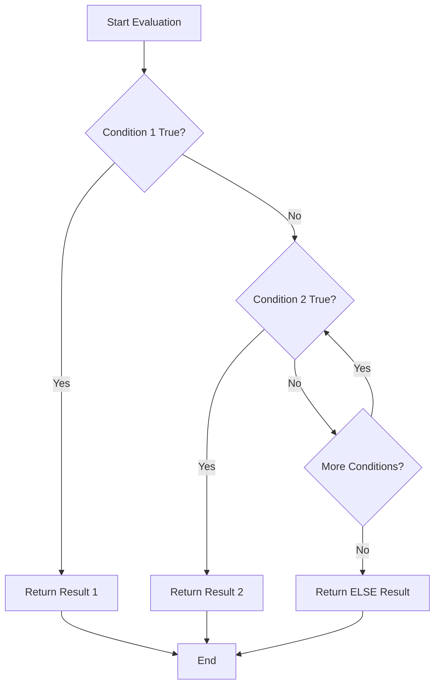

Excellent — this is another **core concept** in Oracle SQL!
Let’s go through how the **`CASE` expression** and **`IF-ELSE` equivalent logic** works in Oracle step-by-step 👇

---

## 🧩 1. There’s no direct `IF ... ELSE` in pure SQL

Unlike PL/SQL (procedural code), **Oracle SQL** does **not** support an explicit `IF ... ELSE` statement.

But Oracle provides an equivalent, **the `CASE` expression**, which works inside:

* `SELECT`
* `UPDATE`
* `DELETE`
* `ORDER BY`
* `WHERE` clauses, etc.

---

## 🧠 2. Types of `CASE` expressions

There are **two forms**:

### (A) **Simple CASE**

Compares a single expression against multiple possible values.

```sql
CASE expression
   WHEN value1 THEN result1
   WHEN value2 THEN result2
   ...
   ELSE default_result
END
```

### (B) **Searched CASE**

Uses logical conditions (similar to `if...else if...else`).

```sql
CASE
   WHEN condition1 THEN result1
   WHEN condition2 THEN result2
   ...
   ELSE default_result
END
```

---

## 💡 3. Example — Simple CASE

Suppose we have a table:

| EMP_ID | DEPT_ID |
| :----- | :------ |
| 1      | 10      |
| 2      | 20      |
| 3      | 30      |

We want to print department names instead of IDs.

```sql
SELECT emp_id,
       CASE dept_id
           WHEN 10 THEN 'HR'
           WHEN 20 THEN 'Finance'
           WHEN 30 THEN 'IT'
           ELSE 'Unknown'
       END AS dept_name
FROM employees;
```

🟩 Output:

| EMP_ID | DEPT_NAME |
| :----- | :-------- |
| 1      | HR        |
| 2      | Finance   |
| 3      | IT        |

---

## ⚙️ 4. Example — Searched CASE (like `if-else`)

Now let’s categorize salaries.

| EMP_ID | SALARY |
| :----- | :----- |
| 1      | 2500   |
| 2      | 8000   |
| 3      | 12000  |

```sql
SELECT emp_id,
       salary,
       CASE
           WHEN salary < 3000 THEN 'Low'
           WHEN salary BETWEEN 3000 AND 10000 THEN 'Medium'
           ELSE 'High'
       END AS salary_level
FROM employees;
```

🟩 Output:

| EMP_ID | SALARY | SALARY_LEVEL |
| :----- | :----- | :----------- |
| 1      | 2500   | Low          |
| 2      | 8000   | Medium       |
| 3      | 12000  | High         |

---

## 🧮 5. CASE in `ORDER BY`

You can even sort using conditional logic:

```sql
SELECT emp_id, dept_id, salary
FROM employees
ORDER BY
  CASE
     WHEN dept_id = 10 THEN 1
     WHEN dept_id = 20 THEN 2
     ELSE 3
  END;
```

This ensures HR (10) appears first, Finance (20) next, etc.

---

## 🧰 6. CASE in `UPDATE`

```sql
UPDATE employees
SET bonus = 
    CASE
        WHEN salary > 10000 THEN 2000
        WHEN salary BETWEEN 5000 AND 10000 THEN 1000
        ELSE 500
    END;
```

---

## 🔄 7. Difference Between SQL `CASE` and PL/SQL `IF-ELSE`

| Feature    | SQL `CASE`                       | PL/SQL `IF-ELSE`                       |
| :--------- | :------------------------------- | :------------------------------------- |
| Context    | Declarative (inside SQL)         | Procedural (inside PL/SQL block)       |
| Syntax     | Expression-based                 | Statement-based                        |
| Where used | SELECT, WHERE, ORDER BY          | BEGIN...END blocks                     |
| Example    | `CASE WHEN col > 5 THEN 'A' END` | `IF col > 5 THEN ... ELSE ... END IF;` |

---

## 🧩 8. PL/SQL `IF ... ELSIF ... ELSE`

If you’re writing inside a **PL/SQL block**, you can use the traditional syntax:

```sql
BEGIN
   IF salary > 10000 THEN
      DBMS_OUTPUT.PUT_LINE('High');
   ELSIF salary > 5000 THEN
      DBMS_OUTPUT.PUT_LINE('Medium');
   ELSE
      DBMS_OUTPUT.PUT_LINE('Low');
   END IF;
END;
/
```

---

## 🧭 9. Execution Flow (Mermaid Diagram)

Here’s a visual of how Oracle processes a searched `CASE` clause 👇



---

Would you like me to show how **Oracle optimizes CASE** internally using **short-circuit evaluation** (so it stops checking once a condition is true)?
