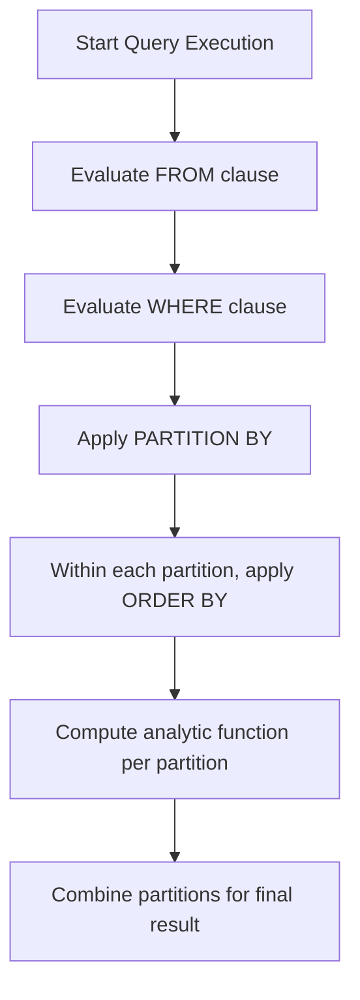

Excellent — this is a deep and very useful SQL concept!
Let’s break down **`PARTITION BY`** in Oracle step by step 👇

---

## 🧩 1. What is `PARTITION BY` in Oracle?

`PARTITION BY` is used in **analytic (window) functions** to divide query results into logical groups — called *partitions* — before performing calculations.
It doesn’t physically divide the table — it just logically groups rows during query processing.

It’s like saying:

> “For each department, calculate the total salary”
> — without writing a separate query per department.

---

## 🧠 2. Basic Syntax

```sql
function_name(column)
OVER (
    PARTITION BY expr
    ORDER BY expr
)
```

| Keyword        | Purpose                                           |
| :------------- | :------------------------------------------------ |
| `PARTITION BY` | Groups rows into partitions for the function      |
| `ORDER BY`     | Defines order of processing within each partition |
| `OVER`         | Indicates it’s an analytic (window) function      |

---

## 💡 3. Example — Partitioning Employee Salaries by Department

| EMP_ID | DEPT_ID | SALARY |
| :----- | :------ | :----- |
| 1      | 10      | 3000   |
| 2      | 10      | 4000   |
| 3      | 20      | 6000   |
| 4      | 20      | 7000   |

### Query

```sql
SELECT emp_id,
       dept_id,
       salary,
       SUM(salary) OVER (PARTITION BY dept_id) AS total_dept_salary
FROM employees;
```

🟩 **Output:**

| EMP_ID | DEPT_ID | SALARY | TOTAL_DEPT_SALARY |
| :----- | :------ | :----- | :---------------- |
| 1      | 10      | 3000   | 7000              |
| 2      | 10      | 4000   | 7000              |
| 3      | 20      | 6000   | 13000             |
| 4      | 20      | 7000   | 13000             |

🧠 Every row “knows” the total for its department — without a `GROUP BY`.

---

## ⚙️ 4. Common Analytic Functions with `PARTITION BY`

| Function                                 | Description                                |
| :--------------------------------------- | :----------------------------------------- |
| `SUM()`, `AVG()`, `COUNT()`              | Aggregate within each partition            |
| `RANK()`, `DENSE_RANK()`, `ROW_NUMBER()` | Assign ranking within partitions           |
| `LAG()`, `LEAD()`                        | Access previous/next row in same partition |
| `FIRST_VALUE()`, `LAST_VALUE()`          | Pick first or last record within partition |

---

## 🧮 5. Example — Ranking Employees Within Department

```sql
SELECT emp_id,
       dept_id,
       salary,
       RANK() OVER (PARTITION BY dept_id ORDER BY salary DESC) AS rank_in_dept
FROM employees;
```

| EMP_ID | DEPT_ID | SALARY | RANK_IN_DEPT |
| :----- | :------ | :----- | :----------- |
| 2      | 10      | 4000   | 1            |
| 1      | 10      | 3000   | 2            |
| 4      | 20      | 7000   | 1            |
| 3      | 20      | 6000   | 2            |

---

## 🧩 6. Can `PARTITION BY` Be Used with the `WITH` Clause?

✅ **Yes, absolutely!**

The `WITH` clause (a.k.a. Common Table Expression or CTE) is just a *temporary named subquery*.
You can use analytic functions (including `PARTITION BY`) **inside** or **after** a `WITH` clause.

### Example:

```sql
WITH salary_data AS (
   SELECT emp_id, dept_id, salary
   FROM employees
)
SELECT emp_id,
       dept_id,
       salary,
       AVG(salary) OVER (PARTITION BY dept_id) AS avg_salary_by_dept
FROM salary_data;
```

🧠 Here:

* `WITH salary_data` defines a reusable subquery.
* The outer query applies the window function using `PARTITION BY`.

You can also put the analytic function **inside** the CTE:

```sql
WITH ranked AS (
   SELECT emp_id,
          dept_id,
          salary,
          ROW_NUMBER() OVER (PARTITION BY dept_id ORDER BY salary DESC) AS rnk
   FROM employees
)
SELECT * FROM ranked WHERE rnk = 1;  -- Top earner per department
```

---

## 🧭 7. Execution Flow (Mermaid Diagram)



---

## ⚡ 8. Key Differences from GROUP BY

| Feature                       | `GROUP BY`  | `PARTITION BY`     |
| :---------------------------- | :---------- | :----------------- |
| Rows collapsed                | ✅ Yes       | ❌ No               |
| Works with analytic functions | ❌ No        | ✅ Yes              |
| Preserves row detail          | ❌           | ✅                  |
| Used for                      | Aggregation | Windowed analytics |

---

## 🧰 9. Real-world Use Cases

| Use Case                          | Example                                                      |
| :-------------------------------- | :----------------------------------------------------------- |
| Top-N salary per department       | `ROW_NUMBER() OVER (PARTITION BY dept ORDER BY salary DESC)` |
| Running total per region          | `SUM(sales) OVER (PARTITION BY region ORDER BY date)`        |
| Comparing with department average | `salary - AVG(salary) OVER (PARTITION BY dept)`              |
| Detecting trends                  | `LAG(value) OVER (PARTITION BY sensor_id ORDER BY time)`     |

---

Would you like me to show a **visual example (Mermaid table)** illustrating how `PARTITION BY` divides data and applies functions step-by-step?
