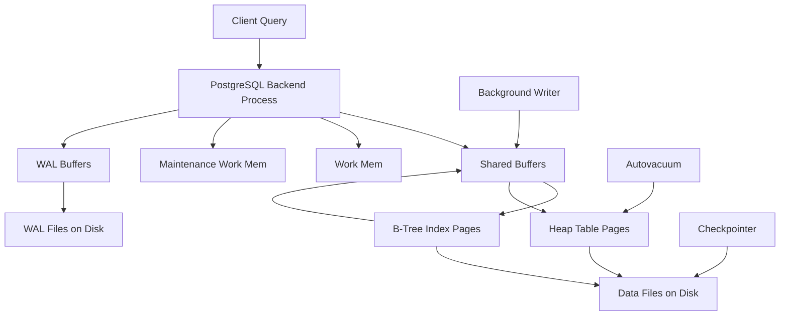

# POSTGRES Database

## Database Concepts
- [ACID](ACID.md)
  

## Architecture 

### Storage

- [Write Ahead Log](Wal.md)
  Crash Recovery Mechanism
- [Disc IO](disc_io.md)
- [Storage Info](base_folder.md)
- [Data Dictionary](data_dictionary.md)
  Graph of inter related tables
- [Data Page](datapage.md)
  Fundamental storage unit
  
### [Memory](memory.md)

- Buffers
- Commit Log
- [Postmanster](Postmaster.md)
  Parent Process
- [Cache](cache.md)
- [Locks](lock.md)
  1. [Inter-Process Communication Lock](interprocess_communication_lock.md)
     Ensures only one process accesses the buffer while I/O is in progress
  2. [Lightweight Locks](lightweight_lock.md)
     used for buffer management, WAL writes, and catalog updates.
- [MVCC](mvcc.md)
  Multi-Version Concurrency Control 
  support many concurrent readers and writers without blocking

## Design
- [Read Operation](read.md)
- [Write Operation](write.md)

## Operations

### Queries
- [Basic Queries](basic_commands.md)
- [Window Functions](window_function.md)
  1. [Partition By](partition_by.md)
- [Optimistic and Pessimistic Locking](optimistic_lock.md)
  
### Improving Performance  
- [Indexes](Indexes.md) for improving performance
    1. [GiST and GIN](gist.md)
       Generalized Inverted Index , Generalized Search Tree
           
- [Partitioning](Partitioning.md)

## Use Cases
- [Excess memeory uage](Examples.md)
- [Long Running Query](longRunningQuery.md)
