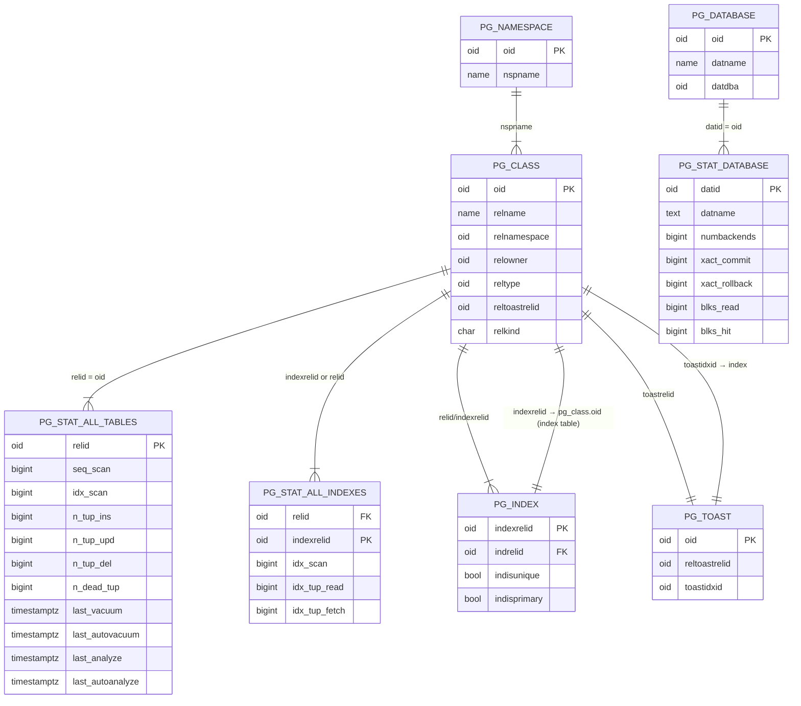
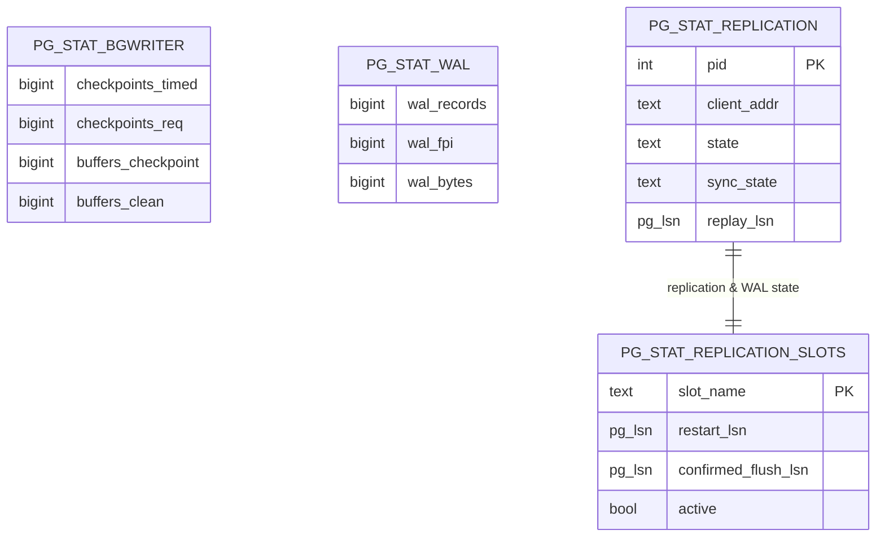
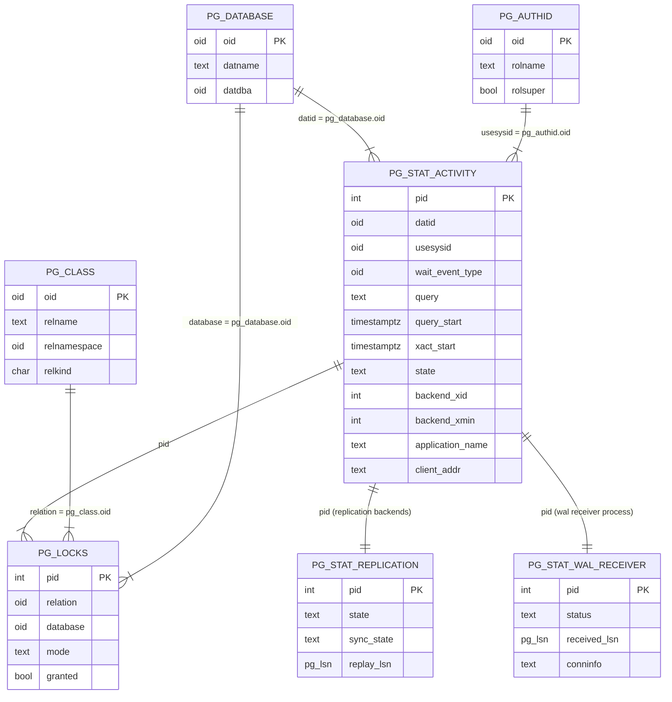
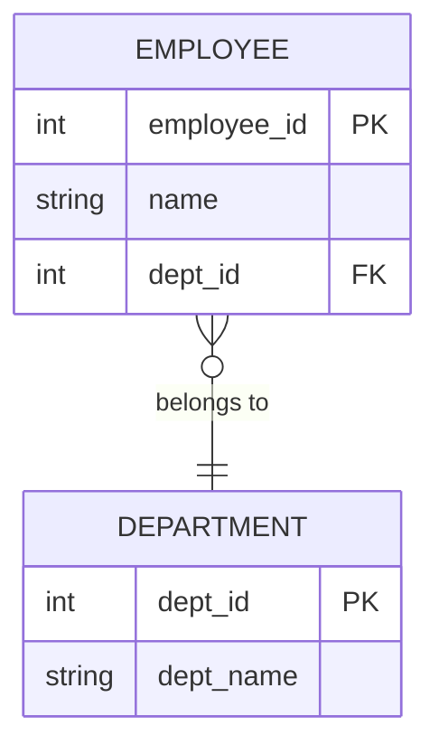

## Catalog and Statistics Tables

high-level ER diagram  of the **most important PostgreSQL internal catalog/statistics tables**—specifically focusing on those prefixed with **`pg_stat_`**.

This is **not the full catalog** (which is huge), but the **core relationships** that matter for query performance, monitoring, vacuum, autovacuum, and index/table stats.

### **Legend**

* Entities = catalog or stats views
* Relationships = how stats map back to real tables or indexes
* Only **primary / most important columns** are shown to keep it readable
* Based on PostgreSQL internal structure (pg_class, pg_stat_all_tables, pg_stat_all_indexes, pg_database, etc.)

---

## **ER Diagram – Key Internal PostgreSQL Stats Tables**



WAL




ACTIVITY STAT


 

 



 
This shows:

* How backend processes (connections) relate to databases
* How they relate to users (roles)
* How they relate to tables (via locks)
* How they relate to queries
* How they relate to replication workers

All relationships are simplified to the parts that matter for performance investigation.

### **The Most Useful PostgreSQL Catalog Table**

If you want **one single catalog table that is truly the most important**, the answer is:

## **`pg_class`**

### **Why `pg_class` Is the Most Useful**

`pg_class` is the *heart* of PostgreSQL’s catalog system because **every table, index, view, TOAST table, materialized view, and sequence** is registered here.

Everything else in the system links back to `pg_class.oid`.

---

## **What `pg_class` Represents**

It stores metadata about:

* Tables
* Indexes
* Views
* Toast tables
* Sequences
* Materialized views
* Partitioned tables
* Child partitions

If it's a physical or logical relation — it's in `pg_class`.

---

## **Key Columns (Why They Matter)**

| Column          | Meaning                | Why It's Important                        |
| --------------- | ---------------------- | ----------------------------------------- |
| `oid`           | Unique ID              | Primary key linking to all other catalogs |
| `relname`       | Table/index name       | Used everywhere                           |
| `relkind`       | Type of object         | `r`=table, `i`=index, `v`=view, `t`=toast |
| `relnamespace`  | Schema                 | Links to `pg_namespace`                   |
| `relowner`      | Owner                  | Links to `pg_authid`                      |
| `reltablespace` | Tablespace             | Storage location                          |
| `relfilenode`   | On-disk file ID        | Maps to actual .dat files                 |
| `reltuples`     | Estimated row count    | Used for planner statistics               |
| `relpages`      | Relation size in pages | Used to estimate I/O cost                 |

---

## **Why DBAs rely on `pg_class` most**

### **1. It is the center of all table/index relationships**

Every stat table references `pg_class`:

* `pg_stat_all_tables.relid → pg_class.oid`
* `pg_stat_all_indexes.indexrelid → pg_class.oid`
* `pg_locks.relation → pg_class.oid`
* `pg_index.indexrelid → pg_class.oid`
* `pg_depend.refobjid → pg_class.oid`
* `pg_constraint.conrelid → pg_class.oid`

### **2. It is needed to calculate table & index sizes**

```sql
SELECT relname, pg_size_pretty(pg_total_relation_size(oid))
FROM pg_class;
```

### **3. Needed to identify table bloat**

`pg_class.relpages` + `pg_stat_all_tables.n_dead_tup`

### **4. Needed to map TOAST tables**

```sql
SELECT reltoastrelid FROM pg_class WHERE relname='my_table';
```

### **5. Needed to analyze index relationships (`pg_index`)**

Planner operations depend heavily on this.

---

## **Why Not pg_stat_activity or pg_stat_all_tables?**

Those are extremely useful **views**, but not true catalog tables.

Also:

* `pg_stat_*` views depend on `pg_class`
* The planner depends on `pg_class`
* Storage files are mapped using `pg_class`
* Locks reference `pg_class`

`pg_stat_activity` is best for troubleshooting, but not fundamental.

---

## **Runner-Up Most Useful Tables (Honorable Mentions)**

### **1. `pg_stat_activity`**

Most useful for:

* Finding slow queries
* Finding blockers
* Monitoring application load

### **2. `pg_stat_all_tables`**

Most useful for:

* Dead tuples
* Analyze/vacuum history
* Seq scans vs index scans

### **3. `pg_index`**

Essential for:

* Index–>table mapping
* Detecting unused or duplicate indexes

### **4. `pg_constraint`**

Used for:

* PK, FK, unique constraints

 
## **Explanation of Each Entity & Relationship**

### **1. `pg_stat_activity`**

Represents each active backend (connection or worker):

* `pid` — unique backend ID
* `query`, `query_start` — current running query
* `xact_start` — transaction lifetime
* `state` — idle, active, idle in transaction
* `backend_xid`, `backend_xmin` — MVCC information
* `application_name`, `client_addr` — connection info

This is the **central view**.

 

### **2. `pg_database`**

Each row in `pg_stat_activity` belongs to a database.

Relationship:

```
pg_stat_activity.datid → pg_database.oid
```

 

### **3. `pg_authid`**

Represents PostgreSQL login roles/users.

Relationship:

```
pg_stat_activity.usesysid → pg_authid.oid
```

Used to see:

* Who is running the query
* Who is holding locks
* Which user is blocking others

---

### **4. `pg_locks`**

Shows all active locks.

Relationships:

```
pg_locks.pid → pg_stat_activity.pid
pg_locks.relation → pg_class.oid
pg_locks.database → pg_database.oid
```

This is how we detect blockers:

* Row locks
* Table locks
* AccessExclusive vs AccessShare
* Lock wait chains

 

### **5. `pg_class`**

To identify which table is locked.

Relationship:

```
pg_locks.relation → pg_class.oid
```

---

### **6. `pg_stat_replication`**

Backends used for WAL replication.

Relationship:

```
pg_stat_replication.pid → pg_stat_activity.pid
```

You can see:

* Replication lag
* State of streaming replication
* Sync/async
* LSN positions

---

### **7. `pg_stat_wal_receiver`**

This links to the **PID** of the WAL receiver process on a standby.

Relationship:

```
pg_stat_wal_receiver.pid → pg_stat_activity.pid
```

---

## **Summary (What This Diagram Shows)**

This ERD explains:

* How **connections (pg_stat_activity)** map to:

  * Databases (`pg_database`)
  * Users (`pg_authid`)
  * Locks (`pg_locks`)
  * Locked tables (`pg_class`)
  * Replication processes (`pg_stat_replication`)
  * WAL receiver process (`pg_stat_wal_receiver`)

It is the **correct and complete** relational structure for everything involving **query performance, blocking, deadlocks, replication lag, and backend behavior**.

 


## **Explanation of Key Structures**

### **1. pg_class**

* Core catalog table for **all tables and indexes**
* `relkind` identifies type:

  * `r` = table
  * `i` = index
  * `t` = TOAST table

All `pg_stat_all_tables` and `pg_stat_all_indexes` rows ultimately map back to pg_class.

---

### **2. pg_stat_all_tables**

Tracks **per-table runtime statistics**:

* Seq scans
* Index scans
* Tuple inserts, updates, deletes
* Dead tuples
* Last analyze/vacuum times

Mapped via:

```
pg_stat_all_tables.relid = pg_class.oid
```

---

### **3. pg_stat_all_indexes**

Tracks **per-index stats**:

* Index scan count
* Tuples read/fetched

Mapped via:

```
pg_stat_all_indexes.indexrelid = pg_class.oid  (index)
pg_stat_all_indexes.relid = pg_class.oid       (table)
```

---

### **4. pg_index**

Metadata about index properties:

* Primary key
* Unique
* Associated table

---

### **5. pg_stat_database**

Tracks DB-level stats like:

* Commit/rollback
* Blocks read/hit
* Temp file usage

Mapped via:

```
pg_stat_database.datid = pg_database.oid
```

---

### **6. pg_stat_bgwriter**

Background writer & checkpoints statistics.

---

### **7. pg_stat_wal**

WAL generation statistics (PostgreSQL 13+).

---

### **8. pg_stat_replication & pg_stat_replication_slots**

Critical for WAL retention & replication lag.

If a slot is inactive → WAL cannot be removed → disk grows → DB fills ↑

---

### **9. pg_toast + pg_class**

Links TOAST tables back to the main table for storing large values.

---

## If You Want

I can also generate:

* A **full Postgres catalog ER diagram**
* A focused **autovacuum internal ER diagram**
* A diagram for **WAL, checkpoints, and replication internal tables**
* A diagram showing **internal locks (pg_locks)** and relation mapping

Just tell me which one you want.


Sample ER Diagram


