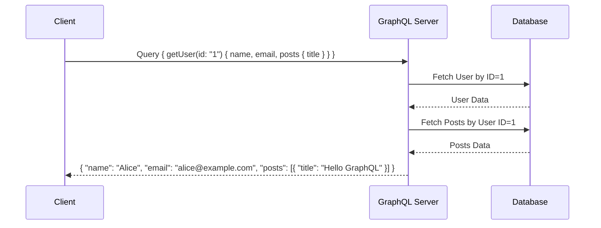
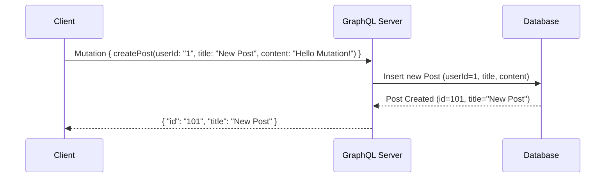
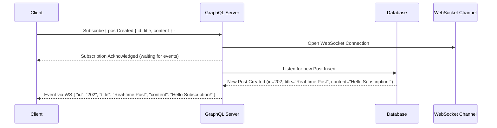
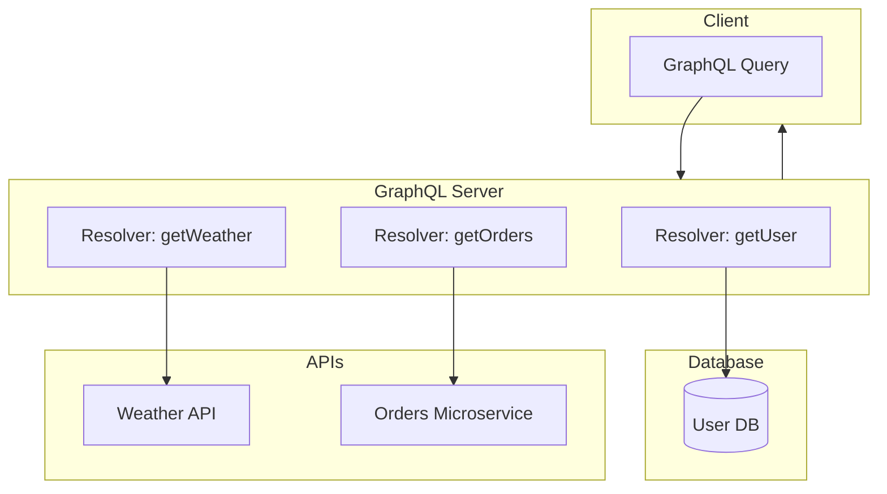
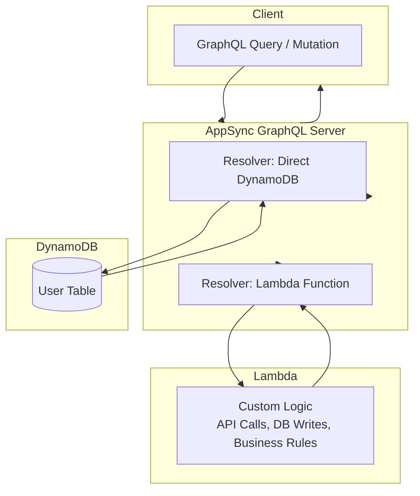

# Design of **simple GraphQL endpoint**  

**Use Case**:
Client wants to fetch information about a user and their posts.

---

### 1. **GraphQL Schema**

```graphql
type User {
  id: ID!
  name: String!
  email: String!
  posts: [Post!]
}

type Post {
  id: ID!
  title: String!
  content: String!
}

type Query {
  getUser(id: ID!): User
}
```

---

### 2. **Query**

```graphql
query {
  getUser(id: "1") {
    name
    email
    posts {
      title
    }
  }
}
```

 This returns **only the fields requested** (name, email, post titles).

---

### 3. **Flow**



---

###  Setup :

* Client sends **GraphQL query**.
* Server resolves it by fetching from DB (or microservices).
* Only **requested fields** are returned (unlike REST, which might return all fields).

---

## Extend the design to include a **mutation use case**.

---

## 1. **GraphQL Schema with Mutation**

```graphql
type User {
  id: ID!
  name: String!
  email: String!
  posts: [Post!]
}

type Post {
  id: ID!
  title: String!
  content: String!
}

type Query {
  getUser(id: ID!): User
}

type Mutation {
  createPost(userId: ID!, title: String!, content: String!): Post
}
```

---

## 2. **Mutation**

```graphql
mutation {
  createPost(userId: "1", title: "New Post", content: "Hello Mutation!") {
    id
    title
  }
}
```

 This creates a new post for the user with `id = 1` and returns the newly created post’s ID and title.

---

## 3. **Mutation Flow**



---

### Functionality :

* **Query** → Fetching existing data (like `getUser`).
* **Mutation** → Modifying/creating data (like `createPost`).

---

## **GraphQL Subscription use case**.

---

## 1. **GraphQL Schema with Subscription**

```graphql
type Subscription {
  postCreated: Post
}
```

---

## 2. **Subscription**

```graphql
subscription {
  postCreated {
    id
    title
    content
  }
}
```

This allows clients (e.g., browsers, apps) to get **real-time updates** whenever a new post is created.
Subscriptions usually work over **WebSockets** instead of plain HTTP.

---

## 3. **Subscription Flow**



---

### Functionality :

* Client subscribes once.
* Server keeps a **persistent connection** (WebSocket).
* On new post creation, server **pushes data** to the client instantly.

---
 **GraphQL doesn’t dictate how the data is fetched** — it’s just a **query language and execution engine**.

When you implement a GraphQL server (say with Apollo, GraphQL-Java, or HotChocolate in .NET), you write **resolvers** for each field. These resolvers decide how to fetch the data.

So GraphQL can:

---

### 🔹 1. Connect Directly to a Database

* If you own the data and have direct DB access.
* Example: `getUser` resolver queries PostgreSQL or MongoDB.

**Flow**:

```
Client → GraphQL Server → Database → Client
```

---

### 🔹 2. Call Other APIs (REST / gRPC / SOAP / Microservices)

* If the data is in another service (e.g., a Users microservice, Payments API).
* GraphQL acts as an **API Gateway** (aggregation layer).

**Flow**:

```
Client → GraphQL Server → Other APIs → Client
```

---

### 🔹 3. Hybrid (Most Common in Real Systems)

* Some resolvers fetch data from a **database**.
* Others fetch from **internal/external APIs**.
* GraphQL stitches everything into one response.

**Flow**:

```
Client → GraphQL Server → { DB + APIs + Cache } → Client
```

---

### Example:

* `getUser` → queries DB.
* `getWeather` → calls external Weather API.
* `getOrders` → calls Orders microservice.

---

 **Three integration options** for GraphQL (Direct DB, API calls, Hybrid).



---

### 🔎 Explanation:

1. **Direct DB** → `getUser` resolver queries **Database**.
2. **API Call** → `getWeather` resolver calls external **Weather API**.
3. **Hybrid** → `getOrders` resolver calls an **Orders Microservice**.
4. GraphQL **stitches results** into **one JSON response**.

---

Got it ✅ Let’s write a **resolver in AWS AppSync**.

In AppSync, resolvers are written using **Velocity Template Language (VTL)** (for direct data sources like DynamoDB, RDS, Lambda) or mapped to **Lambda functions** (for custom logic).

I’ll show you both ways:

---

## 🔹 1. **Resolver with DynamoDB (Direct Integration)**

Suppose we have a schema:

```graphql
type User {
  id: ID!
  name: String!
  email: String!
}

type Query {
  getUser(id: ID!): User
}
```

📌 **Request Mapping Template (getUser.req.vtl)**

```vtl
{
  "version": "2018-05-29",
  "operation": "GetItem",
  "key": {
    "id": { "S": "$ctx.args.id" }
  }
}
```

📌 **Response Mapping Template (getUser.res.vtl)**

```vtl
$util.toJson($ctx.result)
```

✅ This resolver queries DynamoDB directly and returns the user object.

---

## 🔹 2. **Resolver with AWS Lambda (Custom Logic)**

If we want to call another API or add custom business logic:

📌 **Schema**

```graphql
type Mutation {
  createPost(userId: ID!, title: String!, content: String!): Post
}

type Post {
  id: ID!
  title: String!
  content: String!
}
```

📌 **Lambda Function (Node.js Example)**

```javascript
exports.handler = async (event) => {
  console.log("AppSync event:", JSON.stringify(event));

  // Example: create a post in DynamoDB or another API
  const newPost = {
    id: Date.now().toString(),
    title: event.arguments.title,
    content: event.arguments.content,
  };

  // return the new post
  return newPost;
};
```

📌 **Request Mapping Template (createPost.req.vtl)**

```vtl
{
  "version": "2018-05-29",
  "operation": "Invoke",
  "payload": $util.toJson($context)
}
```

📌 **Response Mapping Template (createPost.res.vtl)**

```vtl
$util.toJson($ctx.result)
```

✅ Now AppSync calls Lambda, which can fetch/write data from DBs, REST APIs, or even call external GraphQL.

---

⚡ So in summary:

* **DynamoDB Resolver** → Pure VTL mapping.
* **Lambda Resolver** → More flexibility (API calls, transformations, business logic).

---


 **AppSync Resolver Flow** for both direct DB and Lambda integration:



---

### 🔎 Explanation:

* Client sends a **GraphQL request** to **AWS AppSync**.
* AppSync chooses the correct **resolver** (based on schema).

  * If **direct DynamoDB**, it executes via VTL mapping.
  * If **Lambda**, AppSync invokes Lambda with request payload.
* The result is transformed (via response mapping template) and returned to the client.

---
 


