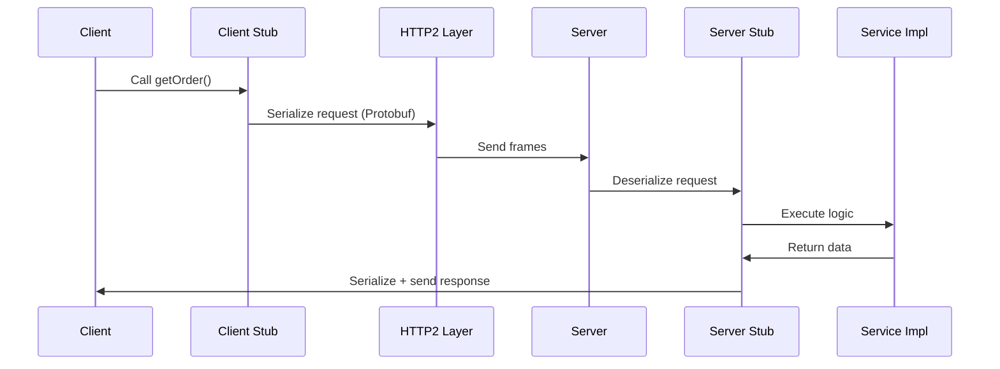

### What is gRPC

gRPC is a high-performance Remote Procedure Call framework designed for service-to-service communication. It uses HTTP/2 for transport, Protocol Buffers for message serialization, and auto-generates client and server code.

### Key Architecture Components

* **HTTP/2 layer**: Manages multiplexing, header compression, and persistent connections.
* **Protobuf compiler (protoc)**: Generates client stubs and server skeletons in Java, Go, Python, etc.
* **gRPC runtime**: Manages marshalling, unmarshalling, flow control, and streaming.
* **Service implementation**: Your application code that handles RPC logic.

### Types of RPC Calls

* **Unary**: One request → one response.
* **Server streaming**: One request → continuous stream of responses.
* **Client streaming**: Stream of requests → one response.
* **Bidirectional streaming**: Both client and server stream data.

### Data Format: Protocol Buffers

Protobuf provides schema-driven, binary serialization. It minimizes network bytes and CPU usage inside the JVM during encoding/decoding compared to JSON parsing.

### Example .proto File

```protobuf
syntax = "proto3";

service OrderService {
  rpc getOrder (OrderRequest) returns (OrderResponse);
}

message OrderRequest {
  string orderId = 1;
}

message OrderResponse {
  string status = 1;
}
```

### Example Java Client (Relevant JVM Components)

```java
ManagedChannel channel = ManagedChannelBuilder
        .forAddress("localhost", 50051)
        .usePlaintext()
        .build(); // JVM creates sockets using java.net APIs

OrderServiceGrpc.OrderServiceBlockingStub stub =
        OrderServiceGrpc.newBlockingStub(channel);

OrderRequest req = OrderRequest.newBuilder()
        .setOrderId("A100")
        .build();

OrderResponse res = stub.getOrder(req); // gRPC runtime serializes via Protobuf
```

JVM networking APIs create TCP connections; gRPC Java runtime handles HTTP/2 framing and Protobuf serialization.

### Mermaid Diagram of gRPC Call



If you want, I can also explain gRPC internal flow at network layer or JVM memory use during serialization.


