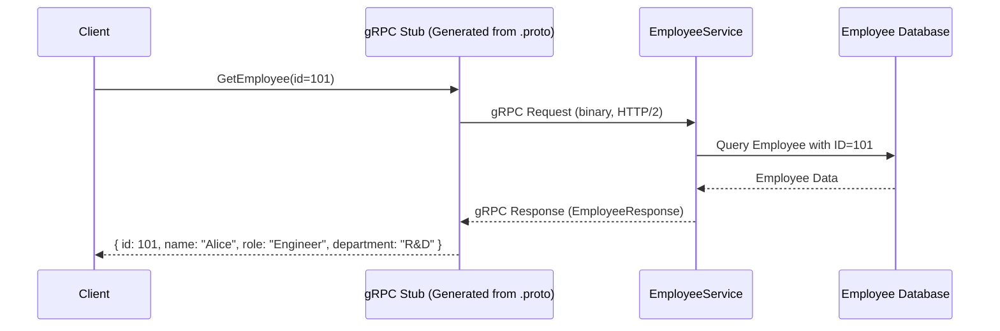

# GRPC

---

# ✅ Use Case: **Employee Service with gRPC**

Suppose we’re building a microservices system for a company.

* A **Client App** (mobile/web) needs employee details.
* Instead of REST, we use **gRPC** for efficient, strongly-typed, high-performance communication.
* gRPC will connect the **Employee Service** (for employee info) and possibly other services like **Department Service**.

---

## 1. **Proto Definition (`employee.proto`)**

```proto
syntax = "proto3";

service EmployeeService {
  rpc GetEmployee (EmployeeRequest) returns (EmployeeResponse);
}

message EmployeeRequest {
  int32 id = 1;
}

message EmployeeResponse {
  int32 id = 1;
  string name = 2;
  string role = 3;
  string department = 4;
}
```

✅ This defines the **gRPC service contract**.

---

## 2. **Flow of Solution**

1. **Client** calls `GetEmployee(id=101)` using gRPC stub.
2. **EmployeeService** receives the request.
3. It queries **Database** (or another microservice).
4. Returns `EmployeeResponse` to client.

---

## 3. **Benefits of gRPC here**

* **Binary & efficient** (uses HTTP/2 + Protocol Buffers).
* **Strong typing** via `.proto` contract.
* **Streaming** supported (useful if we want `ListEmployees` with streaming).
* Works well for **microservice-to-microservice communication**.

---

## 4. **Design Diagram**



---

###  Summary

* **Problem**: Need fast, typed employee lookup service.
* **Solution**: Use **gRPC** with `.proto` definition for contract.
* **Flow**: Client → gRPC Stub → Employee Service → DB → Response.
* **Result**: Efficient, scalable, strongly typed communication.

---


##  Why Put a gRPC Layer in Front of an Existing REST Service?

### 1. **Internal vs External Consumers**

* REST is often kept for **external clients** (web browsers, 3rd party APIs).
* gRPC can be added as a **faster, strongly-typed interface** for **internal microservices**.
* This way, both worlds are served:

  * External → REST (JSON/HTTP1.1, browser-friendly).
  * Internal → gRPC (binary/HTTP2, efficient).

---

### 2. **Migration Path (Legacy → Modern)**

* If your Employee Service started as REST, but now you’re moving toward **microservices using gRPC**, you can **wrap existing REST endpoints with a gRPC facade**.
* Over time, you can refactor the service itself to **native gRPC** without breaking old REST clients.

---

### 3. **Performance Gateway**

* Imagine Employee Service is **heavily used by other services** (Payroll, Attendance, Analytics).
* Adding a gRPC layer in front acts as a **gateway** that translates gRPC calls → REST calls.
* This improves performance **on the client/microservice side** because:

  * gRPC clients are auto-generated.
  * Network traffic is reduced (binary payloads).
  * Clients don’t need to parse big JSON payloads.

---

### 4. **Polyglot Ecosystem**

* Your Employee Service is written in Java (REST), but other services might be in Go, Python, or C#.
* Instead of every team writing a custom REST client, gRPC **auto-generates stubs** for all languages.
* This avoids **client duplication** and mismatches in REST request/response handling.

---

### 5. **Future-Proofing with Streaming**

* REST can’t handle **real-time updates** (like employee status changes, shift assignments, streaming payroll updates).
* A gRPC facade allows you to add **streaming methods** (`SubscribeEmployeeUpdates`) while still calling existing REST APIs under the hood.

---

## 🔎 Summary

Putting a gRPC layer in front of an existing REST Employee Service is useful when:

* You want **internal services to talk in gRPC** (fast, efficient, typed).
* You still need **REST for external clients** (backward compatibility).
* You want a **migration path** toward gRPC without rewriting the existing REST service immediately.
* You need **multi-language client SDKs** auto-generated from `.proto`.
* You plan to add **streaming capabilities** not possible with REST.

---

✅ But if:

* Employee Service is **only called by browsers/external apps** → REST is enough, no need for gRPC.
* You don’t need cross-language, streaming, or performance optimizations → REST is fine.

---

⚡ So in practice, teams often put gRPC in front of REST **only when they have internal microservices that need it**.

---

