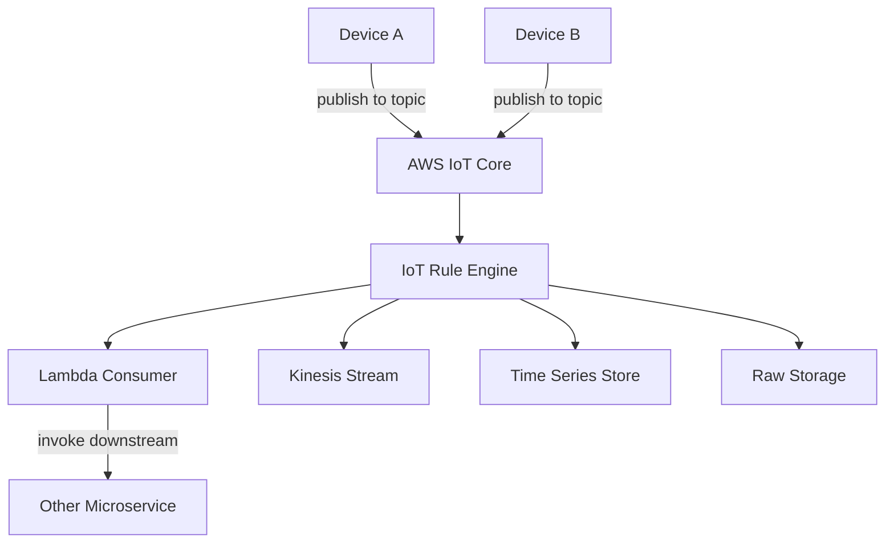
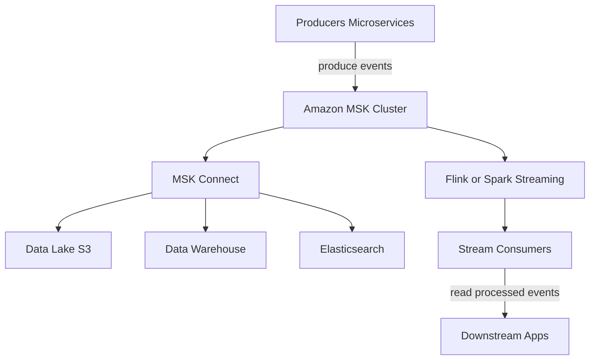
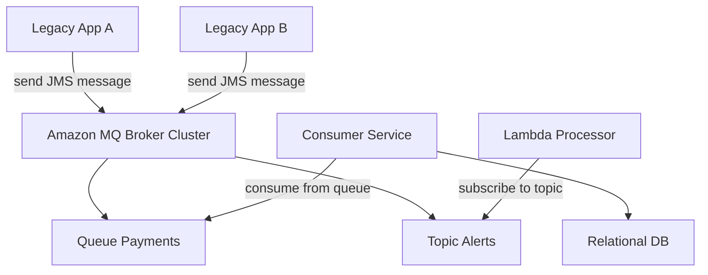

compare **MQTT, Kafka, and ActiveMQ** (aka RabbitMQ-style brokers) **within an AWS stack**, show when to pick each, list pros/cons, and provide three clean Mermaid architecture diagrams (no parentheses in diagram labels so they render cleanly).

---

# At a glance comparison

| Dimension                   |                                     MQTT via AWS IoT Core |                                              Kafka via Amazon MSK |                                                     ActiveMQ via Amazon MQ |
| --------------------------- | --------------------------------------------------------: | ----------------------------------------------------------------: | -------------------------------------------------------------------------: |
| Primary model               |                           Lightweight pub sub for devices |                   Distributed commit log, high throughput pub sub |                                            Broker based queues and pub sub |
| Best for                    |              IoT devices, constrained networks, telemetry |    High throughput streaming, event sourcing, analytics pipelines | Traditional enterprise messaging, JMS, reliable point to point and pub sub |
| Protocols                   |                                          MQTT, WebSockets |                                           Kafka protocol over TCP |                                                AMQP, MQTT, OpenWire, STOMP |
| Managed AWS service         |                                              AWS IoT Core |                                                        Amazon MSK |                                                                  Amazon MQ |
| Message durability          |                 Broker persists if configured, QoS levels |                         Strong durability and retention in topics |                                   Durable queues and durable subscriptions |
| Ordering guarantees         |                     Per topic per client session with QoS |                                   Strong partition level ordering |                                Queue ordering per consumer, broker-managed |
| Scalability                 |       Scales for many lightweight clients, broker managed |                           Scales horizontally for huge throughput |          Scales vertically with broker clusters, easier for moderate scale |
| Latency                     |        Very low per message, optimized for small payloads |                   Low for batch streams, optimized for throughput |                Low to moderate, designed for reliable enterprise messaging |
| Exactly once / transactions |        QoS 2 semantics, not full distributed transactions | Supports exactly once semantics with idempotence and transactions |                             Supports JMS transactions and acknowledgements |
| Use case summary            | Telemetry, device control, mobile push with low bandwidth |            Event streaming, ETL, analytics, real time ML features |      Legacy apps, banking, enterprise integration, transactional workflows |

---

# When to choose which (rules of thumb)

* Use **AWS IoT Core with MQTT** when you have many edge devices, mobile or constrained networks, need tiny payloads, low battery usage, and simple pub/sub topics.
* Use **Amazon MSK (Kafka)** for high throughput pipelines, event sourcing, analytics, stream processing, and when you need long retention and strong ordering/partitioning.
* Use **Amazon MQ (ActiveMQ)** when you need JMS compatibility, strict enterprise messaging semantics, SOAP or legacy clients, or transactional queues with broker-managed acknowledgements.

---

# Common integration patterns on AWS

* Bridge IoT to analytics: AWS IoT Core rules can route MQTT messages to Kinesis, Lambda, S3, or MSK for downstream processing.
* Stream processing: MSK producers push events into topics, stream processors like Flink or MSK Connect sink to S3 Redshift or ElasticSearch.
* Enterprise integration: Amazon MQ for JMS clients, connect to Lambda or EC2 consumers, or use connectors to sync with RDS or S3.

---

# Architecture diagrams

### 1) MQTT on AWS IoT Core for IoT telemetry and control

Notes

* Devices use MQTT or MQTT over WebSocket to connect to AWS IoT Core.
* IoT Rule Engine routes messages to Lambda, Kinesis, S3, DynamoDB, or MSK.
* Use Device Shadows and Jobs in IoT Core for state management and OTA updates.

---

### 2) Event streaming with Amazon MSK for analytics and ML

Notes

* MSK provides durable, partitioned topics with configurable retention.
* Stream processing computes features and writes back to feature store or other topics.
* Use MSK Connect or Kafka Connect connectors to sink/load to S3 Redshift ElasticSearch etc.

---

### 3) Enterprise messaging with Amazon MQ using ActiveMQ

Notes

* Amazon MQ provides standard protocols like AMQP MQTT OpenWire and supports JMS clients.
* Good when you must support older enterprise clients or require JMS transactions.

---

# Feature and operational tradeoffs

* **Operational complexity**

  * MSK requires cluster planning and Kafka expertise but AWS MSK manages brokers.
  * IoT Core is fully managed and handles millions of devices with built-in auth, device registry.
  * Amazon MQ is managed but still requires broker tuning for high scale.

* **Security**

  * IoT Core integrates with AWS IoT policies, mutual TLS for devices, and AWS Cognito for apps.
  * MSK supports VPC, IAM for MSK APIs, encryption in transit and at rest, and ACLs via Kafka.
  * Amazon MQ supports VPC, TLS, user authentication, and IAM access.

* **Throughput and retention**

  * Kafka excels at very high throughput and long retention windows.
  * MQTT messages are small and optimized for many clients but not for long retention in the broker by default.
  * ActiveMQ is suited for reliable delivery and transactional semantics rather than huge scale retention.

---

# Example decision matrix (short)

* Many constrained devices sending telemetry, need native device management → **AWS IoT Core with MQTT**.
* High volume event streaming, analytics, multiple consumers, long retention → **Amazon MSK**.
* Enterprise systems with JMS clients, transactional queues, and protocol compatibility needs → **Amazon MQ**.

---

If you want, I can:

* Produce sample IaC snippets for each pattern (CloudFormation or Terraform).
* Show how to route IoT Core messages into an MSK topic via an IoT Rule.
* Provide a small producer/consumer code example for each technology.

Which of those would you like next?
