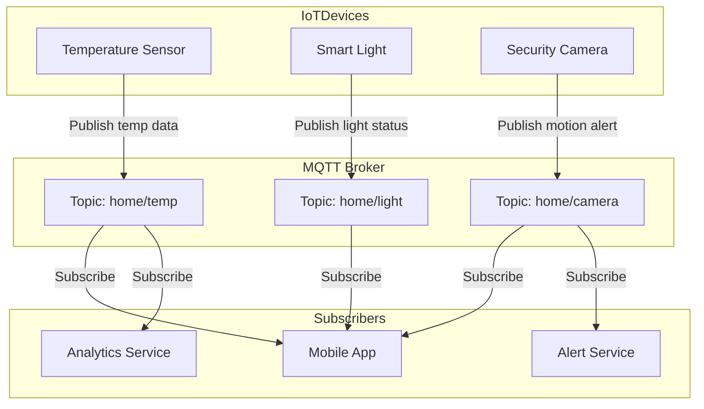

# MQTT

**MQTT (Message Queuing Telemetry Transport)** is a **lightweight publish-subscribe messaging protocol** designed for **low-bandwidth, high-latency, or unreliable networks**.

* Runs on **TCP/IP** (sometimes WebSockets).
* Uses a **Broker** (like Mosquitto, EMQX, HiveMQ).
* Clients are either **Publishers** (send messages) or **Subscribers** (receive messages).
* Messages are organized into **Topics** (like `/home/livingroom/temp`).
* Very efficient → small header (\~2 bytes), ideal for IoT, sensors, real-time apps.

---

# Use Cases 

Imagine we’re building a **Smart Home System** with hundreds of IoT devices:

* Devices (thermostats, lights, security cameras) send **status updates**.
* Mobile apps need to **receive real-time data** (temperature, motion alerts).
* Network may be **unstable or low-bandwidth** (WiFi, 4G, etc).

Using **HTTP REST** here is inefficient because:

* Each device would make frequent POST requests → high overhead.
* Polling wastes bandwidth and battery.

---

# ✅ Why MQTT is Best Fit Here

* **Publish/Subscribe decoupling** → devices don’t need to know each other, just the broker.
* **Low bandwidth & power-efficient** → suitable for sensors and mobile apps.
* **QoS levels** allow reliable delivery even if the network is unstable.
* **Scalable** → thousands of devices can connect to one broker.

---

# ✅ System Design with MQTT (Smart Home Example)



---

# ✅ Flow Explanation

1. **Temperature Sensor** publishes updates to `home/temp`.
2. **Smart Light** publishes status to `home/light`.
3. **Security Camera** publishes alerts to `home/camera`.
4. **Mobile App** subscribes to all three topics to show live updates.
5. **Analytics Service** subscribes to `home/temp` for long-term trends.
6. **Alert Service** subscribes to `home/camera` to send push notifications.

---

# ✅ Example MQTT Code (Python with Paho MQTT)

```python
import paho.mqtt.client as mqtt

# Callback when message received
def on_message(client, userdata, msg):
    print(f"Received {msg.topic}: {msg.payload.decode()}")

client = mqtt.Client()
client.on_message = on_message

client.connect("broker.hivemq.com", 1883)  # Public MQTT broker

# Subscribe to temperature updates
client.subscribe("home/temp")

# Publish a test temperature
client.publish("home/temp", "25°C")

client.loop_forever()
```

---

✅ **Summary**:

* MQTT is **best fit** for **IoT, real-time messaging, and unreliable networks**.
* It solves the problem of **low bandwidth + high device count** with efficient **pub/sub architecture**.
* Widely used in **smart homes, connected cars, industrial IoT, and messaging apps**.

---

👉 Do you want me to **compare MQTT with Kafka & RabbitMQ** (when to use each) for a deeper perspective?
