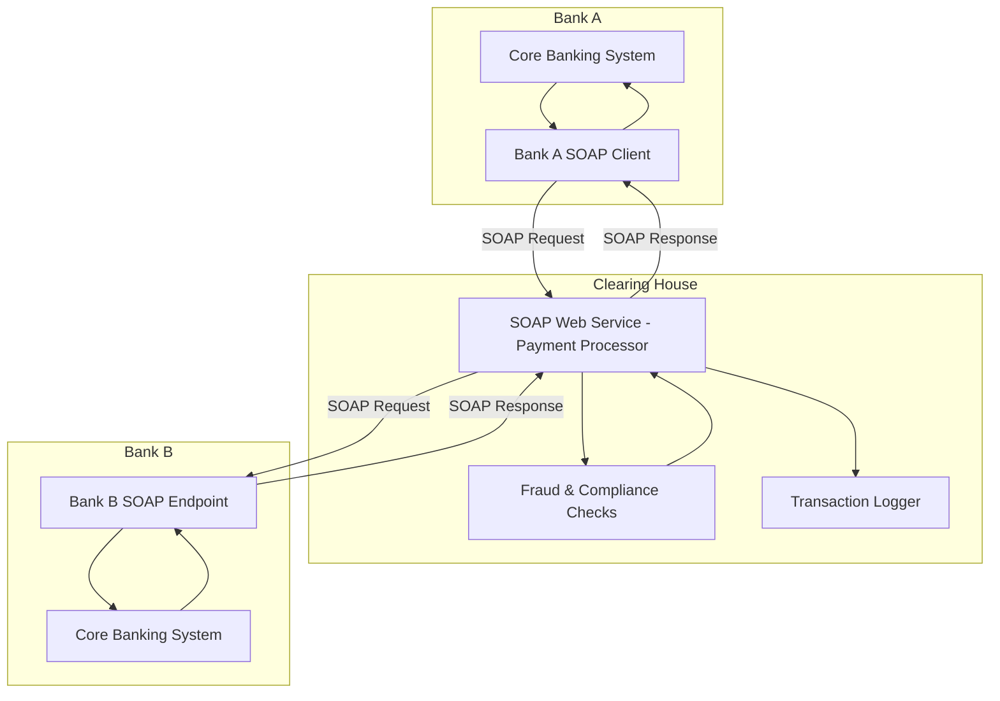

Most modern systems prefer **REST** or **gRPC**, but **SOAP APIs** are still the best fit in certain **enterprise-grade scenarios** where strict standards, reliability, and contracts are critical.

---

#  Use Case: **Bank-to-Bank Money Transfer (SWIFT-like System)**

### Why SOAP is the Best Fit here

1. **Strict Contracts (WSDL)** – Financial systems need strongly typed messages with a well-defined contract.
2. **ACID Compliance** – SOAP works well with **transaction support** (e.g., two-phase commit).
3. **Security (WS-Security)** – Built-in message signing, encryption, and integrity guarantees.
4. **Reliability (WS-ReliableMessaging)** – Ensures delivery in case of retries/failures.
5. **Regulatory Compliance** – SOAP is widely accepted in **banking, healthcare, insurance**.

---

#  Solution Flow

1. **Bank A Core System** initiates a fund transfer.
2. **Bank A Payment Gateway** calls a **SOAP API** exposed by the **Clearing House**.
3. **Clearing House SOAP Service** validates transaction details, applies fraud checks, compliance rules.
4. **Clearing House** routes the request to **Bank B SOAP Endpoint**.
5. **Bank B Core System** confirms transfer → sends SOAP Response.
6. **Acknowledgments** and **status updates** are returned with guaranteed delivery.

---

# Design

---

# Steps

1. **Bank A → Clearing House**: SOAP request sent with fund transfer details (account number, amount, reference ID).
2. **Validation & Compliance**: Clearing house checks fraud patterns, AML/KYC compliance.
3. **Transaction Logging**: Every step logged for audit.
4. **Clearing House → Bank B**: SOAP request forwarded.
5. **Bank B → Clearing House**: Sends confirmation (success/failure) in SOAP response.
6. **Clearing House → Bank A**: Final status returned.

---

SOAP wins here because:

* **Financial transactions need strong guarantees** (not just “best effort” like REST).
* **Interoperability** between old mainframe systems and modern services.
* **Legal requirements** for audit logging and message integrity.

---

