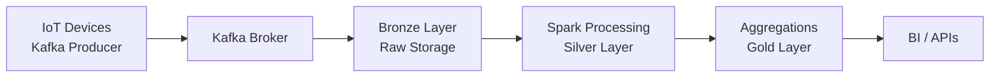

Lambda and Kappa are two popular architectures used for processing and analyzing large-scale data in big data systems. They differ in how they handle real-time and batch data processing.

---

### **Lambda Architecture**
Lambda architecture is a design pattern that addresses the challenge of building robust, distributed systems for processing large volumes of data in real time.

#### **Key Components:**
1. **Batch Layer**: 
   - Processes historical data in batches.
   - Ensures accuracy and generates a **master dataset** (immutable and append-only).
   - Uses frameworks like Hadoop, Spark, or similar.

2. **Speed Layer**: 
   - Processes data in real time or near real time for low-latency requirements.
   - Ensures freshness by handling incremental updates.
   - Uses frameworks like Apache Storm, Apache Flink, or Spark Streaming.

3. **Serving Layer**: 
   - Combines outputs from the batch and speed layers.
   - Provides query functionality and serves pre-computed results to applications.
   - Uses NoSQL databases or key-value stores like HBase, Cassandra, or Elasticsearch.

#### **Workflow:**
- Data is ingested into both the batch and speed layers.
- The batch layer processes the data and updates the master dataset periodically.
- The speed layer handles recent data for real-time insights.
- The serving layer merges the results for queries.

#### **Advantages:**
- Fault-tolerance due to the batch layer's reliability.
- Supports both real-time and batch analytics.
- Ensures data consistency through re-computation in the batch layer.

#### **Disadvantages:**
- Complex to implement and maintain (dual pipelines).
- Higher operational cost.

---

### **Kappa Architecture**
Kappa architecture is a simplified alternative to Lambda, designed for systems where real-time processing is the primary requirement.

#### **Key Components:**
1. **Stream Processing**:
   - Processes all incoming data as a continuous stream.
   - Uses a unified processing pipeline for both real-time and historical data.
   - Relies on frameworks like Kafka Streams, Apache Flink, or Spark Streaming.

2. **Serving Layer**:
   - Similar to Lambda's serving layer, it serves processed data for querying.
   - Often uses databases optimized for real-time updates, such as Elasticsearch or Cassandra.

#### **Workflow:**
- Data flows through a single pipeline where it is processed in real time.
- Historical data is replayed from the log (e.g., Kafka) if reprocessing is needed.

#### **Advantages:**
- Simpler architecture due to a single processing pipeline.
- Easier to implement and maintain compared to Lambda.
- Real-time focus with the ability to reprocess data if required.

#### **Disadvantages:**
- Not as suitable for systems requiring complex batch processing.
- Data consistency depends on the streaming framework.

---

### **Comparison:**

| Feature                | Lambda Architecture        | Kappa Architecture         |
|------------------------|----------------------------|----------------------------|
| **Layers**             | Batch + Speed + Serving   | Stream + Serving           |
| **Data Processing**    | Batch + Real-Time         | Unified Real-Time          |
| **Complexity**         | More complex              | Simpler                   |
| **Use Cases**          | Batch + Real-Time Needs   | Primarily Real-Time Needs  |
| **Reprocessing**       | Batch re-computation      | Stream replay             |

### **When to Use?**
- Use **Lambda Architecture** if you need both batch and real-time processing for applications like reporting dashboards or fraud detection.
- Use **Kappa Architecture** if your system primarily needs real-time processing or has minimal need for historical reprocessing.

- Beyond Lambda and Kappa, there are several other big data architectures designed to handle different use cases and challenges in processing, storing, and analyzing large-scale data. Here's an overview of some key architectures:

---

### 1. **Zeta Architecture**
   - **Purpose**: Evolved from Lambda architecture to unify batch and stream processing.
   - **Key Features**:
     - Avoids the dual-processing pipeline of Lambda by focusing on event-driven architectures.
     - Relies on a central data log (e.g., Apache Kafka) to store immutable events.
     - Both batch and real-time systems consume data from the same log, ensuring consistency.
   - **Use Cases**:
     - Large-scale event-driven applications.
     - Systems requiring both historical reprocessing and real-time updates.

---

### 2. **Data Lake Architecture**
   - **Purpose**: Designed for storing vast amounts of structured, semi-structured, and unstructured data.
   - **Key Features**:
     - Centralized storage for raw data in its native format.
     - Often built on scalable storage systems like Hadoop HDFS, Amazon S3, or Azure Data Lake.
     - Can integrate with various processing frameworks for analytics (e.g., Apache Spark, Presto).
   - **Use Cases**:
     - Data warehousing.
     - Machine learning and advanced analytics.

---

### 3. **Event-Driven Architecture (EDA)**
   - **Purpose**: Focuses on processing events as they occur in real time.
   - **Key Features**:
     - Data is processed as discrete events (e.g., clicks, transactions, IoT sensor data).
     - Uses message brokers like Kafka, RabbitMQ, or Pulsar.
     - Event consumers and producers are decoupled for flexibility.
   - **Use Cases**:
     - IoT applications.
     - Real-time user activity tracking.

---

### 4. **Microservices-Based Data Architecture**
   - **Purpose**: Distributes data processing responsibilities across microservices.
   - **Key Features**:
     - Each microservice handles a specific part of the data processing pipeline.
     - Uses APIs or message brokers for communication.
     - Encourages modular, scalable systems.
   - **Use Cases**:
     - Cloud-native applications.
     - Systems requiring agility and scalability.

---

### 5. **Data Mesh Architecture**
   - **Purpose**: Decentralizes data ownership and processing responsibilities.
   - **Key Features**:
     - Data is treated as a product, owned and managed by individual teams.
     - Centralized governance ensures data quality and standards.
     - Encourages domain-driven design.
   - **Use Cases**:
     - Organizations with diverse data domains.
     - Decentralized analytics systems.

---

### 6. **Serverless Data Architecture**
   - **Purpose**: Focuses on building big data systems using serverless cloud services.
   - **Key Features**:
     - Eliminates the need for infrastructure management.
     - Relies on managed services like AWS Lambda, Google Cloud Functions, or Azure Functions for data processing.
     - Highly scalable and cost-efficient for variable workloads.
   - **Use Cases**:
     - Ad-hoc big data processing.
     - Event-driven pipelines.

---

### 7. **Streaming-First Architecture**
   - **Purpose**: Optimized for continuous processing of real-time data streams.
   - **Key Features**:
     - Prioritizes streaming data ingestion and processing.
     - Often integrates with Apache Kafka, Flink, or Pulsar.
     - Can handle unbounded datasets effectively.
   - **Use Cases**:
     - Financial transactions.
     - Live monitoring and alerting systems.

---

### 8. **Shared-Nothing Architecture**
   - **Purpose**: Scales out by distributing data and computation across independent nodes.
   - **Key Features**:
     - No shared storage or resources between nodes.
     - Ensures fault tolerance and scalability.
     - Popular in MPP (Massively Parallel Processing) systems like Amazon Redshift, Snowflake.
   - **Use Cases**:
     - Distributed database systems.
     - Large-scale OLAP workloads.

---

### 9. **Federated Data Architecture**
   - **Purpose**: Enables querying and combining data across multiple independent systems.
   - **Key Features**:
     - Data remains in its original location, avoiding duplication.
     - Middleware or virtual layers aggregate and process queries.
     - Examples include Presto, Dremio.
   - **Use Cases**:
     - Cross-database analytics.
     - Multi-cloud environments.

---

### 10. **Hybrid Architecture**
   - **Purpose**: Combines on-premises and cloud systems to handle diverse workloads.
   - **Key Features**:
     - Integrates data from on-prem and cloud systems.
     - Allows data processing to occur where it is most efficient.
   - **Use Cases**:
     - Enterprises transitioning to the cloud.
     - Systems requiring low-latency local processing with cloud scalability.

---

### What Is Medallion Data Architecture

Medallion architecture is a **layered data design** that incrementally improves data quality and structure as data flows from **raw ingestion to business-ready analytics**. It is commonly used in data lakes and lakehouses.

---

### Core Layers Overview

The architecture is organized into **Bronze, Silver, and Gold layers**, each with a clear responsibility and data contract.

---

### Bronze Layer (Raw Data)

Purpose: **Ingest data as-is with minimal transformation**

Characteristics:

* Append-only
* Schema-on-read
* Full fidelity of source data
* Used for replay and audits

Example use case:
IoT devices sending telemetry via Kafka

Components involved:

* Kafka producer (device gateway)
* Kafka broker (log storage)
* Kafka consumer (ingestion service)
* JVM (deserialization)
* Linux kernel (network I/O, epoll)
* Object store API (S3 / HDFS)

Example schema:

```sql
device_id STRING
event_ts  TIMESTAMP
payload   JSON
ingest_ts TIMESTAMP
```

Pseudo ingestion logic:

```java
KafkaConsumer.poll()
  -> JVM deserializes bytes
  -> write raw JSON to bronze storage
```

---

### Silver Layer (Cleansed & Enriched Data)

Purpose: **Validate, clean, deduplicate, and normalize data**

Characteristics:

* Structured schema
* Data quality checks
* Deduplication
* Enrichment with reference data

Example use case:
Validating IoT signal ranges and removing duplicates

Components involved:

* Spark executor (data processing)
* JVM (Spark runtime)
* Kafka consumer (optional reprocessing)
* PostgreSQL CBO (query optimization on lookup tables)
* Linux file system cache

Example transformation:

```sql
SELECT
  device_id,
  event_ts,
  CAST(payload->>'temp' AS DOUBLE) AS temperature
FROM bronze_events
WHERE payload->>'temp' IS NOT NULL
```

Pseudo processing flow:

```text
Spark task reads bronze files
-> JVM executes transformations
-> invalid records filtered
-> output written to silver tables
```

---

### Gold Layer (Business-Ready Data)

Purpose: **Optimized data for analytics and reporting**

Characteristics:

* Aggregated
* Denormalized
* Query-optimized
* SLA-backed datasets

Example use case:
Hourly average temperature per device

Components involved:

* Spark SQL engine
* PostgreSQL / Greenplum CBO
* BI query engine
* JVM (SQL execution)
* Linux memory manager (page cache)

Example aggregation:

```sql
SELECT
  device_id,
  date_trunc('hour', event_ts) AS hour,
  AVG(temperature) AS avg_temp
FROM silver_signals
GROUP BY device_id, hour
```

---

### Data Flow Diagram



---

### Data Quality Responsibility by Layer

* Bronze: None (trust the source)
* Silver: Validation, deduplication, normalization
* Gold: Business rules, KPIs, metrics correctness

---

### Schema Evolution Handling

* Bronze: Store raw JSON, no schema enforcement
* Silver: Versioned schemas, backward compatibility
* Gold: Controlled schema changes only

---

### Performance Optimization Strategy

* Bronze: Sequential writes, no indexes
* Silver: Partitioning, minimal indexes
* Gold: Aggregations, columnar formats, heavy indexing

---

### Kubernetes Deployment Mapping

Components involved:

* kubelet mounts volumes and manages pods
* Spark driver pod coordinates jobs
* Spark executor pods process partitions
* Container runtime executes JVM processes

Execution flow:

```text
kubelet -> starts Spark executor container
-> JVM runs task
-> reads partition
-> writes transformed data
```

---

### Kafka Role in Medallion Architecture

* Kafka producer: emits raw events
* Kafka broker: durable commit log
* Kafka consumer: feeds Bronze or Silver pipelines
* Consumer group: enables horizontal scaling

---

### Oracle / PostgreSQL Usage Pattern

* Bronze: rarely queried
* Silver: validation joins using CBO
* Gold: star-schema style analytics
* CBO chooses hash joins and parallel scans

---

### Why Medallion Architecture Works

* Clear separation of concerns
* Easy reprocessing from Bronze
* Scales with data volume
* Enables governance and observability
* Aligns with batch and streaming systems

---

### Common Mistakes

* Applying business logic in Bronze
* Skipping Silver and going straight to Gold
* Over-aggregating Gold data
* Not defining data contracts per layer

---

### When Medallion Architecture Is Best

* Streaming + batch workloads
* IoT, clickstream, logs
* Analytics-heavy platforms
* Regulated data environments

---

### Key Takeaway

Medallion architecture provides **predictable data quality, scalability, and operational clarity** by progressively refining data from raw events to business-grade insights using well-defined layers and responsibilities.


### Choosing the Right Architecture
The choice of architecture depends on factors like latency requirements, data size, system complexity, and operational constraints. A thoughtful design ensures scalability, reliability, and efficiency tailored to your big data application's needs.
