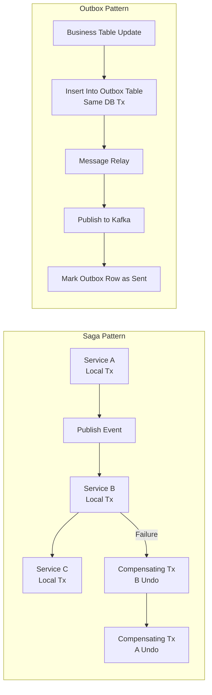

Great question! Both **Outbox Pattern** and **Two-Phase Commit (2PC)** are strategies for maintaining **data consistency across multiple systems**, especially in **distributed architectures** like microservices. But they differ significantly in how they work, their trade-offs, and when they should be used.

---

### **Two-Phase Commit (2PC)**

**What it is:**
A protocol used in distributed transactions to ensure **atomicity** across multiple resources (like databases, message queues, etc.).

#### **Phases:**
1. **Prepare Phase**: Each participant (database, etc.) prepares to commit and responds "yes" or "no".
2. **Commit Phase**: If all respond "yes", the coordinator tells everyone to commit. Otherwise, it tells everyone to rollback.

#### **Pros:**
- Guarantees strong consistency (ACID compliant).
- Simple to reason about for small systems.

#### **Cons:**
- **Blocking**: If the coordinator crashes, resources are locked until recovery.
- **Scalability**: Not suitable for high-throughput systems.
- **Limited support**: Not all systems (like Kafka, NoSQL DBs) support it well.

#### **Use case:**
- Systems needing strict consistency (e.g., bank transfers).

---

### **Outbox Pattern**

**What it is:**
Instead of coordinating multiple systems in a single transaction, each service writes events/messages to an **Outbox table** in its **own database** along with the main business data (in the same DB transaction). Then a separate process **reads from the Outbox** and publishes the events to the message broker.

#### **How it works:**
1. Service A writes data + event to Outbox table (same DB transaction).
2. A separate thread/process reads from Outbox and sends it to Kafka/RabbitMQ/etc.
3. Marks the event as "sent".

#### **Pros:**
- Decouples services; no distributed transactions.
- Works with eventual consistency.
- Scales well in microservices.

#### **Cons:**
- More implementation complexity (Outbox processing, deduplication).
- Eventual consistency, not real-time.

#### **Use case:**
- Microservices communicating over Kafka or RabbitMQ.
- High-throughput systems that don’t require strong consistency.

---

### **Comparison Table**

| Feature                      | Two-Phase Commit (2PC) | Outbox Pattern                |
|-----------------------------|------------------------|-------------------------------|

| Type                        | Synchronous            | Asynchronous (eventual)       |
| Consistency                 | Strong (ACID)          | Eventual                      |
| Performance                | Slower (blocking)      | High-throughput               |
| Failure Handling            | Complex (coordinator)  | Simpler (retry mechanism)     |
| Scalability                 | Poor                   | Good                          |
| Use Case                    | Critical financial ops | Event-driven architectures    |

---

### **Code-level Example:**

**Outbox Pattern (Spring Boot + JPA):**

```java
@Transactional
public void placeOrder(Order order) {
    orderRepository.save(order);
    outboxRepository.save(new OutboxEvent("OrderPlaced", order));
}
```

A separate scheduler will poll the Outbox table and push events to Kafka.

---

### **Summary**

- **Use 2PC** for **strong consistency** in **monolithic or tightly coupled** systems.
- **Use Outbox** for **eventual consistency** in **distributed/microservices** architectures with **message queues**.

Let me know if you want a full working example of either in Spring Boot or a comparison in code.


Below is a **clean, concise, production-grade comparison** of **Saga Pattern vs Outbox Pattern**, including **when to use which**, **internal mechanics**, **Spring Boot implementation details**, and a **Mermaid architecture diagram**.

---

## ### Definition

### ### Saga Pattern

A **distributed transaction pattern** where a long business transaction is broken into local transactions.
Each service performs a step and publishes an event.
If a step fails → a **compensating action** runs to undo prior work.

Used for **orchestration** or **choreography** across multiple microservices.

---

### ### Outbox Pattern

A pattern ensuring **reliable delivery of events** produced inside a local transaction by storing them in an **outbox table** and letting a separate **Message Relay** publish them to Kafka, SNS, SQS, etc.

Guarantees **atomicity of database write + event publish**.

---

## ### Purpose (Side-by-side)

| Concern                               | Saga                | Outbox  |
| ------------------------------------- | ------------------- | ------- |
| Business workflow across services     | Yes                 | No      |
| Distributed transaction               | Yes                 | No      |
| Data consistency across microservices | Yes                 | Partial |
| Guaranteed event publishing           | No (without Outbox) | Yes     |
| Undo/compensation                     | Yes                 | No      |
| Solves dual-write problem             | No                  | Yes     |

---

## ### Core Problems They Solve

### ### Saga solves:

* Multi-step business transactions
* Workflow across heterogenous services
* Avoids 2PC
* Compensation on failures

### ### Outbox solves:

* Dual-write problem (DB + Kafka publish)
* Event loss
* Event duplication
* Transactional consistency

---

## ### How They Work

### ### Saga (Orchestration example)

1. Order Service → Create Order (PENDING)
2. Orchestrator sends command to Payment
3. Payment Service → charges customer
4. Inventory Service → reserves items
5. Shipping → prepares shipment
6. Success → Order CONFIRMED
7. Failure in any step → rollback using compensating events

**Components:**

* Saga Orchestrator (Spring Boot)
* Local transactions in each service
* Compensation handlers
* Event messages (Kafka)

---

### ### Outbox Pattern

1. Application updates business tables
2. Same DB transaction inserts an event row into `outbox_event`
3. A background relay (Debezium / Scheduler / Kafka Connector) picks the event
4. Publishes it to Kafka/SQS
5. Marks the outbox row as sent or deletes it

**Components:**

* Outbox table
* Relay/Connector
* Idempotent consumer

---

## ### When to Use What

### ### Use Saga When:

* You have **business workflows** involving multiple services
* Failure requires **compensation**
* You need to coordinate multiple steps
* Example: Order → Payment → Inventory → Shipping

### ### Use Outbox When:

* A single service updates state **and** must publish an event reliably
* You need **atomic DB + event publish**
* Example: Order created → publish "OrderCreated" to Kafka

### ### When to use **Both together**

Most real systems combine them:

* **Saga** manages the business workflow
* **Outbox** ensures the events sent during each local transaction are reliably emitted

This is the correct architecture in modern microservices.

---

## ### Mermaid Diagram (Side-by-side Flow)



---

## ### Spring Boot Implementation (Short & Clear)

### ### Saga Step Method

```java
@Transactional
public void reserveInventory(Order order) {
    inventoryRepository.reserve(order.getItems());
    domainEventPublisher.publish(new InventoryReservedEvent(order.getId()));
}
```

### ### Outbox Insert (Atomic)

```java
@Transactional
public void createOrder(Order o) {
    orderRepo.save(o);
    outboxRepo.save(new OutboxEvent("OrderCreated", o));
}
```

---

## ### Key Differences (Super Concise)

| Topic                    | Saga                       | Outbox               |
| ------------------------ | -------------------------- | -------------------- |
| Transaction scope        | Multi-service              | Single service       |
| Involves workflow logic  | Yes                        | No                   |
| Deals with consistency   | Across services            | Within one service   |
| Compensating actions     | Required                   | Not applicable       |
| Event ordering guarantee | No                         | Yes (per event type) |
| Delivery guarantees      | Saga depends on broker     | Outbox is guaranteed |
| Pattern classification   | Orchestration/Choreography | Data consistency     |

---

## ### Final One-Line Summary

**Saga = How services coordinate a workflow.**
**Outbox = How a service publishes events reliably.**

They solve totally different problems but are usually combined.

---

If you want, I can also generate:

* A **full Spring Boot project structure** for Saga vs Outbox
* A **Kafka-based Saga Orchestrator** with real code
* A **Debezium Outbox Connector configuration** for production
