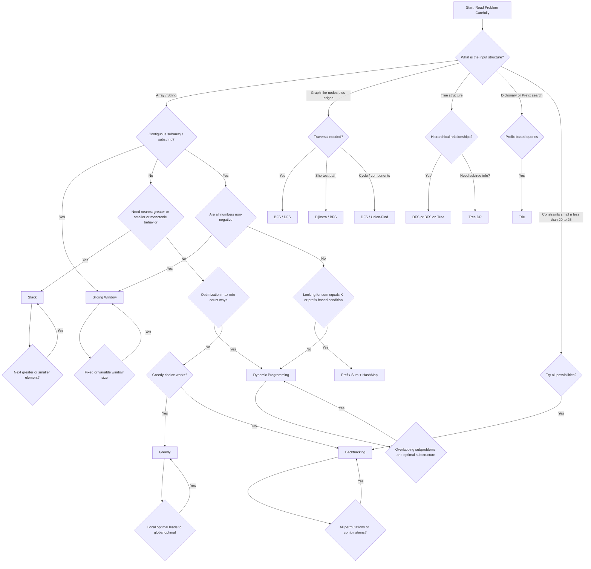

Here’s a clean Mermaid decision tree you can use to decide which DSA technique fits a problem based on clues, constraints, and patterns:


---

How to actually use this in interviews

Instead of memorizing the tree, map keywords → technique:

“Subarray / substring / longest window” → Sliding Window

“Next greater/smaller / histogram / monotonic” → Stack

“All combinations / permutations / choices” → Backtracking

“Min/Max with overlapping work” → DP

“Take best at each step” → Greedy

“Connections / shortest path / network” → Graph

“Hierarchy / parent-child” → Tree

“Prefix search / autocomplete” → Trie


---

If you want, I can turn this into a **1-page cheat sheet + 50 real problem mappings (Amazon-style)** so you can quickly identify patterns during OA.


# Data Structure and Algorithms

- [Array](array)
- [String](string)
- [Linked List](linked_list)
- [Heap](heap/algorithms.md)
- [Tree](tree)
- [Graph](graph)

# Analysis 

---

# 🔎 1. A Priori Analysis (Before Execution)

* **Definition**: Analysis of an algorithm’s efficiency **theoretically before implementation or execution**.
* Focuses on:

  * **Time Complexity** → number of steps as a function of input size `n`.
  * **Space Complexity** → memory usage as a function of `n`.

👉 It is **machine-independent**.
We use mathematical models (Big-O, Big-Ω, Big-Θ) to describe growth.

### Example (Python)

Let’s analyze **linear search** *a priori*.

```python
def linear_search(arr, target):
    for i in range(len(arr)):   # loop runs at most n times
        if arr[i] == target:   # constant time comparison
            return i
    return -1
```

**A Priori Analysis:**

* Best case → `O(1)` (target at first position)
* Worst case → `O(n)` (target at last position or not present)
* Space complexity → `O(1)` (no extra space except a few variables)

So, *before running code*, we know time grows linearly.

---

# 🔎 2. A Posteriori Analysis (After Execution)

* **Definition**: Analysis of an algorithm’s efficiency **after implementing and executing it** on real hardware.
* Focuses on:

  * **Actual running time** (in seconds, milliseconds, etc.)
  * **Actual memory usage**
* Depends on:

  * Input size
  * Hardware (CPU speed, cache, RAM)
  * Compiler/interpreter

👉 It is **machine-dependent** and relies on experimental results.

### Example (Python)

Let’s measure linear search execution time using `time` module.

```python
import time
import random

def linear_search(arr, target):
    for i in range(len(arr)):
        if arr[i] == target:
            return i
    return -1

# Prepare data
n = 10**6
arr = list(range(n))
target = n - 1   # worst case

# A Posteriori analysis
start = time.time()
result = linear_search(arr, target)
end = time.time()

print("Found at index:", result)
print("Execution time (seconds):", end - start)
```

Sample output (depends on your machine):

```
Found at index: 999999
Execution time (seconds): 0.15
```

This gives us **empirical evidence** about performance.

---

# ✅ Comparison Table

| Feature            | A Priori Analysis                       | A Posteriori Analysis                       |
| ------------------ | --------------------------------------- | ------------------------------------------- |
| When done          | Before execution (theoretical)          | After execution (experimental)              |
| Basis              | Mathematical model, asymptotic analysis | Actual execution on hardware                |
| Output             | Big-O, Big-Ω, Big-Θ (growth functions)  | Actual running time, memory usage           |
| Machine dependency | Independent                             | Dependent (differs across machines)         |
| Example in Python  | Analyzing loop count in code            | Measuring execution time with `time` module |

---

✅ In short:

* **A Priori** → Predict performance before running code (theory).
* **A Posteriori** → Measure performance after running code (experiment).

---

Would you like me to also give an **example where a priori analysis suggests two algorithms are similar (both O(n log n)), but a posteriori analysis shows one is much faster in practice**? That’s often used to explain why both analyses are important.


* Topics
- [Binary Search Tree](binary_search_tree)
