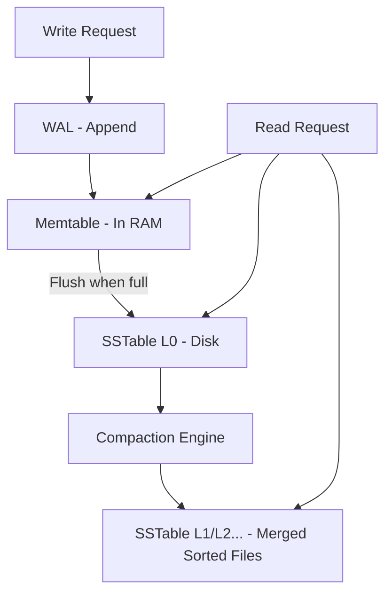
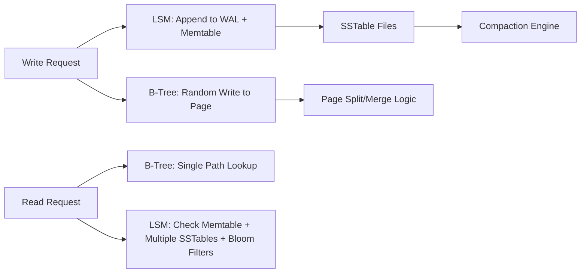

### What is an LSM Tree (Log-Structured Merge Tree)

An **LSM Tree** is a **write-optimized** data structure used in modern databases to handle **very high write throughput** efficiently.
It is the core storage engine for systems like:

* Apache Cassandra
* RocksDB / LevelDB
* ScyllaDB
* Elasticsearch (for indexing layer)
* HBase
* Kafka Streams state stores

### Core Idea

Instead of writing directly to disk structures like a B-Tree, an LSM tree:

1. **Buffers writes in memory**
2. Writes data to disk in **sorted immutable files** (SSTables)
3. Periodically **merges (compacts)** those files in the background

This makes writes extremely fast and sequential, avoiding random disk I/O.

---

### Components and How They Work

### 1. Memtable (In-Memory Structure)

* Usually a **balanced BST** or **skip list**
* All writes go here first
* Very fast because it stays in RAM
* When full → flushed to disk as an **SSTable**

### 2. Write-Ahead Log (WAL)

* Every write is appended to WAL before inserting into memtable
* Ensures crash recovery
* Sequential append to disk (Linux VFS → disk block layer)

### 3. SSTables (Sorted String Tables)

* Immutable, sorted files on disk
* Stored in different **levels** (L0, L1, L2…)
* Query engine uses **bloom filters** to avoid unnecessary file reads

### 4. Compaction (Merge Process)

* Background process merges SSTables
* Removes duplicates, deletes, old versions
* Keeps the database size optimized
* In Cassandra/LevelDB → compaction is triggered by **storage engine manager**

---

### Why LSM Trees Are Popular

| Feature            | Benefit                         |
| ------------------ | ------------------------------- |
| Sequential I/O     | Extremely fast writes           |
| Immutable SSTables | Crash safe, simpler concurrency |
| Compaction         | Reduces fragmentation           |
| Bloom filters      | Fast read avoidance             |
| Multi-level design | Scales to very large datasets   |

---

### Read Path (Simplified)

1. Check **memtable**
2. Check **recent SSTables (L0) with bloom filters**
3. If found → read SSTable block
4. Query result merged with newer versions during lookup

Reads can be slower than writes due to multiple SSTables.

---

### Write Path (Simplified)

1. Append to **WAL**
2. Insert key into **memtable**
3. Memtable full → flush to disk as **SSTable**
4. Compaction runs to merge files

All writes are sequential, giving very high throughput.

---

### Mermaid Diagram

---

### Real Use Case (Relevant to Databases / Storage Engines)

#### Cassandra

* Writes go to **memtable**
* Flushed into SSTables
* **Leveled compaction** merges background files
* Bloom filters used to skip disk reads

#### RocksDB (used inside Kafka Streams, TiDB, CockroachDB)

* Highly tuned LSM implementation
* Designed for SSDs
* Uses compaction styles (universal/leveled)

---

### Summary (Concise)

* LSM Tree = **write-optimized** storage structure using **memtables + immutable SSTables**.
* Writes are fast because they are **sequential**.
* Reads use **bloom filters**, **indexes**, and **multiple levels**.
* Background **compaction** merges older files.
* Used in Cassandra, LevelDB, RocksDB, HBase, Kafka Streams, Elasticsearch indexing.

If you want, I can also explain **LSM Tree vs B-Tree**, or **how compaction algorithms work (leveled vs size-tiered)**.

## Are LSM Tree and B-Tree Data Structures or Designs?

Both **LSM Tree** and **B-Tree** are **data structures**, but they represent **different categories**:

---

### B-Tree → **Pure Data Structure**

* A B-Tree is a **classic, well-defined data structure**.
* It has strict rules for:

  * node size
  * branching factor
  * balanced height
  * page splits/merges
* Stored in fixed-size **disk pages**.
* Used directly by databases like **Oracle, PostgreSQL, MySQL InnoDB**.

**Conclusion:**
B-Tree is a **fundamental data structure**.

---

### LSM Tree → **Data Structure + Storage Engine Design**

LSM Tree is **not a single structure**, but a **combination of multiple structures**:

* WAL (append-only log)
* Memtable (skip list / RB-tree)
* Immutable SSTables
* Bloom filters
* Compaction planner

It is a **data structure concept AND a storage engine design pattern**.

Databases implement it as an **architecture** rather than one specific tree.

**Conclusion:**
LSM Tree = **data structure pattern** + **system design for write-optimized storage**.

---

### Key Difference in Nature

| Feature         | B-Tree                     | LSM Tree                              |
| --------------- | -------------------------- | ------------------------------------- |
| Type            | Single tree data structure | Hybrid architecture using multiple DS |
| Materialized On | Disk pages                 | RAM + WAL + SSTables                  |
| Defined In      | Theory (strict rules)      | Design pattern (custom per DB)        |
| Core Goal       | Balanced searches          | Write-optimized merges                |
| Used In         | OLTP RDBMS                 | NoSQL, log systems, time series       |

---

### Analogy (Accurate)

* **B-Tree is like an engine.**
* **LSM Tree is like a whole vehicle design using many components.**

---

### Why This Distinction Matters

* B-Trees look the same across all databases.
* LSM trees vary drastically:

  * Cassandra vs HBase vs RocksDB all use LSM differently.
  * Different compaction algorithms.
  * Different memtable implementations.
  * Different bloom filter strategies.

So LSM is not a fixed structure like a B-Tree.

---

### Final Answer (Concise)

* **B-Tree = pure data structure**.
* **LSM Tree = data structure pattern + storage-engine design**, built using multiple underlying structures.

If you want, I can draw a mermaid diagram showing **B-Tree vs LSM architecture**.
### Comparison: LSM Tree vs B-Tree

(Concise, technical, and to-the-point)

---

### Core Difference

| Aspect               | LSM Tree                     | B-Tree                           |
| -------------------- | ---------------------------- | -------------------------------- |
| Primary Optimization | **Write-optimized**          | **Read-optimized**               |
| Disk I/O Pattern     | Sequential writes            | Random writes                    |
| Storage Files        | Immutable SSTables           | Mutable pages (nodes)            |
| Maintenance          | Background compaction        | Page splits/merges during update |
| Read Complexity      | Multi-level lookup           | Single-tree lookup               |
| Ideal Workload       | High writes, heavy ingestion | Read-heavy OLTP (RDBMS)          |

---

### How a B-Tree Works (Quick)

* Data stored in **fixed-size pages** on disk (4 KB / 8 KB).
* Writes locate the exact page → **in-place update**.
* May trigger **page splits** or **merges**.
* Used by MySQL InnoDB, Oracle, PostgreSQL, SQL Server.

**Components involved:**

* Linux page cache
* Database buffer pool
* Disk block I/O
* B-Tree node/page manager

---

### How an LSM Tree Works (Quick)

* Writes go to **WAL** and **memtable** in RAM.
* Flushed to disk as immutable **SSTables**.
* Background **compaction** merges files.
* Used by Cassandra, RocksDB, LevelDB, HBase.

**Components involved:**

* Linux append-only log writes
* Memtable structure (skip list / red-black tree)
* Compaction engine
* Bloom filters
* Immutable SSTables on disk

---

### Write Path Differences

### B-Tree Write

* Must read the leaf page first (random I/O).
* Modify the page → write back (random I/O).
* Could trigger page split.

**Cost**

* Random reads/writes = expensive
* Latency impacted under high write load

### LSM Tree Write

* Append to WAL (sequential)
* Insert into memtable (RAM)
* Flush as SSTable (sequential)
* Compaction runs later

**Cost**

* Mostly sequential writes → very fast
* Higher write throughput

---

### Read Path Differences

### B-Tree Read

* One index lookup → one path down the tree
* Usually **1–2 disk page reads** with buffer pool
* Very predictable and fast

### LSM Tree Read

* Must check:

  * Memtable
  * Multiple SSTables (L0, L1 …)
  * Bloom filters help avoid reading unnecessary files
* Compaction reduces but doesn’t eliminate multi-file search

**Cost**

* Reads slower than B-Trees
* Higher read amplification

---

### Space Amplification

| Metric              | LSM                             | B-Tree                                        |
| ------------------- | ------------------------------- | --------------------------------------------- |
| Write Amplification | High (compaction rewrites data) | Low                                           |
| Space Amplification | Moderate                        | High (due to fragmentation and page overhead) |
| Read Amplification  | High                            | Low                                           |

---

### Crash Recovery

| LSM                                          | B-Tree                                 |
| -------------------------------------------- | -------------------------------------- |
| Uses WAL + immutable files → quicker restart | Uses redo/undo logs; must replay pages |
| Memtable rebuild from WAL                    | Buffer pool recovery needed            |

---

### Use Cases

### When to Use LSM Tree

* Very high write rates
* IoT ingestion, logs, time-series
* Distributed databases (Cassandra/HBase)
* Stream processing (Kafka Streams, RocksDB)

### When to Use B-Tree

* OLTP systems
* Frequent reads and point lookups
* Relational DB workloads (transactions, joins)
* Low write-amplification requirement

---

### Mermaid Diagram (Comparison Overview)

---

### Summary (Concise)

* LSM Trees **optimize writes**: sequential I/O, memtable buffering, SSTables, compaction.
* B-Trees **optimize reads**: in-place updates, low read amplification.
* LSM Trees suffer from slower reads but excel at ingestion-heavy workloads.
* B-Trees dominate relational DBs; LSM dominates NoSQL and log-based systems.

If you want, I can also compare **LSM Tree vs Log-Structured File System (LFS)** or **how compaction strategies work (leveled vs size-tiered)**.
