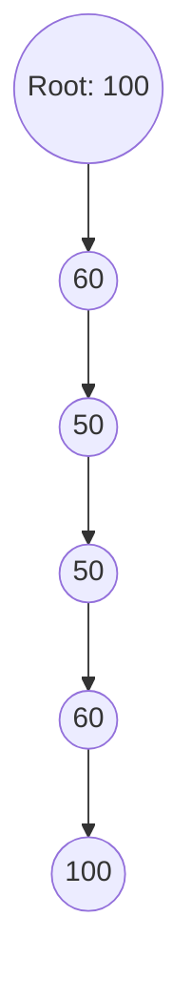

### What is a Splay Tree

A **Splay Tree** is a **self-adjusting binary search tree (BST)** where **frequently accessed nodes are automatically moved closer to the root** to make subsequent operations faster.

It uses an operation called **splaying**, which rotates the tree so that the accessed node becomes the **root**.

### Core Idea

* Recently used elements become faster to reach.
* Good for workloads with **temporal locality** (same keys accessed repeatedly).
* Operations have **amortized O(log n)** time.

### Key Operations

### Search / Insert / Delete

Each operation ends with a **splay**:

* Bring the accessed/inserted/deleted node (or last accessed node) to the **root**.
* Maintains BST properties.

### Splaying

Tree rotations performed to bring a node to the root.
Three types of rotation patterns:

1. **Zig** — node is child of root
2. **Zig-Zig** — node and its parent are both left or both right children
3. **Zig-Zag** — node is left child of right parent or right child of left parent

### Why Splay Trees Are Useful

* Good performance for workloads with repeated queries
* Great for caches, routing tables, memory allocators
* No need to store extra metadata (unlike AVL/Red-Black trees)

---

### Time Complexity

| Operation              | Amortized Cost           |
| ---------------------- | ------------------------ |
| Search                 | O(log n)                 |
| Insert                 | O(log n)                 |
| Delete                 | O(log n)                 |
| Worst case (single op) | O(n), but rarely happens |

Amortized complexity comes from splaying that balances the tree over time.

---

### Example (Close to Real Use Case)

Suppose you're building a memory allocator where **recent blocks are often reused**.

If key 50 is searched repeatedly:

```
Initial:
      100
     /
   60
  /
 50

After multiple searches for 50 → 50 becomes the root:
      50
        \
         60
           \
           100
```

---

### Mermaid Diagram (Splaying “Zig-Zig” Example)



---

### Pseudocode (Search)

```pseudo
function search(root, key):
    if root == null:
        return null
    node = bst_search(root, key)
    root = splay(root, node)
    return root
```

---

### Summary (Concise)

* Splay Tree = **self-adjusting BST** using **rotations**.
* Frequently accessed nodes move to the **root**.
* Operations are **amortized O(log n)**.
* Useful for **caches, memory allocation systems, routing tables**.

If you want, I can also explain **difference between Splay Tree vs AVL vs Red-Black Tree**.
