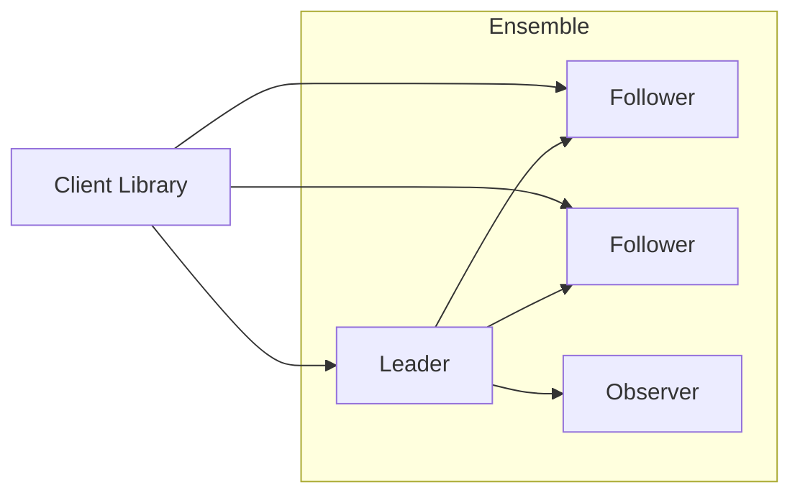
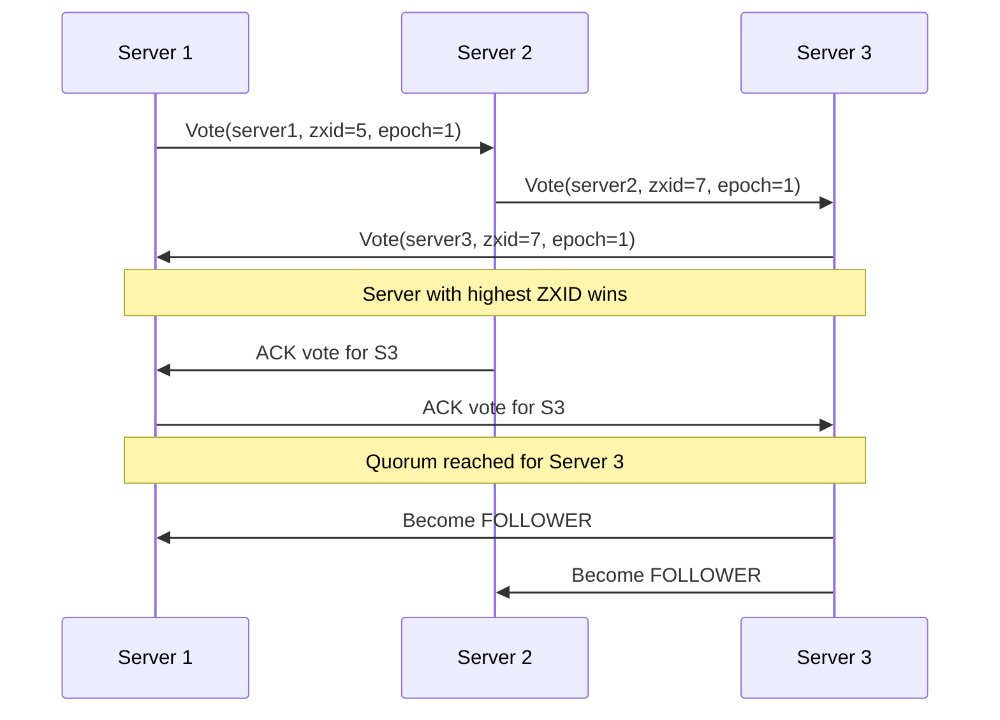
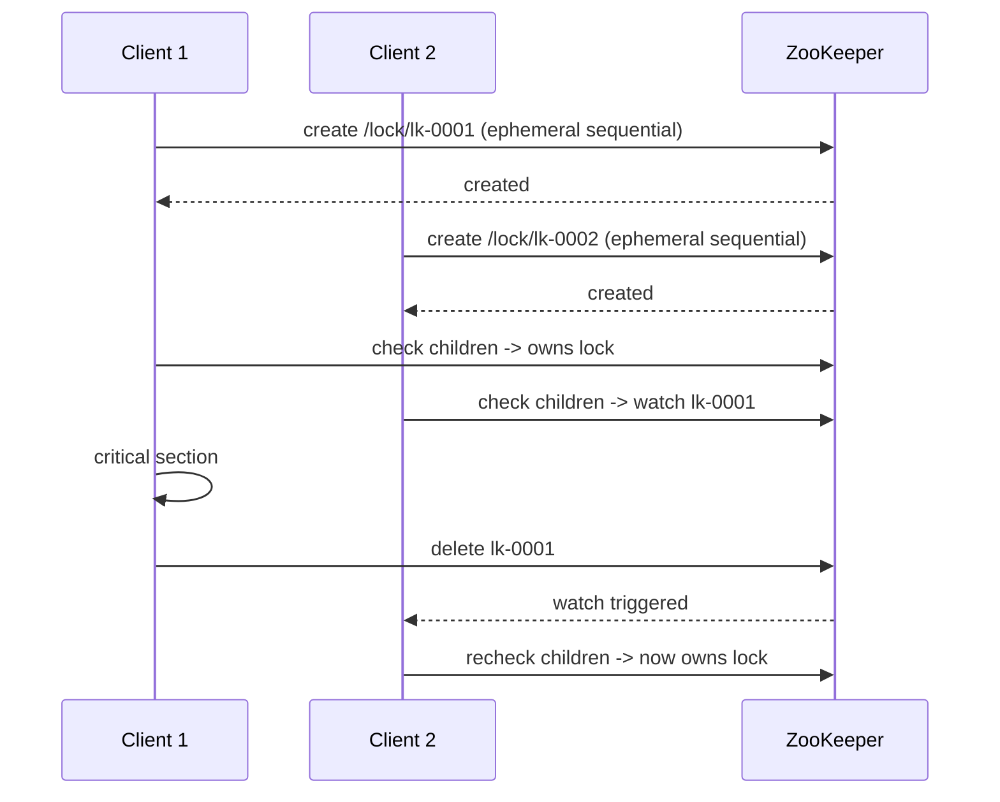
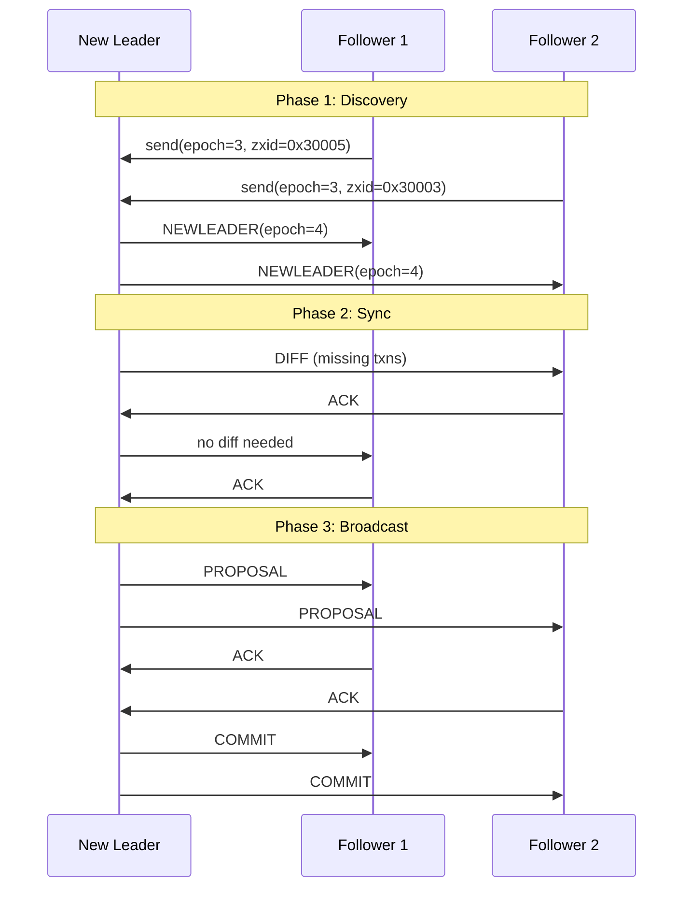

### ZooKeeper overview

Apache ZooKeeper is a distributed coordination service that provides strongly consistent metadata storage used for leader election, configuration management, service discovery, and distributed locks.

### Core components of ZooKeeper

### Server ensemble

* A ZooKeeper cluster must run an **odd number** of servers.
* A majority (**quorum**) must be available for writes.
* Servers operate as **Leader**, **Followers**, and optional **Observers**.

### Leader

* Handles all write requests.
* Assigns **ZXID** to every transaction.
* Uses **Zab protocol** to broadcast proposals and commit updates.
* Ensures total ordering of writes.

### Followers

* Handle read requests directly.
* Receive write proposals from the leader.
* Write to their local transaction logs and send ACKs.
* Commit updates only after COMMIT message.

### Observers

* Receive state updates but do not vote in quorum.
* Used for scaling read throughput without affecting consistency.

### Client library

* Client connects to a server using a session.
* Provides operations: get, set, create, delete, exists, watch.
* Supports **session heartbeats** and automatically switches servers if one fails.

### ZNode structure

* ZooKeeper stores hierarchical data similar to a filesystem.
* Each node (znode) contains:

  * Data (small metadata, not large files)
  * Version counters
  * ACL
  * Timestamps
* Types:

  * Persistent
  * Ephemeral (tied to client session)
  * Sequential (auto-increment suffix)

### DataTree (in-memory state)

* Each server keeps the entire namespace in memory.
* Backed by transaction log and snapshots for recovery.
* Ensures fast reads.

### Zab protocol

* ZooKeeper Atomic Broadcast.
* Guarantees total order and durability of writes.
* Consists of leader election, broadcast (proposal/ack/commit), and recovery phases.

### Session management

* Clients maintain a session with the server.
* Uses heartbeat packets to avoid timeout.
* Ephemeral znodes are deleted automatically when session expires.

### Transaction log and snapshot

* All writes are appended to a **transaction log** (fsynced for durability).
* Periodic **snapshots** store the entire DataTree.
* On restart, snapshot + logs restore state.

### ACL and authentication

* ZooKeeper enforces ACL per znode.
* Schemes: world, auth, digest, ip, sasl.
* Provides fine-grained access control.

### Watches

* Lightweight event notification system.
* Clients set watches on znodes to get notified for:

  * Node created
  * Node deleted
  * Data changed
  * Children changed
* One-time triggers; clients must re-register.

### Mermaid diagram of ZooKeeper components



If you want, I can also explain the complete internal workflow of leader election, how Zab recovery works, or how ZooKeeper implements distributed locks.


### Leader election in ZooKeeper

### Purpose

Leader election selects a single server to coordinate all writes in the ensemble. ZooKeeper uses **Fast Leader Election (FLE)** along with the **Zab protocol** to ensure a single, consistent leader without split-brain.

### When leader election occurs

* On cluster startup.
* When the current leader fails (no heartbeat).
* When quorum is lost and later restored.
* When a follower detects a higher-epoch leader.

### Key concepts

* **ZXID**: 64-bit id for all writes. Higher ZXID means a more up-to-date server.
* **Epoch**: High 32 bits of ZXID; increments when a new leader is elected.
* **Quorum**: Majority of servers must agree on the leader.
* **Vote**: Each server proposes a (server_id, zxid, epoch).

### Election steps

### Step 1: Election triggered

Each server moves to **LOOKING** state and proposes itself as leader with:

* its **last ZXID**,
* its **server ID**,
* and current **epoch**.

### Step 2: Exchange of votes

Servers exchange votes with each other. Every vote contains:

* proposed leader id
* proposed leader zxid
* epoch

Votes are sent repeatedly until a consistent winner emerges.

### Step 3: Vote comparison

When a server receives a vote, it compares it to its own using strict ordering:

1. Higher **epoch** wins
2. If epoch equal → higher **ZXID** wins
3. If ZXID equal → higher **server ID** wins

This ensures the server with the most up-to-date data becomes leader.

### Step 4: Forming a quorum

A server becomes leader only if its proposal receives votes from a **majority** of servers.
This prevents split-brain because two majorities cannot form in the same ensemble.

### Step 5: Transition of states

* Winning server → **LEADING**
* All other servers → **FOLLOWING**
* Observers → **OBSERVING**

During this phase, new epoch is assigned and Zab recovery begins.

### Step 6: Recovery phase

Followers synchronize with the leader:

* leader sends **DIFF**, **TRUNC**, or **SNAP** messages
* followers update their data to match the leader’s state

After synchronization, the ensemble becomes ready to process writes.

### Mermaid sequence diagram



If you want, I can explain the Zab recovery phase in detail or contrast ZooKeeper leader election with Raft elections.


### Distributed lock in ZooKeeper

### Purpose

ZooKeeper provides a strongly consistent mechanism to build **distributed locks** so that multiple clients can coordinate and ensure that **only one client performs a critical section at a time**, even across different machines.

### How ZooKeeper implements distributed locks

ZooKeeper does not have a built-in “lock” API; instead, locks are created using **ephemeral sequential znodes** and ZooKeeper’s ordering + watch mechanism.

### Key components

* **Ephemeral znode**: Automatically deleted when the client’s session ends. Prevents deadlocks if a client crashes.
* **Sequential znode**: ZooKeeper appends an increasing number to the name, giving strict ordering.
* **Watches**: One-time triggers that notify a client when a znode changes.
* **DataTree**: Server component that maintains all znodes in-memory and tracks ordering for sequential nodes.

### Lock acquisition algorithm (curator recipe style)

### Step 1: Create lock root

Create a persistent znode `/lock` once.

### Step 2: Client requests lock

Client creates an **ephemeral sequential** znode:

```
/lock/lock-0000001234
```

The sequence number determines ordering.

### Step 3: Determine if client owns the lock

* Client fetches all children under `/lock`.
* Sort them lexicographically.
* If client’s znode is **the smallest**, it owns the lock.

### Step 4: If not the smallest, watch the previous node

* Client finds the immediate predecessor node.
* Sets a **watch** on that node.
* When predecessor is deleted (because the previous lock holder finished or crashed), the watch triggers.
* Client rechecks ordering and typically becomes the new lock holder.

### Step 5: Execute critical section

Client performs the protected operation.

### Step 6: Release the lock

Client deletes its ephemeral sequential znode.

### Why this avoids deadlocks

* Ephemeral znodes prevent orphan locks (client crash → znode disappears automatically).
* Sequential numbering ensures strict ordering.
* Only watches the **immediately previous** znode, preventing herd effect.

### Mermaid diagram: Distributed lock flow



### Pseudocode (Python-style)

```python
def acquire_lock(client, root="/lock"):
    node = client.create(f"{root}/lock-", ephemeral=True, sequential=True)
    while True:
        children = sorted(client.get_children(root))
        index = children.index(node.name)
        
        if index == 0:
            return node
        
        prev = children[index - 1]
        client.watch(f"{root}/{prev}", callback=lambda: None)
        wait_for_watch()
```

### Where ZooKeeper components are involved

* **DataTree**: Maintains all znodes and their sequence order.
* **SessionTracker**: Removes ephemeral znodes on session expiry.
* **WatchManager**: Stores and triggers watches when znodes change.
* **Zab protocol**: Ensures sequential node creation and lock ordering are consistent across the ensemble.

If you want, I can also explain:

* Distributed read/write locks
* Fair vs non-fair locks
* Lock fencing tokens to prevent stale lock holders
* How this compares to locking in Redis or etcd


### Zab recovery phase

### Purpose

After a leader election, ZooKeeper must bring all followers to a **consistent state** before processing any new writes. Zab recovery ensures:

* All servers agree on the same starting history
* No committed transactions are lost
* No uncommitted transactions are applied
* Only the leader with the highest epoch and ZXID becomes authoritative

### Key concepts

* **ZXID** = (epoch, counter).
* **Committed vs. uncommitted proposals**.
* **DIFF / TRUNC / SNAP** synchronization messages.
* **Quorum agreement** that the leader’s history is correct.
* **DataTree** (in-memory state) + transaction logs + snapshots.

---

### Recovery phases

### Phase 1: Discovery phase

Goal: Leader learns the state of all followers.

Steps:

1. Followers connect to the leader and send:

   * last accepted epoch
   * last ZXID they have
2. Leader selects the **highest epoch** and increments it for the new leadership term.
3. Leader determines the **most up-to-date follower** by comparing ZXIDs.
4. Followers switch to the leader’s epoch (ACKNEWLEADER).

Outcome: All servers agree on the *new epoch*.

---

### Phase 2: Synchronization phase

Goal: Align follower logs & snapshots with the leader.

Leader compares its history with each follower and determines one of three sync modes:

#### 1. DIFF (fast path)

Used when follower is *slightly* behind.

* Leader sends only the missing committed transactions.
* Follower applies them directly to DataTree.

#### 2. TRUNC

Used when follower has **extra uncommitted** transactions.

* Leader instructs follower to **truncate** the log back to leader’s last known committed ZXID.
* Ensures removal of potentially inconsistent writes.

#### 3. SNAP

Used when follower is far behind or has invalid history.

* Leader sends a **full snapshot** of DataTree.
* Follower replaces its in-memory state entirely.

After these operations, follower sends **ACK**.

---

### Phase 3: Broadcast phase (steady state)

Once a quorum of followers is fully synchronized:

* Leader declares the system ready for proposals.
* Zab transitions from **recovery** to **broadcast** mode.
* New client writes can now be processed via PROPOSAL → ACK → COMMIT.

---

### Why Zab recovery guarantees consistency

* **Most up-to-date server becomes leader**, preventing stale data from leading.
* **Truncation removes uncommitted writes** that could corrupt order.
* **DIFF ensures all committed writes propagate everywhere**.
* **SNAP resets corrupted or outdated followers**.
* **Quorum ensures no two leaders can exist**, preventing split-brain.

---

### Internal components involved

* **Leader**:

  * Reads transaction log + snapshot
  * Determines DIFF/TRUNC/SNAP
  * Coordinates epoch upgrade

* **Follower**:

  * Sends zxid/epoch
  * Applies DIFF/TRUNC/SNAP
  * Rebuilds DataTree from snapshot if needed

* **Zab engine**:

  * Enforces ordering and epoch transitions

* **FileTxnLog & FileSnap**:

  * Transaction log and snapshot files on disk used for reconstruction

* **DataTree**:

  * Rebuilt in memory after snapshot or DIFF

---

### Mermaid diagram: Zab recovery



If you want, I can also explain **DIFF/TRUNC/SNAP with real ZXID examples**, or compare Zab recovery with **Raft log replication**.
