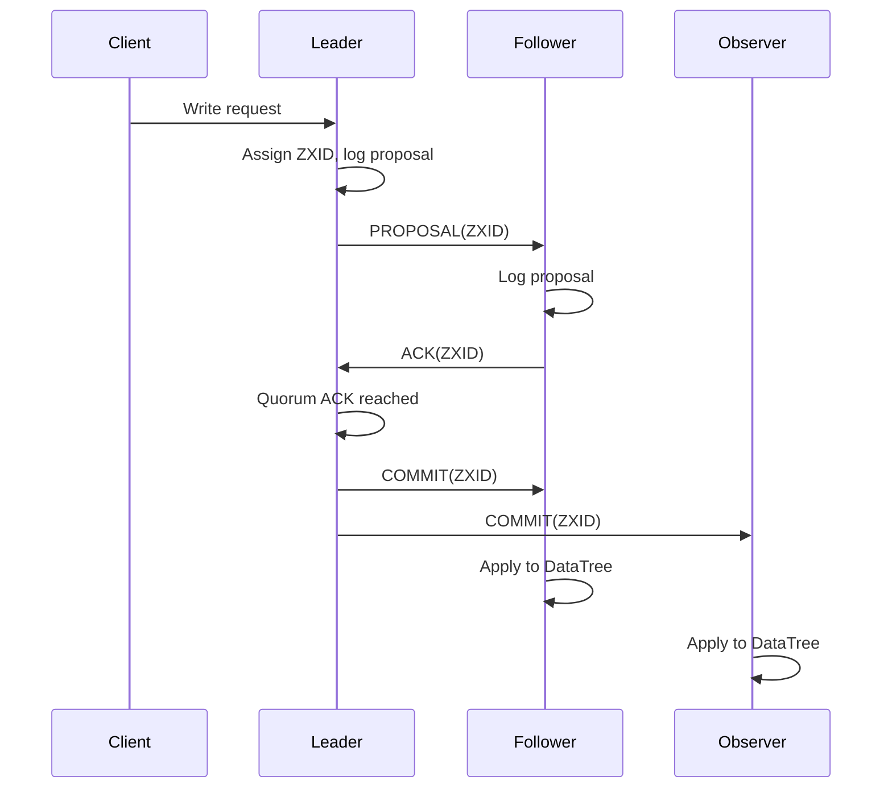

### Difficult Apache ZooKeeper question

In Apache ZooKeeper, how does the Zab (ZooKeeper Atomic Broadcast) protocol guarantee total order and durability of writes during leader failure, and what exact steps occur inside the leader, followers, and observers when a write request is committed? Include details about quorum confirmation, ZXID structure, and how ZooKeeper avoids split-brain during leader election.

### Zab protocol guarantees

### Total order of writes

* Every write is assigned a **ZXID** by the leader.
* ZXID is a 64-bit value:

  * High 32 bits: **epoch** (leader ID term).
  * Low 32 bits: **counter** (monotonically increasing).
* Followers commit writes strictly in increasing ZXID order, ensuring global total order.

### Durability during leader failure

* Leader logs the proposal to its transaction log.
* Proposal is sent to all followers.
* A write is committed only after receiving **ACKs from a quorum** (majority of nodes).
* Because the quorum survives any single failure, the committed proposal is guaranteed to be present on at least one follower even if the leader crashes.

### Write request internal flow

### Leader internal steps

* Receives client write request.
* Generates a new ZXID.
* Appends proposal to its local transaction log (fsync).
* Broadcasts **PROPOSAL** message to followers.

### Follower steps

* Receives PROPOSAL.
* Writes proposal to its local transaction log.
* Sends **ACK** to leader.

### Commit step

* Once the leader receives ACKs from quorum:

  * Sends **COMMIT** message to followers.
  * Applies the transaction to its in-memory data tree (DataTree).
* Followers apply the commit in exact ZXID order.

### Observer steps

* Observers receive commits but do not participate in quorum.
* They apply state updates but do not ACK proposals.

### Avoiding split-brain during leader election

* Uses **Fast Leader Election (FLE)**.
* Each server advertises:

  * Its last seen ZXID
  * Its server ID
* A server can become leader only if it has the **highest ZXID** among candidates.
* During election, servers form a quorum.
* Only the node with quorum support becomes leader.
* Nodes outside quorum cannot form a leader, preventing split-brain.

### Mermaid diagram of write flow

If you want, I can ask you the next difficult question on quorum loss, session fencing, ephemeral nodes, or watch guarantees.
