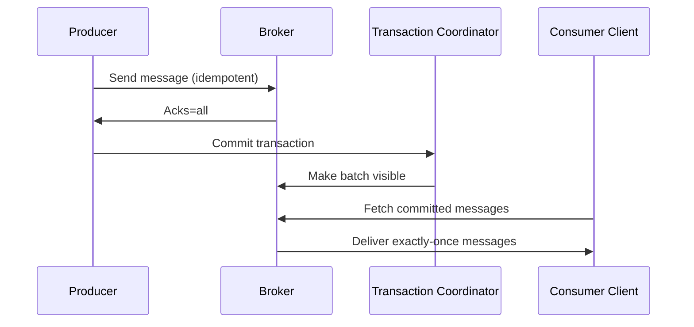

# *Delivery Guarantees* in messaging systems 
 

# **Delivery Guarantee in Messaging Systems**

## **What It Means**

Delivery Guarantee defines **how a messaging system promises to deliver messages to consumers under failure conditions** such as:

* network issues
* broker crashes
* consumer restarts
* producer retries
* partition rebalancing
* acknowledgment loss

It describes the **contract** between **Producer → Broker → Consumer** about whether a message may be:

* delivered **once**
* delivered **multiple times**
* lost under failures
 

# **Why Delivery Guarantee Exists**

Messaging systems run over distributed networks where failures are *expected*, not rare.
Systems must choose:

* **availability**,
* **latency**,
* **durability**,
* **complexity**,
  based on business needs.

Delivery guarantees provide explicit behavior and expectations, so developers can design **idempotency**, **deduplication**, or **compensating logic** depending on the guarantee.

 

# **The Three Delivery Guarantee Models**

## **At-Most-Once**

* Messages delivered **0 or 1 time**
* No retries
* Fastest but may **lose messages**
* Used for logs, metrics, telemetry

**Contract:** No duplicates, but may drop messages.
 

## **At-Least-Once**

* Messages delivered **1 or more times**
* Retries enabled
* No message loss
* May deliver **duplicates**

**Contract:** Messages will not be lost, but must handle duplicate processing.
 

## **Exactly-Once**

* Delivered **once and only once**
* Requires coordination: transactions, idempotent writes, atomic commits
* Most expensive in latency/complexity
* Used for financial or inventory consistency

**Contract:** No loss, no duplicates — strict delivery semantics.

 

# **Delivery Guarantees Are System-Wide**

A messaging system’s delivery guarantee depends on:

* **Producer reliability**

  * acknowledgments, retries, batching
* **Broker reliability**

  * replication, durability, commit logs
* **Consumer reliability**

  * where/when offsets/acks are committed
* **Network behavior**

  * partitions, timeouts, lost ACKs
* **Storage durability**

  * replicated logs, WAL, sync writes

Even if the broker supports exactly-once, the **consumer application** must also behave correctly (idempotency, transactional commits) to truly achieve EOS.


 

| Guarantee         | Meaning              | Message Loss | Duplicates | Use Case                              |
| ----------------- | -------------------- | ------------ | ---------- | ------------------------------------- |
| **At-Most-Once**  | Deliver 0 or 1 times | Possible     | No         | logging, low-value telemetry          |
| **At-Least-Once** | Deliver ≥1 times     | No           | Possible   | orders, events, ingestion systems     |
| **Exactly-Once**  | Deliver exactly once | No           | No         | finance, payments, stateful pipelines |


## **At-Least-Once Delivery**

 

A message is delivered **one or more times**.
**Duplicates are possible**, loss is not.

### Why duplicates may occur

The producer sends a message → broker writes it → broker ACK gets **lost** → producer **retries** → message appended **again**.

### Kafka components causing behavior

* **Producer retries**
* **Broker replication delay**
* **Consumer committing offset after processing**

### Producer config enabling at-least-once

```properties
acks=all
retries=Integer.MAX_VALUE
enable.idempotence=false
```

### Consumer behavior

If consumer **commits offsets AFTER processing**, a retry may cause duplicate processing.

### Real-world example

Order service processes a payment **twice** because the first commit failed → duplicated events.

### Guarantee Summary

✔ No message loss
✖ Duplicate messages possible


## **At-Most-Once Delivery**

### Meaning

A message is delivered **zero or one time**.
**Loss is possible**, duplicates are not.

### Why messages can be lost

Consumer commits offset **before processing**.
If processing fails → offset already moved → record lost.

### Producer config

```properties
acks=0
retries=0
```

This means the producer does not wait for acknowledgements.

### Consumer behavior

Offset committed **before** processing.

### Real-world example

You receive **fewer logs** in ELK because some messages were dropped.

### Guarantee Summary

✔ No duplicates
✖ Potential message loss

---

# **Exactly-Once Delivery (EOS)**

### Meaning

A message is delivered **once and only once**, even in failures.

### Kafka components enabling EOS

1. **Idempotent Producer**

   * Ensures retries do not produce duplicates.
   * Broker deduplicates using **producerId + sequenceNumber**.

2. **Transactions API**

   * Producer writes multiple messages **atomically**.
   * Either **all writes** succeed or **none**.

3. **Consumer committed offsets in the same transaction** (if using Kafka Streams or transactions).

### Producer config for EOS

```properties
enable.idempotence=true
acks=all
retries=Integer.MAX_VALUE
transactional.id=my-txn-id
```

### Broker behavior

* Broker maintains a **per-producer sequence number** to prevent duplicates.
* Kafka’s transactional log ensures **atomic writes**.

### Consumer behavior

A consumer sees messages **only after the transaction is committed**.

### Real-world example

Banking system:
Debit from Account A AND credit to Account B must be an atomic event.
Kafka can guarantee this.

### Guarantee Summary

✔ No loss
✔ No duplicates
✔ Atomic multi-partition writes
✖ Slightly more latency due to transactions
 

 

# **Recommended Usage**

* **Always use At-least-once** unless duplicates break your business logic.
* Use **Exactly-once** only when doing:
  ✔ sink-to-Kafka-to-sink pipelines
  ✔ Kafka Streams
  ✔ financial consistency operations

More :
* Diagrams of retry cycles
* At-least vs at-most vs EOS flowchart
* Configurations for Kafka Streams EOS
* How consumer group commits affect guarantees

 

* Delivery guarantee diagram
* How each guarantee is implemented at low-level
* Differences across Kafka vs RabbitMQ vs SQS vs Pulsar
# Message Delivery Semantics in Kafka

Kafka provides three delivery guarantees that determine how messages flow from Producer to Broker and from Broker to Consumer. These guarantees rely on Kafka components such as the Producer client, Broker replication layer, Consumer client, and Consumer Group Coordinator.

### At Most Once Delivery

Messages may be lost but are never re-delivered.
Producer sends data without retries or acknowledgment checks.
Consumer commits the offset before processing, so a crash loses work.
Kafka components involved: Producer client (no retry), Broker (no guarantee), Consumer client (early offset commit).

### At Least Once Delivery

Messages are never lost but may be processed more than once.
Producer retries sends until Broker acknowledges the write.
Consumer commits offset after processing, so a crash replays messages.
Kafka components involved: Producer retry logic, Broker replication layer, Consumer client (post-processing offset commit).

### Exactly Once Delivery

Messages are delivered once with no duplicates by combining idempotent producers and transactional semantics.
Producer enables idempotence and writes messages with unique Producer IDs; Broker enforces duplicate suppression.
Consumer processes transactional batches only when committed.
Kafka components involved: Idempotent Producer, Broker transaction coordinator, Consumer client with isolation.level=read_committed.

### Producer Configuration

```properties
acks=all
enable.idempotence=true
retries=5
max.in.flight.requests.per.connection=1
```

The Kafka Producer client uses idempotence to avoid duplicate writes, while the Broker transaction coordinator ensures atomic commit.

### Consumer 

```java
while (true) {
    var records = consumer.poll();
    for (var record : records) {
        process(record);
        /** JVM executes business logic **/
    }
    consumer.commitSync();
    /** Consumer client sends commit to Group Coordinator **/
}
```

The Consumer Group Coordinator updates committed offsets.




### When to Use Each Semantics

At Most Once: metrics, logs that can tolerate loss.
At Least Once: payment pipelines with deduplication in JVM layer.
Exactly Once: financial transactions, inventory updates, where duplicates cannot be tolerated.


Kafka **cannot guarantee exactly-once message delivery** at the transport level.
What Kafka guarantees is **exactly-once processing** (EOS) when the application follows specific patterns.

Meaning:

* A message may still be delivered more than once on the wire
* But it will be **processed exactly once** end-to-end (producer → broker → consumer → sink)

This is the *only* type of “exactly once” Kafka supports.
 

>To Achieve Kafka Exactly-Once Processing
>You must change **Producer**, **Broker**, and **Consumer** settings together.
 

###  Producer Settings for EOS

Enable idempotent producer and transactions.

Kafka ≥ 3.0 enables idempotence by default, but set these explicitly:

```
enable.idempotence=true
acks=all
retries=∞
max.in.flight.requests.per.connection=1
```

To turn on **transactions**, add:

```
transactional.id=my-producer-tx-id
```

The producer code must:

```
producer.initTransactions();
producer.beginTransaction();
producer.send(record);
producer.commitTransaction();
```

**This ensures every write happens exactly once even during retries.**
 
###  Broker Requirements

These are default in modern Kafka, but important:

```
unclean.leader.election.enable=false
min.insync.replicas=2    (if replication-factor ≥ 3)
```

Ensures **durable writes** and protects your EOS pipeline.


###  Consumer Requirements (Kafka Consumer w/o Streams)

Use the **transaction-aware consumer** settings:

```
isolation.level=read_committed
enable.auto.commit=false      (mandatory)
```

And your consumer must **manually commit offsets as part of the transaction** if you are producing to another topic.


###  End-to-End Exactly-Once Pattern (Consumer → Producer)

If your service reads from Kafka and writes back to Kafka, use a **transactional producer** to commit offsets atomically with output messages:

```
producer.beginTransaction();
Records = consumer.poll(...)
process(...)
producer.send(...)
producer.sendOffsetsToTransaction(consumerOffsets, consumerGroupId);
producer.commitTransaction();
```

This ensures:

* Offsets are committed **only if** output messages were produced
* If process fails, offsets roll back → input re-processed
* Re-processing does **not** produce duplicates
 

##  Using Kafka Streams

Kafka Streams automatically gives **exactly-once processing** by setting:

```
processing.guarantee=exactly_once_v2
```

That’s it. Streams manages transactions and offset commits for you.

 


You will **not** get EOS if:

* Consumer writes to an external system that doesn't support transactions
  (e.g., PostgreSQL without XA, Elasticsearch, MongoDB, Redis)
* You commit offsets before you finish processing
* You use auto-commit
* You do not use transactional producers
* You use multiple partitions that are not processed in-order

EOS requires the **full transactional chain**.

 

| Component         | Required Setting / Logic                                                                              |
| ----------------- | ----------------------------------------------------------------------------------------------------- |
| **Producer**      | `enable.idempotence=true`, `transactional.id`, `acks=all`, `beginTransaction() / commitTransaction()` |
| **Broker**        | `min.insync.replicas`, disabled unclean election                                                      |
| **Consumer**      | `isolation.level=read_committed`, manual commit, commit offsets in transaction                        |
| **Application**   | Atomic processing: read → process → write → commit offsets in same transaction                        |
| **Kafka Streams** | `processing.guarantee=exactly_once_v2`                                                                |


| Delivery Semantics     | Latency                                                                   | Reliability                                                              | Resource Usage                                                                                                       |
| ---------------------- | ------------------------------------------------------------------------- | ------------------------------------------------------------------------ | -------------------------------------------------------------------------------------------------------------------- |
| **At-most-once**       | **Lowest latency** (no retries, no confirmation waits)                    | **Lowest reliability** (messages may be lost; no retries; no guarantees) | **Lowest resource usage** (no duplicate checks, no transactions, minimal broker load)                                |
| **At-least-once**      | **Medium latency** (retries + acks + possible re-processing)              | **High reliability** (messages never lost; duplicates possible)          | **Medium resource usage** (extra bandwidth due to retries, more broker I/O, consumer re-processing)                  |
| **Exactly-once (EOS)** | **Highest latency** (transaction init, commit, coordination, more fsyncs) | **Highest reliability** (no loss + no duplicates end-to-end)             | **Highest resource usage** (transaction metadata, idempotence state, more CPU, memory, broker coordination overhead) |


 

More

* Full Java producer–consumer code for EOS
* Spring Kafka example with `KafkaTransactionManager`
* Kafka Streams EOS example
* A diagram of end-to-end transaction flow
* A detailed chart showing internal mechanisms for each semantic
* A Spring Kafka configuration comparison
* Java code examples for all three semantics
 

