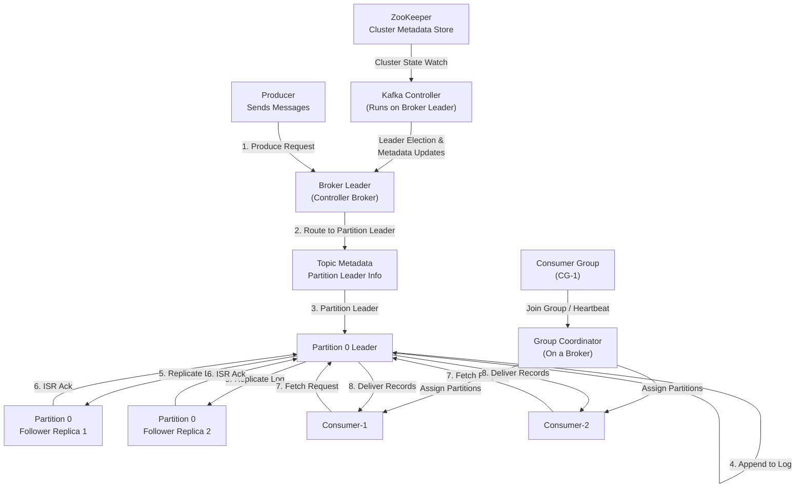
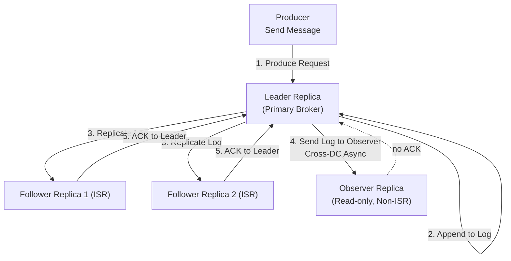

# Kafka

Difference between Kafka and Traditional Messaging Systems

### Storage-Centric vs Queue-Centric Design

Kafka uses a **distributed commit log** stored on disk in an append-only format, allowing linear writes and high throughput. Traditional systems like IBM MQ store messages in **queue structures** where messages are removed after consumption, limiting replay, throughput, and horizontal scaling.

### [Consumer](consumer-group.md) Model

Kafka uses a **pull-based** consumer model where the Consumer client controls fetch rate and offsets. IBM MQ is **push-based**, where the broker decides delivery timing. Kafka allows replay, rewind, and independent offsets for each Consumer Group; IBM MQ removes messages once acknowledged.

### [Scaling](auto-scaling.md) and [Partitioning](partitions.md)

Kafka partitions each topic across brokers, enabling horizontal scaling. Partition assignment is handled by the **Consumer Group Coordinator** on the broker. IBM MQ relies on **single-queue managers**, scaling vertically rather than horizontally.

### [Broker](Brokers.md) Responsibilities

Kafka Brokers are **dumb storage nodes** that do no message routing or transformation. IBM MQ brokers are **smart brokers** that perform routing, transactions, persistence checks, transformations, and priority scheduling. Kafka offloads most logic to the Producer and Consumer clients.

### Replication and Fault Tolerance

Kafka uses **log replication** with leader–follower architecture and high-throughput replication managed by the Broker replication layer. IBM MQ typically uses **active-passive** or shared-disk failover models, limiting concurrent scaling and throughput.

### [Delivery Guarantees](DeliveryGuarantee.md)

Kafka supports **at-least-once**, **at-most-once**, and **exactly-once** using the Producer client, Broker replication layer, and Transaction Coordinator. IBM MQ provides strict **exactly-once** but at much higher cost and lower throughput due to synchronous persistence and broker-level transactions.

### Data Retention and Replay

Kafka retains messages for a configured period regardless of consumption. Consumers maintain offsets in the Consumer Group Coordinator and may replay historical events. IBM MQ deletes messages after consumption, making replay difficult or impossible.

### Use Case Orientation

Kafka is optimized for **event streaming, real-time analytics, and log ingestion**. IBM MQ is optimized for **transactional messaging, request–reply, and guaranteed delivery** within enterprise systems.


 flow of messages between Producer → Broker → Partition → Replica → Consumer.



Data flow to Observer :


 


diagram of consumer group rebalancing.
### Kafka Components and Message Flow
```ascii
                 +----------------------+
                 |      PRODUCER        |
                 | (Sends Records)      |
                 +----------+-----------+
                            |
                            | 1. Send message (Produce Request)
                            v
                     +------+-------+
                     |   BROKER     |   <--- Kafka Server Process
                     | (Leader Node)|        Handles client requests
                     +------+-------+
                            |
                            | 2. Route to partition leader
                            v
                 +----------+--------------------+
                 |         TOPIC                |
                 |   Contains Multiple          |
                 |        PARTITIONS            |
                 +------------------------------+
                                |
                                | 3. Leader Append
                                v
                        +-------+--------+
                        |  PARTITION 0   |
                        |   Leader       |
                        +-------+--------+
                                |
                                | 4. Replication to followers
                                v
      +--------------------+           +--------------------+
      |    PARTITION 0     |           |    PARTITION 0     |
      |   Follower Replica | <-------- |   Follower Replica |
      +--------------------+    5. ISR +--------------------+
                                (In-Sync Replicas)

                                |
                                | 6. Consumer Fetch
                                v
                         +------+--------+
                         |   CONSUMER    |
                         | (Reads Data)  |
                         +---------------+
```
Explanation of Flow

1. Producer → Broker
Producer sends a ProduceRequest to the broker responsible for the target partition’s leader.

2. Broker Routes Message
The broker identifies the partition leader using metadata maintained by the Kafka Controller.

3. Leader Append
The leader broker appends the message to the partition log.

4. Replication
The leader pushes the new log entry to follower replicas.

5. ISR (In-Sync Replicas)
Followers acknowledge; once they’re up-to-date, they remain in ISR.

6. Consumer Fetches
Consumer sends FetchRequest to the same leader.

8. Observer Replicas
Leader also asynchronously ships log entries to Observer replicas.
Observers do not ACK — they never block producers.

Internal Components Involved

Producer: batches, compression, partitioner

Broker: network thread, I/O thread, log append

Partition Leader: handles reads/writes

Replicas: fetch from leader asynchronously

ISR: set of replicas fully caught up

Controller: manages leader election

Consumer: fetches sequentially from leader

Observer : 
A non-voting, asynchronous replica , Does NOT participate in  ISR , ACKs Leader election
Used for:  Geo-redundancy , Read scaling  , Cross-AZ / Cross-region replication
  


## Architecture 

Kafka consists of four core components:

| Component                          | Description                                                                              |
| ---------------------------------- | ---------------------------------------------------------------------------------------- |
| **Producer**                       | Publishes messages (records) to Kafka topics.                                            |
| **Broker**                         | Kafka server — stores and serves topic partitions.                                       |
| **Consumer**                       | Reads messages from topics.                                                              |
| **ZooKeeper / KRaft (Controller)** | Manages cluster metadata, leader election (ZooKeeper in older versions, KRaft in newer). |


##  Internal Architecture

Here’s the big picture:


###  **Topic, Partition, and Offset**

* Each **topic** is split into **partitions**.
* Each partition is an **ordered, immutable log** of records.
* Each record has an **offset** — a monotonically increasing integer.

Example:

| Offset | Key | Value        |
| ------ | --- | ------------ |
| 0      | A   | “Start”      |
| 1      | B   | “Processing” |
| 2      | C   | “Done”       |

Consumers **remember offsets** (their position) — allowing replays and parallel reads.


### **Producer Internals**

### a. **Batching & Buffering**

* Producers batch messages in memory for efficiency.
* Data is sent to the **leader partition** (based on key hash or round-robin).

### b. **Acknowledgment Modes**

| acks= | Meaning                                       |
| ----- | --------------------------------------------- |
| 0     | Fire and forget                               |
| 1     | Leader writes to log, no replica confirmation |
| all   | Wait until all replicas acknowledge           |

### c. **Compression**

* Kafka supports gzip, snappy, LZ4, zstd — compress batches for throughput.


### **Broker Internals**

Each Kafka broker manages:

* A set of **partitions** (leaders + followers).
* **Segment files** on disk per partition.
* **Indexes** for fast lookups.

### Disk structure:

```
/kafka-logs/
  ├── topicA-0/
  │   ├── 00000000000000000000.log
  │   ├── 00000000000000000000.index
  │   ├── 00000000000000000000.timeindex
```

Kafka uses:

* **Append-only writes** → sequential disk I/O (super fast).
* **Page cache** → OS-level read optimization.


### **Replication & Leader Election**

* Each partition has one **leader** and multiple **followers**.
* Followers **replicate** the leader’s log.
* A **controller broker** monitors all leaders and performs **leader re-election** if a broker fails.

Replication protocol ensures:

* **High availability**
* **Durability**
* **Consistency** (only committed offsets are visible)


### **Consumer Internals**

### a. **Consumer Groups**

* Consumers join a group.
* Kafka ensures each partition is assigned to only one consumer per group.
* If one dies, its partitions are reassigned.

### b. **Offset Management**

* Stored in a special internal topic: `__consumer_offsets`.
* Allows fault-tolerant offset tracking across restarts.


### **Retention and Compaction**

Kafka doesn’t delete messages after consumption.
It deletes or compacts them **based on policies**:

| Policy    | Behavior                                |
| --------- | --------------------------------------- |
| `delete`  | Keep logs for a time or size limit.     |
| `compact` | Keep only the **latest value per key**. |


 
### **“Commit”  in Kafka**

A message is considered **committed** when Kafka guarantees that **it will not be lost**, even if the leader broker crashes.

This requires the message to be:

1. Written to the **Leader** replica
2. Successfully replicated to **all ISR (In-Sync Replicas)**
3. Included in the **High Watermark (HW)**

Consumers are **only allowed** to read **up to the HW**, never beyond it.


Kafka uses three important offsets per partition:

### **1. LEO (Log End Offset)**

* The offset **after** the last written record.
* For example, if the last record is at offset 9 → LEO = 10.

### **2. Follower LEO**

* Each follower tracks its own log end offset.

### **3. HW (High Watermark)**

* The last committed offset (the last offset replicated to all ISR replicas).
* Consumers read **only up to this value**.


` Leader HW = min(leader_log_end_offset, min(follower_log_end_offsets)) `


* The committed point is the **smallest** LEO among:

  * The leader
  * All ISR followers


Because a record is **not committed** until **every ISR** has it.


| Replica    | LEO |
| ---------- | --- |
| Leader     | 10  |
| Follower-1 | 9   |
| Follower-2 | 8   |

Then:

```
Leader HW = min(10, min(9, 8))
Leader HW = 8
```

So offsets **0–7** are committed.
Offsets **8–9** are uncommitted (consumers cannot read them yet).

 

### **Why Kafka Uses This Logic**

### **Reason 1: Strong Durability**

A message is only safe if **all ISR replicas** have written it.

### **Reason 2: Leader Failover Safety**

If the leader crashes:

* Kafka elects a new leader **from the ISR**.
* The new leader must contain all committed messages.
* Therefore, HW must only include messages present on **all** ISR members.

This prevents data loss after failover.

### **Reason 3: Prevent Consumers From Seeing Uncommitted Data**

Consumers must not read data that could be lost during failover.
 

### **How Replication Updates HW Step-by-Step**

1. Producer writes record (offset 10) to leader.
2. Leader increases its LEO to 11.
3. Leader sends the record to ISR followers.
4. ISR followers write it and update their LEO.
5. Leader compares:

   ```
   leaderLEO = 11
   followerLEOs = [11, 11]
   HW = min(11, 11) = 11
   ```
6. HW moves forward (commit point advances).
7. Consumers are now allowed to read offset 10.

 

| Term                         | Meaning                                    |
| ---------------------------- | ------------------------------------------ |
| **LEO**                      | log end offset; end of log on each replica |
| **HW**                       | high watermark; commit boundary            |
| **ISR**                      | replicas that are fully caught up          |
| **Commit**                   | a record replicated to all ISR replicas    |
| **Consumer visible offsets** | only offsets ≤ HW                          |

 

### **Why Leader LEO Is Included in the Formula**

You might wonder:

**Why do we include `leader_log_end_offset` in:**

```
min(leader_log_end_offset, ...)
```

Because:

* The leader may temporarily lag behind followers (rare but possible during log truncation or re-election).
* Kafka ensures HW is always **≤ leader LEO**.

 

# **Final Interpretation (One Line)**

**Kafka commits a message only when *every* In-Sync Replica has the message; the High Watermark is the smallest LEO among leader and all ISR followers.**
 

More :

* A mermaid diagram of commit flow
* Example with ISR shrink/expand
* How HW works in KRaft (without ZooKeeper)
* How unclean leader election affects HW
 


### **KRaft Mode (Newer Kafka)**

* Modern Kafka (2.8+) can run **without ZooKeeper**.
* Uses **KRaft (Kafka Raft Metadata mode)** to store metadata directly in Kafka logs.
* Simplifies architecture, improves fault tolerance.


### Key Internal Optimizations

| Mechanism                  | Purpose                                                       |
| -------------------------- | ------------------------------------------------------------- |
| **Zero-copy transfer**     | Uses `sendfile()` to send data directly from disk to network. |
| **Batching & compression** | Increases throughput.                                         |
| **Sequential I/O**         | Append-only log = fewer disk seeks.                           |
| **Page cache**             | OS caches recently accessed log segments.                     |
| **Replication protocol**   | Guarantees fault tolerance.                                   |


| Layer      | Component  | Function                            |
| ---------- | ---------- | ----------------------------------- |
| Producer   | Client app | Publishes messages                  |
| Broker     | Server     | Stores, replicates, serves messages |
| Controller | Broker     | Manages cluster metadata            |
| Consumer   | Client app | Reads messages                      |
| Log        | File       | Persistent ordered record of events |


More : how a record moves from Producer → Leader → Replica → Consumer (with offsets and replication steps)?


 **core abstractions (log, partition, replica)** and **algorithms for replication, consistency, leader election, batching, and offset tracking**.


## Kafka’s Core Design Principle: The Distributed Commit Log

Kafka is designed as a **distributed append-only log**, meaning:

* Every topic is partitioned.
* Each partition is a **totally ordered, immutable log**.
* Writes are always **appends at the end**.
* Reads are **sequential**.

This model is the backbone of all internal algorithms — simple, deterministic, and allows efficient use of the filesystem.


##  Log Storage Internals

Each **partition** is implemented as a **directory** on disk with multiple **segment files**:

```
/kafka-logs/
 └── topicA-0/
     ├── 00000000000000000000.log
     ├── 00000000000000000000.index
     ├── 00000000000000000000.timeindex
     ├── 00000000000001000000.log
```

### Algorithms Used:

* **Sequential append** → O(1) write performance.
* **Binary search in index** → O(log n) offset lookup.
* **Segment rotation** based on time or size limits.
* **Page Cache optimization** → leverage Linux `mmap()` and `sendfile()` for zero-copy I/O.

### Write Path:

1. Producer sends a batch → Broker appends to in-memory buffer.
2. Periodic flush to disk (fsync policy).
3. Broker writes to **leader log segment**.
4. Followers replicate it.


###  Partitioning and Routing Algorithm

Kafka must decide **which partition** a message belongs to.

Algorithm:

```python
partition = hash(key) % num_partitions
```

* Deterministic for the same key (preserves order for that key).
* If no key is given, uses round-robin partitioning.
* Ensures horizontal scalability.


###  Replication Protocol (ISR Algorithm)

Kafka uses an **asynchronous replication** model with a **leader-follower** setup.

### Key terms

* **ISR (In-Sync Replicas):** replicas fully caught up with leader.
* **HW (High Watermark):** last offset replicated to all ISR members.
* **LSO (Last Stable Offset):** offset up to which data is guaranteed committed.

### Replication steps

1. Producer sends message to **leader**.
2. Leader appends it to local log.
3. Followers **fetch** data from leader periodically.
4. Once followers ack, leader advances **HW**.
5. Only records ≤ HW are visible to consumers.

### Algorithms:

* **Leader-based replication** (similar to Raft, but simpler).
* **ISR maintenance loop:**

  * If a follower lags > `replica.lag.time.max.ms`, it’s removed from ISR.
  * When caught up, it’s re-added.


### 5. Commit and Consistency Algorithm

Kafka guarantees:

* **At least once delivery** (default)
* **Exactly once delivery** (with idempotent producers + transactions)
* **Durable writes** (acks=all, fsync)

### Commit logic (simplified)

```text
Leader HW = min(leader_log_end_offset, min(follower_log_end_offsets))
```

Records <= HW are *committed* and safe.

Consistency:

* **Linearizable per partition** (total order preserved)
* **Eventual consistency across replicas**

 

### 6. Producer Internals and Batching Algorithm

### Goals:

* High throughput
* Low latency
* Idempotency

### Internal algorithm:

1. **Accumulator buffer** per partition.
2. Periodic **flush thread** sends batches based on:

   * batch.size
   * linger.ms
3. Messages are serialized, optionally compressed.
4. Sent to leader → broker appends → returns ack.

This batching model allows millions of writes/sec.


### 7. Consumer Group Rebalancing Algorithm

Kafka uses a **group coordinator** algorithm.

1. Each consumer sends a `JoinGroup` request.
2. One is elected as **leader** (the group coordinator assigns partitions).
3. Leader sends an **assignment plan**.
4. Others receive `SyncGroup` messages with their partition assignments.

### Rebalancing triggers:

* New consumer joins.
* A consumer dies.
* Topic partitions change.

To avoid excessive rebalances:

* Kafka introduced **incremental rebalancing** (KIP-429).
* Uses **CooperativeStickyAssignor** algorithm.


### 8. Offset Management Algorithm

Offsets are stored in an internal topic: `__consumer_offsets`.

Each commit is a small Kafka message:

```
key = <group_id, topic, partition>
value = <offset, metadata, timestamp>
```

Consumers periodically send `OffsetCommitRequest`.
On restart, they send `OffsetFetchRequest`.

This makes offset tracking **fault-tolerant** and **distributed**.


### 9. Controller and Leader Election Algorithm

Kafka elects:

* A **Controller broker** for metadata management.
* **Partition leaders** for handling traffic.

### In older versions

* ZooKeeper elects controller via ephemeral nodes.

### In newer versions (KRaft)

* Kafka implements its own Raft-like consensus layer.

### Controller duties:

* Track broker heartbeats.
* Reassign partition leaders when brokers fail.
* Manage cluster metadata and ISR updates.


### 10. Log Compaction Algorithm

For topics with cleanup policy `compact`:

1. Kafka scans segments.
2. Keeps **latest message per key**.
3. Deletes older versions.

Algorithm:

* Uses a **key-index map** while scanning.
* Periodically merges segments (similar to LSM-tree compaction).


### 11. Transaction and Idempotent Producer Algorithms

Kafka 0.11+ supports **exactly-once semantics** via:

* **Producer IDs (PID)**
* **Sequence numbers**
* **Transactional Coordinator**

Algorithm:

1. Each producer assigned a PID.
2. Each message has `(PID, sequence_number)`.
3. Broker deduplicates messages based on these.
4. Transaction coordinator tracks **begin**, **commit**, or **abort** markers in a special topic.

This guarantees **no duplicates**, **atomicity**, and **isolation** across partitions.
 

### 12. Kafka’s Core Performance Tricks

| Technique               | Explanation                                         |
| ----------------------- | --------------------------------------------------- |
| **Zero-copy I/O**       | Uses `sendfile()` → direct disk-to-socket transfer. |
| **Batch compression**   | Compresses multiple messages per batch.             |
| **Memory-mapped files** | OS handles page caching efficiently.                |
| **Sequential I/O**      | Append-only writes minimize disk seeks.             |
| **Async replication**   | Low latency with optional durability.               |


| Subsystem         | Algorithm / Mechanism        | Purpose               |
| ----------------- | ---------------------------- | --------------------- |
| Replication       | ISR, HW, LSO tracking        | Durability & HA       |
| Leader election   | Controller + ZooKeeper/KRaft | Fault recovery        |
| Partition routing | Hash(key) % N                | Scalability           |
| Offset tracking   | Internal Kafka topic         | Reliability           |
| Batching          | Size + linger.ms             | Throughput            |
| Log compaction    | Key-based merge              | Storage efficiency    |
| Rebalance         | CooperativeStickyAssignor    | Stability             |
| Idempotency       | PID + seq numbers            | Exactly-once delivery |

More : **Kafka internals algorithm flow diagram** — showing the write path (Producer → Broker → Replica → Consumer) including ISR, HW, and offset tracking?

