```mermaid
sequenceDiagram
    participant Producer as Producer Apps
    participant LB as Load Balancer
    participant KafkaCluster as Kafka Broker Cluster
    participant Controller as Auto-scaling Controller
    participant ConsumerGroup as Consumer Group
    participant Monitoring as Metrics / Monitoring System

    Note over Producer,KafkaCluster: PRODUCER SIDE (Broker Auto Scaling)
    Producer->>LB: Send messages
    LB->>KafkaCluster: Route messages to brokers (Topic Partitions)
    Monitoring->>Controller: Report broker CPU / partition load
    Controller->>KafkaCluster: Add or remove brokers dynamically
    KafkaCluster->>Controller: Rebalance partitions among brokers

    Note over ConsumerGroup,KafkaCluster: CONSUMER SIDE (Consumer Auto Scaling)
    KafkaCluster->>ConsumerGroup: Provide messages to consumers
    Monitoring->>Controller: Report consumer lag & throughput
    Controller->>ConsumerGroup: Add or remove consumer instances
    ConsumerGroup->>KafkaCluster: Trigger partition rebalancing

    Note over Controller: Scaling Policies<br/>• Broker scale based on CPU/IO or topic load<br/>• Consumer scale based on lag<br/>• Both monitored by metrics system
```

Excellent question 👏 — scaling Kafka automatically (both **Kafka brokers** and **Kafka consumers/producers**) involves tuning and combining **Kafka’s internal configurations**, **cluster orchestration tools** (like **Kubernetes or AWS MSK**), and **application-level scaling policies**.

Let’s break this down step by step:

---

## 🧱 1. Understanding Kafka Scaling Dimensions

Kafka can scale **horizontally** and **vertically** at three main levels:

| Layer                                  | Scaling Type           | Goal                                             |
| -------------------------------------- | ---------------------- | ------------------------------------------------ |
| **Cluster (Brokers, Zookeeper/KRaft)** | Horizontal             | Increase total throughput and partition capacity |
| **Topic Partitions**                   | Horizontal             | Distribute message load across brokers           |
| **Consumers (Consumer Groups)**        | Horizontal             | Parallelize message consumption                  |
| **Producers**                          | Horizontal or batching | Increase message write throughput                |

---

## ⚙️ 2. Kafka Configuration for Scaling Automatically

### 🧩 A. **Broker-Level Scaling**

To scale the **Kafka cluster automatically**, you typically rely on **Kubernetes (EKS/GKE)** or **AWS MSK (Managed Kafka)** to add or remove broker nodes.
Still, Kafka config parameters must support scaling gracefully.

#### **Key Broker Configurations**

| Config                      | Purpose                                 | Recommendation                                                            |
| --------------------------- | --------------------------------------- | ------------------------------------------------------------------------- |
| `num.partitions`            | Default number of partitions per topic  | Increase this for higher parallelism (e.g., 12–48 for large topics).      |
| `auto.create.topics.enable` | Automatically creates topics if missing | Keep **false** in prod; create topics with partition strategy explicitly. |
| `num.network.threads`       | Threads handling network requests       | Increase when adding brokers or heavy I/O.                                |
| `num.io.threads`            | Threads doing disk I/O                  | Scale with disk count and CPU cores.                                      |
| `log.retention.hours`       | Controls log retention                  | Helps manage disk usage as load increases.                                |
| `replica.fetchers`          | Controls replication concurrency        | Increase to avoid lag during scale-up.                                    |

---

### ⚙️ B. **Topic-Level Scaling**

Kafka distributes data by **partitioning** topics.

#### To Scale Up:

* **Increase partition count** (`kafka-topics --alter ... --partitions N`)
* **Rebalance partitions** across brokers with `kafka-reassign-partitions`.

**Note:** Increasing partitions allows more consumers (in the same consumer group) to process messages in parallel — this is the **most common form of scaling**.

---

### ⚙️ C. **Consumer-Level Auto Scaling**

Consumers typically scale horizontally using **container orchestration** (Kubernetes, ECS, etc.) with **autoscaling rules** based on **lag metrics**.

#### **Kafka Configs that Support Scalable Consumers**

| Config                                | Purpose                                    | Recommendation                                                                               |
| ------------------------------------- | ------------------------------------------ | -------------------------------------------------------------------------------------------- |
| `group.id`                            | Defines consumer group                     | All consumers sharing group ID share partitions automatically.                               |
| `max.poll.records`                    | Controls number of records per poll        | Tune for processing speed.                                                                   |
| `fetch.min.bytes` / `fetch.max.bytes` | Controls fetch batch size                  | Increase for high throughput.                                                                |
| `enable.auto.commit=false`            | Use manual commits for consistent scaling. |                                                                                              |
| `partition.assignment.strategy`       | Strategy for partition distribution        | Use `org.apache.kafka.clients.consumer.CooperativeStickyAssignor` for smooth scaling in/out. |

---

### 🔁 **Consumer Auto-Scaling Metrics**

Most systems use **consumer lag** (difference between last produced and last consumed offsets) to trigger scaling:

| Metric                  | Description                              | Source                     |
| ----------------------- | ---------------------------------------- | -------------------------- |
| `kafka.consumer_lag`    | Lag between producer and consumer offset | Prometheus / JMX / Datadog |
| `records_lag_max`       | Max lag per partition                    | JMX metric                 |
| `records_consumed_rate` | Throughput of consumption                | JMX metric                 |

#### **Autoscaling Trigger Example (Kubernetes HPA + Prometheus)**

```yaml
apiVersion: autoscaling/v2
kind: HorizontalPodAutoscaler
metadata:
  name: kafka-consumer-hpa
spec:
  scaleTargetRef:
    apiVersion: apps/v1
    kind: Deployment
    name: kafka-consumer
  minReplicas: 2
  maxReplicas: 10
  metrics:
  - type: Pods
    pods:
      metric:
        name: kafka_consumer_lag
      target:
        type: AverageValue
        averageValue: "1000"
```

✅ When lag > 1000 → more pods are added.
✅ When lag drops → pods scale down automatically.

---

### ⚙️ D. **Producer-Level Scaling**

Producers scale well horizontally (multiple instances can safely write to the same topic).

**Configs to support scalability:**

| Config                                  | Description                                      | Recommended for scale |
| --------------------------------------- | ------------------------------------------------ | --------------------- |
| `acks=all`                              | Ensures durability when scaling brokers.         |                       |
| `linger.ms`                             | Batch multiple messages to reduce request count. |                       |
| `batch.size`                            | Controls batch size per partition.               |                       |
| `compression.type`                      | Use `lz4` or `zstd` for better throughput.       |                       |
| `max.in.flight.requests.per.connection` | Tune to balance performance and ordering.        |                       |
| `partitioner.class`                     | Custom partitioning for load balancing.          |                       |

---

### ⚙️ E. **Kafka Connect and Streams Scaling**

If using **Kafka Connect** or **Kafka Streams**, both scale automatically via **tasks** or **instances**:

* **Connect workers**: increase parallelism by adding workers (tasks rebalance automatically).
* **Kafka Streams**: automatically redistributes partitions across instances when scaled.

---

## 🚀 3. Infrastructure-Level Auto Scaling

To make scaling truly *automatic*, combine Kafka config with infrastructure automation:

| Platform            | Scaling Mechanism                                                      |
| ------------------- | ---------------------------------------------------------------------- |
| **AWS MSK**         | Auto-scaling storage, partition rebalancing, and cluster resizing APIs |
| **Kubernetes**      | Horizontal Pod Autoscaler (HPA) + custom metrics (e.g., lag, CPU)      |
| **Confluent Cloud** | Automatically manages scaling, rebalancing, and retention              |

---

## 🧠 4. Example: Auto-Scaling Kafka Consumer Architecture

```
┌──────────────────────┐
│   Kafka Producers    │
│ (Microservices, etc) │
└─────────┬────────────┘
          │
          ▼
┌────────────────────────┐
│   Kafka Cluster (MSK)  │
│  Partitions: 48        │
└─────────┬──────────────┘
          │
          ▼
┌──────────────────────────────┐
│  Consumer Deployment (K8s)   │
│  group.id = "analytics"      │
│  Min pods = 2, Max = 10      │
│  Autoscaled via HPA (lag>1K) │
└─────────┬────────────────────┘
          │
          ▼
┌────────────────────────┐
│   Downstream Database   │
│ (S3, Redshift, etc.)    │
└────────────────────────┘
```

---

## ✅ Summary — Key Levers for Auto Scaling

| Area                | How It Scales                  | Configuration / Mechanism                   |
| ------------------- | ------------------------------ | ------------------------------------------- |
| **Broker**          | Add more brokers               | Cloud provider APIs or K8s StatefulSets     |
| **Topic**           | Add partitions                 | `--alter --partitions`                      |
| **Consumer**        | Add replicas (pods)            | Consumer groups + autoscaling (lag metrics) |
| **Producer**        | Add instances                  | Load-balanced deployment                    |
| **Storage**         | Scale automatically (MSK, EBS) | MSK autoscaling or CloudWatch metrics       |
| **Network Threads** | Increase concurrency           | `num.network.threads`, `num.io.threads`     |

---

Would you like me to show a **concrete example of Kubernetes-based auto-scaling configuration** (including Prometheus query for lag and Helm YAML snippets) for Kafka consumers? It’ll demonstrate how autoscaling happens live in production.


### **Automatically Scaling Kafka Brokers**  

To **automatically add brokers** to a Kafka cluster, you can use **Kubernetes (Kafka Operator)**, **Auto Scaling in AWS**, or custom automation scripts.  

---

## **🔹 Methods for Automatic Kafka Broker Scaling**  

### **1️⃣ Kubernetes-Based Auto Scaling (Recommended for Cloud & On-Prem)**
Using **Strimzi Operator** or **Confluent Operator**, you can scale Kafka dynamically.  

✅ **Steps to Auto-Scale in Kubernetes using Strimzi**  

#### **Step 1: Install Strimzi Kafka Operator**
```bash
kubectl create namespace kafka
kubectl apply -f https://strimzi.io/install/latest?namespace=kafka
```

#### **Step 2: Modify Kafka Cluster to Auto-Scale**
Edit your **Kafka resource file (`kafka.yaml`)**:  
```yaml
apiVersion: kafka.strimzi.io/v1beta2
kind: Kafka
metadata:
  name: my-cluster
  namespace: kafka
spec:
  kafka:
    replicas: 3   # Increase this dynamically for auto-scaling
    listeners:
      - name: plain
        port: 9092
        type: internal
    storage:
      type: persistent-claim
      size: 100Gi
```

#### **Step 3: Apply the Scaling Configuration**
```bash
kubectl apply -f kafka.yaml
```
To scale brokers dynamically:  
```bash
kubectl scale kafka my-cluster --replicas=5
```
💡 **Kubernetes will automatically create new broker pods** and update the cluster.

---

### **2️⃣ Auto Scaling in AWS (Amazon MSK or EC2-based Kafka)**
If running Kafka on **AWS MSK** or **EC2 instances**, use **Auto Scaling Groups (ASG)** to add brokers dynamically.

✅ **Steps for AWS Auto Scaling**
1. **Create an Auto Scaling Group** with Kafka AMI & EC2 launch template.
2. Set **scaling policies** (e.g., add brokers if CPU > 80% for 5 mins).
3. Use **Instance Discovery** to dynamically join brokers.

---

### **3️⃣ Custom Automation with Ansible or Terraform**
You can use **Ansible or Terraform** to provision brokers dynamically.  

✅ **Example: Ansible Playbook to Add Brokers**
```yaml
- name: Add new Kafka broker
  hosts: new-brokers
  tasks:
    - name: Install Kafka
      apt:
        name: kafka
        state: present
    - name: Configure Kafka
      template:
        src: server.properties.j2
        dest: /etc/kafka/server.properties
    - name: Start Kafka broker
      systemd:
        name: kafka
        state: started
```
To trigger scaling:
```bash
ansible-playbook add-broker.yml --limit new-broker
```

---

## **🔹 How Do New Brokers Join the Cluster?**
1. **Dynamic Broker ID Allocation** → If `broker.id=-1` in `server.properties`, Kafka will auto-assign an ID.
2. **Auto Partition Rebalancing** → Use **Kafka Cruise Control** or **Reassign Partitions** command.

```bash
bin/kafka-reassign-partitions.sh --bootstrap-server kafka-1:9092 --generate
```

---

## **🔹 Best Practices for Auto Scaling Kafka**
✅ **Use Kubernetes or AWS Auto Scaling** for managed scaling.  
✅ **Enable auto partition rebalancing** to distribute load.  
✅ **Monitor broker health with Prometheus + Grafana**.  

Would you like a **fully automated Terraform/Kubernetes setup**?


Here’s a **Mermaid diagram** that visually explains **auto-scaling in Kafka**, showing how both **Kafka brokers** (producers’ side) and **Kafka consumers** scale automatically based on load and lag metrics 👇

---



---

### 🧠 **Explanation**

| Component                   | Role                                                                                                                     |
| --------------------------- | ------------------------------------------------------------------------------------------------------------------------ |
| **Producer Apps**           | Send data to Kafka topics.                                                                                               |
| **Kafka Broker Cluster**    | Manages topic partitions; brokers scale horizontally to handle load.                                                     |
| **Consumer Group**          | Multiple consumers process messages in parallel. Scaling adjusts consumer count.                                         |
| **Monitoring System**       | Tracks CPU usage, throughput, and consumer lag (via Prometheus/Grafana, etc.).                                           |
| **Auto-scaling Controller** | (E.g., Kubernetes HPA, custom script, or Confluent Control Center) — adds/removes brokers or consumers based on metrics. |

---

### ⚙️ **Typical Auto-Scaling Triggers**

| Metric                      | Scaling Target   | Description                    |
| --------------------------- | ---------------- | ------------------------------ |
| Broker CPU > 80%            | Add Kafka Broker | Indicates brokers overloaded.  |
| Partition Load > N msgs/sec | Add Broker       | Too many writes per partition. |
| Consumer Lag > Threshold    | Add Consumer     | Consumers can’t keep up.       |
| Consumer Lag = 0 for X min  | Remove Consumer  | Overprovisioned.               |

---

Would you like me to make this into a **diagram image** (e.g., PNG or SVG) you can use in documentation or slides?
