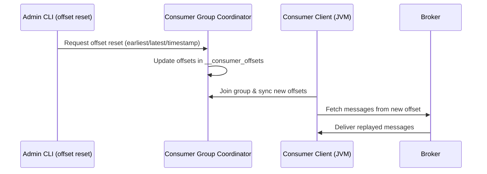

# Kafka **Consumer Group**

A **consumer group** is a **logical grouping of consumers** that work together to consume messages from a Kafka topic **in parallel**, with each message being processed **only once** by the group.


#### 🔸 **Topics**, **Partitions**, and **Consumer Groups**

| Concept            | Description                                                               |
| ------------------ | ------------------------------------------------------------------------- |
| **Topic**          | A named feed to which producers publish and from which consumers read.    |
| **Partition**      | Topics are divided into partitions for parallelism and scalability.       |
| **Consumer Group** | A group of consumers that cooperatively read from the topic’s partitions. |


* Each partition is assigned to **only one consumer** in the group.
* Kafka ensures **load balancing**: multiple consumers in the same group divide the partitions.
* Each group **maintains its own offset**, so multiple groups can read the same topic independently.


### Example 

* Topic `orders` has 3 partitions: `orders-0`, `orders-1`, `orders-2`.
* Consumer group `order-service` has 2 consumers: `C1` and `C2`.

> Kafka assigns:

* `C1`: `orders-0`, `orders-1`
* `C2`: `orders-2`

Every message is processed **once per group**, not per consumer.


### Managing Consumer Groups (ZooKeeper CLI)

**Note**: Managing consumer groups via ZooKeeper is **deprecated** and was only used in very old Kafka versions (< 0.10). Modern Kafka stores consumer offsets in Kafka itself (`__consumer_offsets` topic).


### If You're Using Very Old Kafka (ZooKeeper-based):

####  1. Start ZooKeeper CLI

```bash
zkCli.sh -server localhost:2181
```

####  2. List all consumer groups (ZooKeeper path)

```bash
ls /consumers
```

You’ll see:

```
[order-service, inventory-service, ...]
```

####  3. List topic subscriptions of a group

```bash
ls /consumers/order-service/owners
```

Lists the topic partitions assigned to the group.

####  4. View partition assignment

```bash
ls /consumers/order-service/owners/orders
```

Example output:

```
[0, 1, 2]
```

Each number is a partition. You can check who owns them.


### Limitations of ZooKeeper-based Group Management

* Doesn't support **dynamic group membership**.
* Doesn't allow **offset commit management via Kafka APIs**.
* Difficult to **rebalance** or **reset offsets**.


### Modern Way (Kafka-managed Groups)

Use:

```bash
kafka-consumer-groups.sh --bootstrap-server localhost:9092 --list
```

List topics, reset offsets, describe groups, etc.

Example:

```bash
# Describe group
kafka-consumer-groups.sh \
  --bootstrap-server localhost:9092 \
  --describe --group order-service

# Reset offset
kafka-consumer-groups.sh \
  --bootstrap-server localhost:9092 \
  --group order-service \
  --topic orders \
  --reset-offsets --to-earliest --execute
```


| Concept             | Description                                                              |
| ------------------- | ------------------------------------------------------------------------ |
| **Consumer Group**  | Set of consumers that coordinate to consume a topic’s partitions         |
| **ZooKeeper Role**  | Used in older Kafka versions for tracking group metadata                 |
| **Modern Practice** | Kafka brokers manage groups via `__consumer_offsets`, ZooKeeper not used |
| **Management Tool** | `kafka-consumer-groups.sh` (not `zkCli.sh`)                              |


Let me know your Kafka version — if you're using Kafka 2.0+ or 3.x, you should **avoid managing consumer groups via ZooKeeper** and use Kafka CLI tools instead.

### Kafka Consumer Partition Assignment Strategies

Kafka provides multiple **partition assignment strategies** that decide how partitions in a consumer group are divided among consumers. The component responsible for this is the **Kafka Consumer Group Coordinator** on the broker side, and the **Kafka Consumer Client** on the client side.

Below are all the main assignors available in the Kafka client library (org.apache.kafka.clients.consumer).


### StickyAssignor

Class: `org.apache.kafka.clients.consumer.StickyAssignor`
Keeps partition assignments **as stable as possible** across rebalances.
Attempts to avoid unnecessary partition movement while keeping load nearly even.


### CooperativeStickyAssignor

Class: `org.apache.kafka.clients.consumer.CooperativeStickyAssignor`
A safer, incremental rebalance version of StickyAssignor.
Avoids stopping all consumers at once (uses **cooperative rebalancing**) and ensures minimal partition churn.


### RangeAssignor

Class: `org.apache.kafka.clients.consumer.RangeAssignor`
Partitions are divided **contiguously** based on lexicographical order of topics.
Can lead to imbalance when partition count is not divisible by consumer count.


### RoundRobinAssignor

Class: `org.apache.kafka.clients.consumer.RoundRobinAssignor`
Distributes partitions in a **round-robin** fashion across consumers, ensuring even distribution.
Needs all consumers to subscribe to **exactly the same topic list**.


### Custom Assignor (User-Defined)

You can implement your own strategy:

```java
public class MyCustomAssignor implements PartitionAssignor {
    // implement subscription(), assign(), onAssignment()
}
```

The Kafka Consumer Group Coordinator executes this custom logic during rebalancing.


### Default Assignor Behavior

Since Kafka **2.6+**, the default is:

* **CooperativeStickyAssignor** for incremental cooperative rebalancing.


### How to Configure Assignor

```properties
partition.assignment.strategy=org.apache.kafka.clients.consumer.CooperativeStickyAssignor
```

Java code:

```java
props.put(ConsumerConfig.PARTITION_ASSIGNMENT_STRATEGY_CONFIG,
          List.of(CooperativeStickyAssignor.class.getName()));
```


More : when to use each assignor and show an example rebalance log for Sticky vs RoundRobin.


### Replay in a Kafka Consumer Group

Replay means **re-consuming messages from an earlier offset**.
Kafka enables replay because messages are **not deleted after consumption**; the Consumer Group Coordinator stores offsets separately.
To replay, you **reset the committed offsets** for the consumer group.
Components involved: **Kafka Consumer Client**, **Broker**, **Consumer Group Coordinator**.

### How Replay Works Internally

1. Consumer Group Coordinator stores committed offsets in `__consumer_offsets`.
2. You request a reset (e.g., earliest).
3. Coordinator updates offsets.
4. Consumer restarts and fetches from updated offsets.
5. Broker delivers earlier messages again.

### Mermaid Sequence Diagram for Replay



### Command to Trigger Replay (Offset Reset)

Reset all partitions to earliest:

```bash
kafka-consumer-groups.sh \
  --bootstrap-server localhost:9092 \
  --group order-consumers \
  --topic orders \
  --reset-offsets --to-earliest --execute
```

Reset to a timestamp:

```bash
kafka-consumer-groups.sh \
  --bootstrap-server localhost:9092 \
  --group order-consumers \
  --topic orders \
  --reset-offsets --to-datetime "2025-01-01T10:00:00" \
  --execute
```

Preview before executing:

```bash
--reset-offsets --to-earliest --dry-run
```

### Java Consumer Code Snippet (Replay-Ready)

```java
Properties props = new Properties();
props.put(ConsumerConfig.BOOTSTRAP_SERVERS_CONFIG, "localhost:9092");
props.put(ConsumerConfig.GROUP_ID_CONFIG, "order-consumers");
props.put(ConsumerConfig.AUTO_OFFSET_RESET_CONFIG, "earliest"); // JVM Consumer client uses earliest on first start
props.put(ConsumerConfig.KEY_DESERIALIZER_CLASS_CONFIG, StringDeserializer.class);
props.put(ConsumerConfig.VALUE_DESERIALIZER_CLASS_CONFIG, StringDeserializer.class);

KafkaConsumer<String, String> consumer = new KafkaConsumer<>(props);
consumer.subscribe(List.of("orders"));

while (true) {
    var records = consumer.poll(Duration.ofMillis(100));  // Consumer client pulls from Broker
    for (var r : records) {
        process(r);  // JVM executes business logic
    }
    consumer.commitSync();  // Consumer Client commits to Coordinator
}
```

### When Replay Is Actually Needed

* Rebuild downstream DB (Oracle, MongoDB, Elasticsearch).
* Reprocess events after logic change in JVM layer.
* Recover from consumer crash that lost local state.

More :

* A table comparing all offset reset strategies
* A flow diagram for timestamp-based replay
* Code to manually seek offsets in the consumer client

### Offset Reset Strategies in Kafka

Kafka supports multiple offset reset strategies when replaying or starting a consumer group. These are handled by the **Kafka Consumer Client** and the **Consumer Group Coordinator**.

### To Earliest

Resets offset to the **beginning** of each partition.
Use when you want **full replay** of all messages.

**Command**

```bash
kafka-consumer-groups.sh --bootstrap-server localhost:9092 \
--group g1 --topic orders --reset-offsets --to-earliest --execute
```

**Consumer Config**

```properties
auto.offset.reset=earliest
```

### To Latest

Moves offset to the **end**, skipping past data.
Use for fresh consumption when history is not required.

**Command**

```bash
--reset-offsets --to-latest --execute
```

**Consumer Config**

```properties
auto.offset.reset=latest
```

### To Offset

Set a **specific numeric offset** per partition.
Use for precise replay control.

**Command**

```bash
--reset-offsets --to-offset 1200 --execute
```

### To Datetime

Resets to the first message **at or after a timestamp**.
Useful for partial replay based on time windows.

**Command**

```bash
--reset-offsets --to-datetime "2025-01-20T10:00:00" --execute
```

### To Current

Keeps offsets unchanged but forces rebalancing.
Used for validation or testing.

**Command**

```bash
--reset-offsets --to-current --execute
```

### To Smallest / To Largest (Legacy)

Pre-0.10 compatible versions.
Equivalent to earliest/latest today.

**Command**

```bash
--reset-offsets --to-smallest --execute
```

### Shift By

Shifts current offsets positively or negatively.
Useful for “go back 100 messages”.

**Command**

```bash
--reset-offsets --shift-by -100 --execute
```

### Java Code Snippet for Manual Seeking (Consumer Client, JVM)

Useful when you want to override offsets without using CLI.

```java
consumer.assign(List.of(new TopicPartition("orders", 0)));
consumer.seek(new TopicPartition("orders", 0), 0); // replay from beginning
```

If you want, I can also generate a comparison table showing when each strategy is ideal for replay scenarios.


