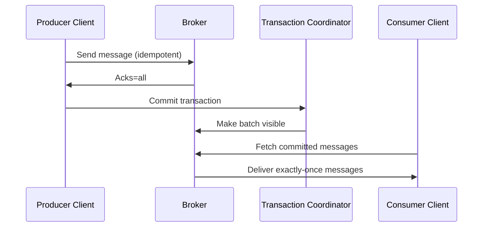

### Message Delivery Semantics in Kafka

Kafka provides three delivery guarantees that determine how messages flow from Producer to Broker and from Broker to Consumer. These guarantees rely on Kafka components such as the Producer client, Broker replication layer, Consumer client, and Consumer Group Coordinator.

### At Most Once Delivery

Messages may be lost but are never re-delivered.
Producer sends data without retries or acknowledgment checks.
Consumer commits the offset before processing, so a crash loses work.
Kafka components involved: Producer client (no retry), Broker (no guarantee), Consumer client (early offset commit).

### At Least Once Delivery

Messages are never lost but may be processed more than once.
Producer retries sends until Broker acknowledges the write.
Consumer commits offset after processing, so a crash replays messages.
Kafka components involved: Producer retry logic, Broker replication layer, Consumer client (post-processing offset commit).

### Exactly Once Delivery

Messages are delivered once with no duplicates by combining idempotent producers and transactional semantics.
Producer enables idempotence and writes messages with unique Producer IDs; Broker enforces duplicate suppression.
Consumer processes transactional batches only when committed.
Kafka components involved: Idempotent Producer, Broker transaction coordinator, Consumer client with isolation.level=read_committed.

### Producer Configuration Example

```properties
acks=all
enable.idempotence=true
retries=5
max.in.flight.requests.per.connection=1
```

The Kafka Producer client uses idempotence to avoid duplicate writes, while the Broker transaction coordinator ensures atomic commit.

### Consumer Pseudocode Example

```java
while (true) {
    var records = consumer.poll();
    for (var record : records) {
        process(record);   // JVM executes business logic
    }
    consumer.commitSync();  // Consumer client sends commit to Group Coordinator
}
```

The Consumer Group Coordinator updates committed offsets.

### Mermaid Diagram of Delivery Semantics Flow



### When to Use Each Semantics

At Most Once: metrics, logs that can tolerate loss.
At Least Once: payment pipelines with deduplication in JVM layer.
Exactly Once: financial transactions, inventory updates, where duplicates cannot be tolerated.

If you want, I can generate a table comparing latency, reliability, and resource usage for all three semantics.
