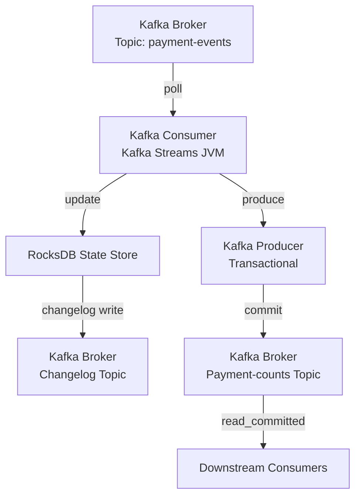

### What Is Kafka Streams

Kafka Streams is a **Java library** that runs inside your **JVM** and processes data directly from Kafka **brokers** using **Kafka consumer**, **Kafka producer**, and **local RocksDB state stores**.
It provides windowing, joins, aggregations, and exactly-once processing without needing a separate cluster.

### How Kafka Streams Ensures Exactly Once

Kafka Streams ensures exactly-once processing through three mechanisms:

1. **Idempotent Kafka producer**
   All writes to output topics use the producer’s idempotency to avoid duplicates during retries.

2. **Transactional writes + offset commits**
   The Streams library uses a transactional Kafka producer to atomically:

   * Write output records
   * Commit consumer offsets
     This ensures read → process → write becomes atomic.

3. **State store changelog**
   Updates to RocksDB state store are logged to a Kafka changelog topic with transactional guarantees.
   On crash, Streams restores state exactly from the changelog, preventing double processing.

### How To Enable Exactly Once

Enable EOS by setting:

```
properties.put(StreamsConfig.PROCESSING_GUARANTEE_CONFIG, StreamsConfig.EXACTLY_ONCE_V2);
```

Streams internally configures:

* Kafka producer for idempotence
* Kafka producer for transactions
* Kafka consumer isolation.level=read_committed
* Changelog topics with appropriate settings

### Concise Example Use Case

Goal: Count number of successful payment events exactly once.

Input topic: `payment-events`
Output topic: `payment-counts`

### Pseudo Code (Close To Real Java)

```
Properties p = new Properties();
p.put(APPLICATION_ID_CONFIG, "payment-counter");
p.put(BOOTSTRAP_SERVERS_CONFIG, "broker1:9092");
p.put(PROCESSING_GUARANTEE_CONFIG, EXACTLY_ONCE_V2);

StreamsBuilder b = new StreamsBuilder();

KStream<String, Payment> payments = b.stream("payment-events");

KTable<String, Long> counts =
    payments.filter((k, v) -> v.status().equals("SUCCESS"))
            .groupByKey()
            .count();

counts.toStream().to("payment-counts");

new KafkaStreams(b.build(), p).start();
```

### Explanation Of Component Actions

* **Kafka consumer (inside Streams)** pulls events from `payment-events`
* **Kafka producer (inside Streams)** writes updated counts to `payment-counts`
* **Kafka Streams runtime (in JVM)** manages transactions and state
* **Kafka broker** stores offsets, changelog entries, and enforces transactional commits
* **RocksDB (local state store)** holds counters for fast access
* **Kafka transaction coordinator** ensures commit or abort for each processing batch

### End-To-End Flow Diagram (Mermaid)



### Summary

Kafka Streams achieves exactly-once by combining:

* Idempotent Kafka producer
* Transactional writes + offset commits
* State store changelogs
* read_committed consumer isolation

This ensures each message is **processed exactly once** even during failures.

