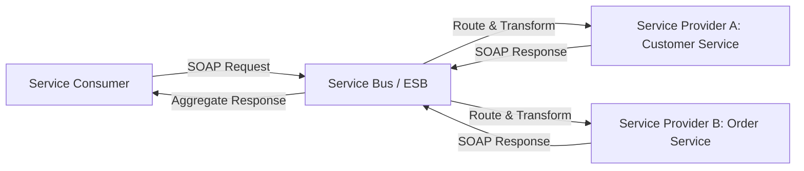

Excellent — let’s explore **Service-Oriented Architecture (SOA)** from both a **historical** and **technical** perspective 👇

---

## 🧭 1. What Is SOA?

**Service-Oriented Architecture (SOA)** is a **design paradigm** where software components (called *services*) are:

* **Loosely coupled**
* **Interoperable**
* **Reusable**
* **Communicate over a network**

Each service performs a specific business function (like *“process payment”* or *“fetch customer data”*), and communicates via **standardized interfaces** — typically using **SOAP (Simple Object Access Protocol)** over **HTTP**.

---

## 🕰️ 2. Timeline — Major Developments in SOA Evolution

| Period           | Key Developments                                                                                                     | Relevance                                                      |
| :--------------- | :------------------------------------------------------------------------------------------------------------------- | :------------------------------------------------------------- |
| **Late 1990s**   | Rise of **distributed object technologies** like **CORBA**, **DCOM**, **RMI**                                        | Early attempts at modular, network-based components            |
| **2000–2003**    | **SOA formally defined** — XML-based web services (**SOAP**, **WSDL**, **UDDI**)                                     | Core foundation of enterprise integration                      |
| **2004–2008**    | **Enterprise SOA boom** — driven by **IBM**, **Oracle**, **Microsoft**, **SAP**                                      | Became standard for large-scale enterprise systems             |
| **2009–2014**    | **RESTful APIs** gained popularity; SOA criticized for complexity and overhead                                       | Shift toward simpler, lightweight web APIs                     |
| **2014–Present** | **Microservices architecture** emerges — decentralized, independently deployable services                            | Evolved from SOA concepts with DevOps and cloud-native tooling |
| **2020s**        | **Serverless**, **event-driven architectures**, and **service meshes** (Istio, Linkerd) evolve the SOA ideas further | Modern cloud-native SOA descendants                            |

---

## 🧩 3. Key SOA Components

| Component                        | Purpose                                                                |
| :------------------------------- | :--------------------------------------------------------------------- |
| **Service Provider**             | Implements and exposes the service                                     |
| **Service Consumer**             | Calls the service via interface                                        |
| **Service Registry (UDDI)**      | Directory for discovering available services                           |
| **Service Contract (WSDL)**      | Defines how a service is called (input/output)                         |
| **SOAP / XML**                   | Communication protocol and message format                              |
| **Enterprise Service Bus (ESB)** | Middleware layer for routing, transforming, and orchestrating services |

---

## 🧠 4. Key Concepts Introduced by SOA

| Concept              | Description                                                         |
| :------------------- | :------------------------------------------------------------------ |
| **Loose Coupling**   | Services interact through well-defined contracts, not internal code |
| **Reusability**      | Services can be reused across applications                          |
| **Interoperability** | Heterogeneous systems (Java, .NET, etc.) can communicate            |
| **Statelessness**    | Services designed to avoid retaining client state between requests  |
| **Discoverability**  | Services can be located dynamically through registries              |

---

## 🏢 5. Real-World Adoption

| Company                                   | Use of SOA                                                    |
| :---------------------------------------- | :------------------------------------------------------------ |
| **Amazon (early 2000s)**                  | Rebuilt internal systems around SOA → paved the way for AWS   |
| **Netflix**                               | Early adopter → later evolved into microservices              |
| **Banks/Insurance (JPMorgan, AXA, Citi)** | Used SOA for integrating legacy mainframes and modern systems |
| **SAP**                                   | Introduced **Enterprise SOA** with NetWeaver                  |
| **IBM**                                   | Provided WebSphere-based SOA suites and ESB middleware        |

---

## 🧮 6. Example — SOA System Flow (Mermaid Diagram)

---

## ⚙️ 7. Why SOA Became Less Popular

| Challenge                      | Explanation                                                                   |
| :----------------------------- | :---------------------------------------------------------------------------- |
| **Heavyweight XML & SOAP**     | Verbose, slower than JSON-based REST                                          |
| **Centralized ESB bottleneck** | Single point of failure and latency hotspot                                   |
| **Difficult versioning**       | Changes in service contracts caused ripple effects                            |
| **Complex governance**         | Needed registries, WSDL, UDDI, and strict XML schemas                         |
| **Monolithic deployments**     | Despite “services”, many were tightly coupled inside large enterprise systems |

---

## 🔁 8. How It Transitioned to Microservices

| SOA                         | Microservices                                            |
| :-------------------------- | :------------------------------------------------------- |
| Centralized ESB             | Decentralized communication (API Gateway, Message Queue) |
| SOAP / XML                  | REST / JSON / gRPC                                       |
| Enterprise-level governance | DevOps-driven ownership per team                         |
| Shared schema & contracts   | Independent data models                                  |
| Large, complex deployments  | Small, containerized services (Docker, Kubernetes)       |

---

## 🚀 9. Legacy and Relevance Today

SOA itself is *less fashionable*, but its **core principles still power modern systems**:

| Modern Architecture               | SOA Concept Reused                          |
| :-------------------------------- | :------------------------------------------ |
| **Microservices**                 | Decentralized, autonomous services          |
| **API Gateway**                   | Replacement for ESB                         |
| **Event-Driven Systems (Kafka)**  | Asynchronous service communication          |
| **Cloud Functions (AWS Lambda)**  | Stateless service invocation                |
| **Service Mesh (Istio, Linkerd)** | Runtime-level service discovery and routing |

---

## 🧭 10. Summary — When and Why SOA Was Relevant

| Era       | Why It Mattered                                                                  |
| :-------- | :------------------------------------------------------------------------------- |
| 2000–2010 | Solved massive **enterprise integration** issues (mainframe + web + ERP)         |
| 2010–2020 | Foundation for **cloud APIs** and **microservices**                              |
| 2020–Now  | Serves as **conceptual ancestor** of cloud-native and event-driven architectures |

---

Would you like me to show a **timeline diagram (Mermaid)** illustrating how SOA evolved into **Microservices → Serverless → Service Mesh** architectures?
