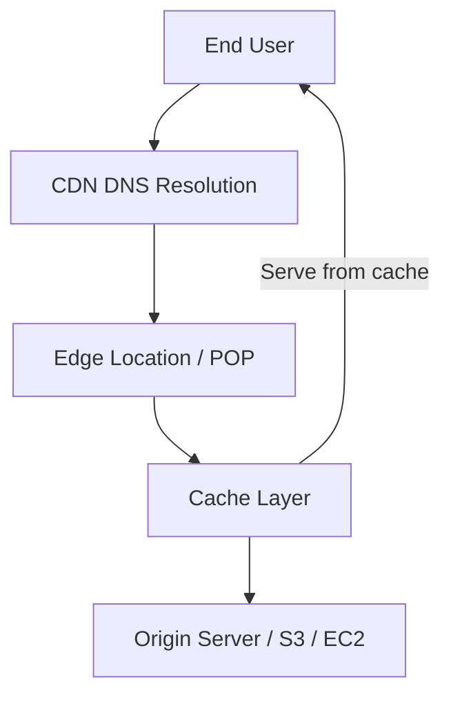
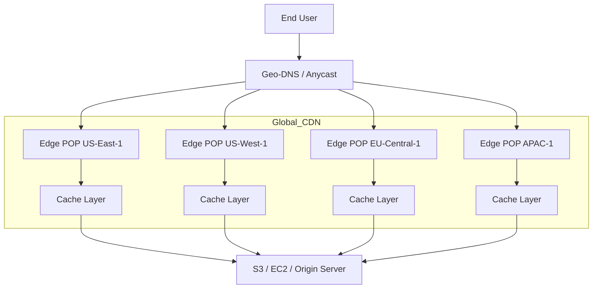

Absolutely — let’s do a **deep dive into the system design of a CDN** (Content Delivery Network) like **AWS CloudFront**, covering **architecture, components, caching strategy, scaling, and optimizations**.

---

## 🧭 1. **Purpose of a CDN**

A CDN is designed to **deliver content (static or dynamic) to users with low latency, high availability, and scalability**.
Key goals:

* Reduce latency by serving content from **locations close to the user**
* Handle **high traffic spikes** efficiently
* Reduce load on the origin server
* Provide **reliability and DDoS mitigation**

---

## 🏗️ 2. **High-Level Architecture**

---

### 🔹 Components

| Component                        | Description                                                                                                 |
| -------------------------------- | ----------------------------------------------------------------------------------------------------------- |
| **Edge Location / POP**          | Geographically distributed servers that cache content near users.                                           |
| **Origin Server**                | The original source of the content (e.g., S3, EC2, custom backend).                                         |
| **Cache Layer**                  | Stores content temporarily; can be **in-memory** or **disk-based**. Supports TTL and invalidation policies. |
| **DNS Resolution**               | Uses **geo-DNS** or **anycast** to route users to the nearest edge server.                                  |
| **Request Routing**              | Determines if content exists in cache or needs to fetch from origin.                                        |
| **Invalidation / Purge Service** | Allows content to be refreshed across edges.                                                                |
| **Analytics & Logging**          | Tracks hits, misses, traffic patterns, errors.                                                              |

---

## ⚙️ 3. **Request Flow**

| Step                     | Description                                                                                                                                |
| ------------------------ | ------------------------------------------------------------------------------------------------------------------------------------------ |
| **1. User Request**      | User requests content: `https://cdn.example.com/video.mp4`                                                                                 |
| **2. DNS Resolution**    | Geo-DNS or Anycast directs request to **nearest edge location**.                                                                           |
| **3. Cache Lookup**      | Edge checks if content exists in cache:  • **Cache Hit:** Serve content immediately.  • **Cache Miss:** Forward request to origin. |
| **4. Fetch from Origin** | Edge fetches content from origin server if needed.                                                                                         |
| **5. Edge Caching**      | Store fetched content in cache for future requests (based on TTL/headers).                                                                 |
| **6. Response to User**  | Content is delivered with low latency from edge.                                                                                           |

---

## 🌐 4. **Caching Strategies**

| Strategy                   | Purpose                                              | Example                                   |
| -------------------------- | ---------------------------------------------------- | ----------------------------------------- |
| **Time-to-Live (TTL)**     | Determines cache duration                            | `Cache-Control: max-age=3600`             |
| **Origin Pull vs Push**    | Pull: fetch content on demand; Push: preload content | Pull: dynamic images; Push: video library |
| **Cache Invalidation**     | Remove stale content                                 | AWS CloudFront Invalidate API             |
| **Stale-While-Revalidate** | Serve stale content while fetching fresh copy        | Reduces latency during high load          |
| **Hierarchical Caching**   | Multi-layer caching across regions                   | Edge cache → Regional cache → Origin      |

---

## ⚡ 5. **Performance Optimization**

| Technique                        | Description                                           |
| -------------------------------- | ----------------------------------------------------- |
| **Anycast Routing**              | Directs users to nearest POP using same IP globally   |
| **HTTP/2 & QUIC**                | Multiplexed connections, low latency                  |
| **Compression**                  | Gzip / Brotli reduces payload                         |
| **Content Segmentation**         | Large files split into chunks (e.g., video streaming) |
| **Edge Lambda / Edge Functions** | Modify requests/responses at edge (custom logic)      |

---

## 🔒 6. **Security Features**

| Feature                            | Purpose                                               |
| ---------------------------------- | ----------------------------------------------------- |
| **HTTPS/TLS termination at Edge**  | Encrypt traffic close to user                         |
| **DDoS Protection**                | Absorb attacks at edge locations                      |
| **WAF (Web Application Firewall)** | Filter malicious requests                             |
| **Signed URLs / Tokens**           | Control access to private content                     |
| **Origin Shield**                  | Protect origin server from large-scale traffic spikes |

---

## 🏢 7. **Scaling & Reliability**

| Aspect                   | How CloudFront handles it                          |
| ------------------------ | -------------------------------------------------- |
| **Global Traffic**       | Thousands of edge locations worldwide              |
| **Horizontal Scaling**   | Each edge server scales independently              |
| **Failover**             | Requests automatically rerouted if an edge is down |
| **Load Balancing**       | Anycast + DNS ensures optimal routing              |
| **Monitoring & Logging** | CloudWatch + Real-time metrics                     |

---

## 🧩 8. **Dynamic Content Handling**

While CDNs are ideal for static content (images, JS, CSS), they also accelerate dynamic content:

* **Dynamic content caching** (API responses)
* **Edge logic / Lambda@Edge** for personalization
* **Compression & connection reuse** to reduce origin load
* **Partial caching / content chunking** for videos

---

## 📊 9. **Example Request Lifecycle**

1. User requests: `https://cdn.example.com/style.css`
2. DNS resolves to nearest edge POP
3. Edge cache: **miss** → fetches from S3 origin
4. Cache stores content (TTL 24h)
5. Subsequent requests → **cache hit**, serve instantly
6. Admin updates file → calls **invalidate** API → cache purged

---

## 🔍 10. **Mermaid Architecture Diagram (Global CDN View)**

---

### ✅ Key Takeaways

* **CDN Edge Locations** serve content **closer to users** → low latency
* **Caching** reduces load on the origin and improves performance
* **Anycast + Geo-DNS** routes requests efficiently
* **Dynamic content support** via edge functions or partial caching
* **Security & reliability** integrated at edge (TLS, WAF, DDoS protection)
* **Global scale** requires hierarchical caching, horizontal scaling, and monitoring

---

If you want, I can create an **advanced diagram showing**:

* **Hierarchical caching layers** (Edge → Regional → Origin)
* **Cache invalidation workflow**
* **Dynamic content routing & personalization**

This will resemble the **full AWS CloudFront architecture at scale**.

Do you want me to create that?
