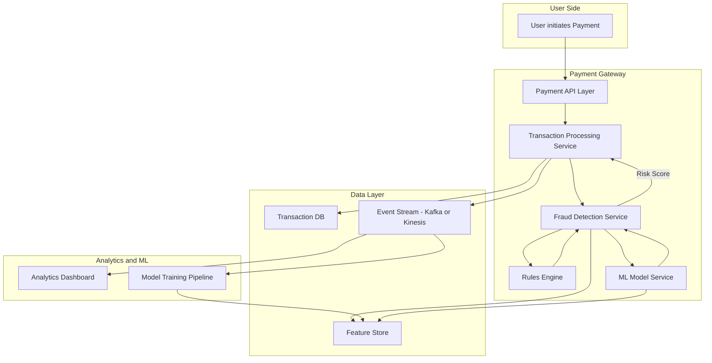

Fraud detection in a **payment gateway** (like Stripe, Razorpay, PayPal) is a **mission-critical component**.
It needs **real-time checks** (to block fraudulent transactions instantly) and **offline analysis** (to improve ML models and rules).

---

# 🔹 Fraud Detection System Design (Payment Gateway)

### Key Components

1. **User → Payment Gateway API**

   * Users initiate payments (via card, UPI, wallets).

2. **Transaction Processing Service**

   * Validates payment request, routes to bank/payment network.

3. **Fraud Detection Service**

   * Real-time risk scoring of each transaction.
   * Uses a **hybrid approach**: Rules Engine + ML Models.

4. **Rules Engine**

   * Detects simple fraud patterns (velocity checks, blacklisted IPs, unusual geolocation, amount anomalies).

5. **ML Model Service**

   * Predicts fraud probability using features like:

     * Device fingerprint, transaction history, behavioral patterns.

6. **Feature Store**

   * Central store for real-time + historical features.

7. **Event Stream (Kafka/Kinesis)**

   * Stores all transaction events for offline analysis & retraining.

8. **Analytics & Monitoring**

   * Tracks fraud detection accuracy, false positives, system health.

9. **Model Training Pipeline**

   * Periodically retrains fraud models with labeled historical data.

---

#  Diagram

---

#  Flow

### 1. Transaction Processing

* User initiates a payment → Payment API → Transaction Processing Service.

### 2. Fraud Detection

* Before routing to the bank, request is sent to **Fraud Detection Service**.
* **Rules Engine** checks simple heuristics (blacklist, multiple attempts).
* **ML Model Service** computes fraud probability using transaction + user + device data.
* Fraud Detection Service combines both and gives **Risk Score**.

### 3. Decision

* If **Risk Score is high → Reject/Flag**.
* If **Risk Score is low → Approve transaction** and continue processing.

### 4. Data Pipeline

* All transaction events flow into **Event Stream**.
* Events go into **Feature Store** for consistent ML training/serving.

### 5. Analytics & Retraining

* Analysts review fraud cases in **Analytics Dashboard**.
* **Model Training Pipeline** retrains ML models using historical labeled data.
* Updated models deployed in **ML Model Service**.

---

✅ This system ensures:

* **Real-time fraud blocking** (milliseconds latency).
* **Scalable architecture** with Kafka/Event Streams.
* **Continuous learning** with feedback loop.

---

Would you like me to **extend this fraud detection design** to also include **external integrations** (like 3rd party fraud APIs, credit bureaus, device fingerprinting services)?

