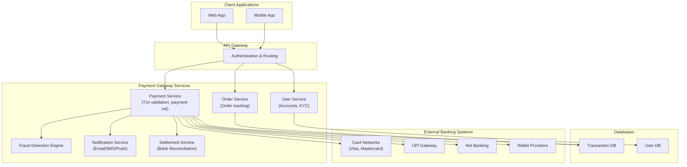

---

# ✅ System Design of a Payment Gateway

A **payment gateway** is an intermediary between merchants and financial institutions that securely processes online payments.

### 🔹 Key Components

1. **Client Applications**

   * Mobile app / Web app where user initiates payment.

2. **API Gateway**

   * Entry point for all payment requests.
   * Handles authentication, routing, and rate limiting.

3. **Payment Service**

   * Core logic: validates transaction, calculates charges, initiates payment.

4. **Order Service**

   * Keeps track of orders linked to payments.

5. **User Service**

   * Manages users, accounts, KYC, and linked payment methods.

6. **Banking Integrations**

   * Connects to card networks (Visa/Mastercard), UPI, Net Banking, wallets.

7. **Transaction Database**

   * Stores transaction details, order status, and audit logs.

8. **Notification Service**

   * Sends confirmation via email/SMS/push notifications.

9. **Fraud Detection / Risk Engine**

   * Monitors suspicious transactions in real-time.

10. **Settlement Service**

    * Handles reconciliation and settlement with banks and merchants.

---

---

# ✅ How this flows
1. User initiates a payment on **Web/Mobile app**.  
2. Request hits **API Gateway**, then goes to **Payment Service**.  
3. Payment Service validates request, checks fraud, stores in **TxnDB**.  
4. Payment routed to **external banks/networks** (Cards, UPI, Net Banking).  
5. On success/failure, system updates **Order Service**, notifies user, and later settles with the merchant.  

---

