---

#   **Real-Time Ride Tracking**

###  Scenario

* A **Mobile App** continuously sends GPS updates (lat/lon, speed, bearing).
* The **Ride Service** needs to:

  1. Receive a **stream of updates** from each driver’s phone.
  2. Push **real-time location updates** to passengers’ apps.
* System requires **low latency**, **bi-directional streaming**, and **high throughput**.

---

##  Why gRPC ?

1. **Bi-Directional Streaming**

   * gRPC allows **persistent duplex streams** over HTTP/2.
   * Driver app can **stream location updates** to the server continuously.
   * Server can **stream ride status/location** back to passenger apps instantly.
   * REST would need constant polling → huge waste of bandwidth & slower response times.

2. **Performance (HTTP/2 + Protobuf)**

   * Each GPS update is a **tiny binary message** (<100 bytes).
   * With REST, each update would be **JSON + HTTP headers** → easily 10–20x bigger payloads.

3. **Cross-Language Clients**

   * The Driver app (Kotlin/Swift), Passenger app (Flutter/Dart), and Backend (Go/Java) can all use **auto-generated gRPC stubs**.
   * No manual REST SDKs needed.

4. **Real-Time Scaling**

   * gRPC streams efficiently multiplex connections with **HTTP/2**.
   * This allows tens of thousands of drivers to stay connected concurrently.
   * REST/WebSockets don’t scale as efficiently.

---

## Ride Tracking

```mermaid
sequenceDiagram
    participant DriverApp
    participant RideService as gRPC Ride Service
    participant PassengerApp

    DriverApp->>RideService: Stream GPS Updates (lat, lon, speed) 🔁
    RideService-->>PassengerApp: Stream Driver Location Updates 🔁
    PassengerApp-->>RideService: Ride Requests / ETA Queries
    RideService-->>PassengerApp: Real-time ETA, Driver Info
```

---

##  Why REST Fails Here

* REST → Requires **polling** (`GET /location` every 2s).
* Polling = high latency, wasted bandwidth, poor battery life.
* WebSockets can do some of this, but lack **strict schema + code generation + streaming semantics**.

---

 **Conclusion**:
For **real-time, bi-directional, high-volume streaming** (like ride tracking, video chat, stock price feeds, multiplayer gaming), **gRPC is a game changer**.
---

Expand the **ride-tracking system design** into a **comprehensive architecture** with all the moving parts 

---

# 🚖 Ride Tracking System Design (like Uber/Lyft)

###  Components

1. **Driver App** – streams GPS updates via gRPC.
2. **Passenger App** – subscribes to driver’s location & requests rides.
3. **API Gateway** – entry point, routes gRPC/REST calls.
4. **Ride Service** (gRPC-based) – handles ride lifecycle (start, stop, match drivers).
5. **Location Service** (gRPC) – ingests and processes driver GPS updates.
6. **Matching Service** (gRPC) – matches passengers with nearby drivers.
7. **Notification Service** – pushes ride updates to apps (FCM/APNS).
8. **Database (SQL/NoSQL)** – stores user, ride, trip history.
9. **Cache (Redis)** – stores hot location data (driver coords).
10. **Stream Processor (Kafka/Redis Streams)** – for real-time location pipelines.

---

#  Comprehensive System Design

---

# Flow 

1. **Driver App** streams GPS updates via gRPC → API Gateway → **Location Service**.

   * Location Service updates Redis (real-time location cache).
   * Also publishes updates to Kafka for analytics/heatmaps.

2. **Passenger App** requests a ride → API Gateway → **Ride Service**.

   * Ride Service talks to **Matching Service** to find nearest driver.
   * Matching Service queries Redis (hot driver locations).

3. Once a driver is assigned → **Ride Service** updates DB and notifies both apps via **Notification Service**.

4. During trip →

   * Driver’s GPS continues streaming via gRPC.
   * Passenger receives live driver location updates (via Ride Service pushing updates).

---

 This architecture shows:

* **gRPC as the backbone** (Driver → Server, Service-to-Service).
* **Redis + Kafka** to handle high-throughput real-time data.
* **Hybrid communication** (Passenger app may use REST/gRPC; Push service uses FCM/APNS).
* **Separation of concerns** (Ride Service, Matching, Location Service).

---

## **Analytics & ML components** 

 **How ride events (location, trip start/end, payments)** flow into analytics and ML pipelines for **ETA prediction, surge pricing, and fraud detection**.

---

# Analytics & ML Design

### Key Steps

1. **Event Collection**

   * All ride-related events (GPS updates, trip start, trip end, payment confirmation) are pushed into **Kafka/Kinesis**.

2. **Stream Processing**

   * A **Stream Processor (e.g., Apache Flink/Spark Streaming)** consumes events.
   * Enriches GPS data with traffic/weather/context.

3. **Feature Store**

   * Processed features (distance, speed, demand density, historical patterns) stored in a **Feature Store (e.g., Feast, Redis, DynamoDB)**.

4. **ML Models**

   * **ETA Prediction Model** → Predicts driver arrival time.
   * **Surge Pricing Model** → Adjusts pricing dynamically.
   * **Fraud Detection Model** → Flags suspicious trips/payments.

5. **Model Serving**

   * ML models deployed in **ML Serving layer (e.g., TensorFlow Serving, SageMaker Endpoint, gRPC microservices)**.
   * Exposed via **internal gRPC APIs**.

6. **Feedback Loop**

   * Predictions compared against actuals (predicted ETA vs actual arrival).
   * Continuous model retraining with new data.

---

#  Diagram

---

#  Step-by-Step Explanation

### 1. Event Collection

* Driver GPS updates, ride start/end events, payments pushed into **Kafka/Kinesis**.
* Ensures durability and real-time streaming.

### 2. Stream Processing

* A **stream processor (Flink/Spark)** consumes these events.
* Computes intermediate metrics: distance traveled, driver idle time, demand per zone.
* Prepares data for ML by creating features.

### 3. Feature Store

* Stores **real-time + historical features** for consistency across training and serving.
* Examples:

  * ETA model → Distance, average speed, time of day, traffic.
  * Surge pricing model → Demand vs supply in region.
  * Fraud detection model → Unusual routes, abnormal payment activity.

### 4. ML Models

* **ETA Prediction** → Predicts driver’s arrival at pickup/drop-off.
* **Surge Pricing** → Computes dynamic pricing multipliers in real time.
* **Fraud Detection** → Flags anomalies (e.g., GPS spoofing, fake rides, payment abuse).

### 5. Model Serving

* Models deployed as **microservices (gRPC endpoints)** for low-latency predictions.
* Ride Matching and Tracking services call these ML endpoints in real time.

### 6. Feedback Loop

* Predictions logged and compared against **actuals**.
* Deviations trigger retraining.
* Continuous pipeline ensures models improve with new data.

---

This separation makes **Analytics & ML independent, scalable, and fault-tolerant**, so ride-matching and tracking services don’t get overloaded with heavy ML computations.
---
# **How these ML predictions flow back into the core ride tracking system**?

---

#   Integrated Ride Tracking + Analytics & ML System

### Flow

1. **Driver App** streams GPS → **Ride Tracking Service**.
2. **Rider App** requests → **Ride Matching Service**.
3. **Ride Matching Service** queries **ETA Model** to show expected arrival.
4. **Ride Tracking Service** calls **Fraud Detection Model** in the background.
5. **Surge Pricing Model** feeds back pricing multipliers to **Ride Matching**.
6. All events flow into **Kafka/Kinesis** → processed → stored in **Feature Store** for ML.
7. **Feedback Loop** keeps retraining ML models with actual ride outcomes.

---

#  Summary

---

# 🔹 Step-by-Step Explanation

1. **Core Ride Flow**

   * Rider requests a ride → Ride Matching finds driver.
   * Driver streams GPS → Ride Tracking updates rider in real-time.

2. **Integration with ML**

   * **ETA Model** → Ride Matching shows accurate driver arrival time.
   * **Surge Pricing Model** → Adjusts price dynamically when demand > supply.
   * **Fraud Detection Model** → Runs in the background to catch anomalies.

3. **Event Streaming**

   * All ride events go into Kafka/Kinesis.
   * Stream Processor enriches events and updates Feature Store.

4. **Model Lifecycle**

   * Models served via low-latency gRPC APIs.
   * Monitoring compares predictions vs actuals.
   * Retraining pipeline ensures continuous improvement.

---

✅ This way, **ML is decoupled but tightly integrated**, supporting both **real-time predictions** and **long-term improvements**.
 
