# **URL Shortener (like bit.ly)**.

A URL shortener takes a long URL, generates a short key (hash/ID), stores the mapping in a database, and redirects when someone clicks the short link.

---

## 🔹 Key Components

* **Client**: User inputs long URL, clicks shorten.
* **API Gateway / Load Balancer**: Handles requests, distributes to services.
* **Application Service**:

  * Generates unique short IDs (hash or base62 encoding).
  * Stores mapping (short → long URL).
  * Handles redirection logic.
* **Database**:

  * Key-Value store (short URL → long URL).
  * Relational or NoSQL depending on scale.
* **Cache (Redis)**: For fast lookups of popular links.
* **Analytics Service**: Logs clicks, geolocation, device info.
* **Optional**: CDN for fast delivery.

---

## 🔹 Mermaid Diagram

```mermaid
flowchart TD
    subgraph Client["Client (Browser / App)"]
        A[Enter Long URL] --> B[Send Request]
        C[Click Short URL] --> D[Redirect Request]
    end

    subgraph LB["API Gateway / Load Balancer"]
        B --> E[Shortener Service]
        D --> E
    end

    subgraph App["Application Layer"]
        E --> F[ID Generator / Hash Function]
        E --> G[URL Service]
    end

    subgraph Storage["Storage Layer"]
        G --> H[(Database<br/>shortURL → longURL)]
        G --> I[(Cache - Redis)]
    end

    subgraph Analytics["Analytics & Logging"]
        G --> J[Click Logs]
        J --> K[Reports / Insights]
    end

    F --> H
    I --> G
    H --> G

    G --> L[Return Short URL]
    G --> M[Redirect to Long URL]
    L --> Client
    M --> Client
```

---

## 🔹 Flow Explanation

1. **Shortening a URL**

   * User enters a long URL.
   * Service generates a unique short key using **ID Generator**.
   * Stores mapping in **Database** (and optionally in **Cache**).
   * Returns the short URL to the client.

2. **Redirecting a Short URL**

   * User clicks the short URL.
   * Service checks **Cache** first → if not found, fetch from **Database**.
   * Logs analytics (timestamp, IP, location, device).
   * Redirects to the long URL.

3. **Analytics**

   * Every click is logged for reporting.

---

👉 Do you want me to also extend this into a **distributed system design** (with sharded databases, consistent hashing, rate limiting, fault tolerance) like in system design interviews?
