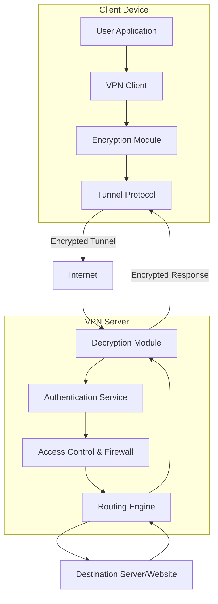

# **VPN**
## System Design 
### Flow between client, VPN server, authentication, encryption, and final destination.

### Explanation of Flow:

1. **Client Device**

   * User runs a VPN client → encrypts traffic using chosen tunnel protocol.

2. **Internet**

   * All traffic moves in encrypted form, preventing snooping.

3. **VPN Server**

   * Decrypts the traffic.
   * Authenticates the user (via certificates, keys, or credentials).
   * Applies firewall and access rules.
   * Routes traffic to destination.

4. **Destination Server**

   * Sees traffic as coming from VPN server (not client).

5. **Response Path**

   * Data flows back through the same tunnel, encrypted end-to-end.

---

Do you want me to also draw a **detailed version with multiple clients connecting to a VPN cluster (load balancer, multiple servers, logs, monitoring)** for production-scale design?
