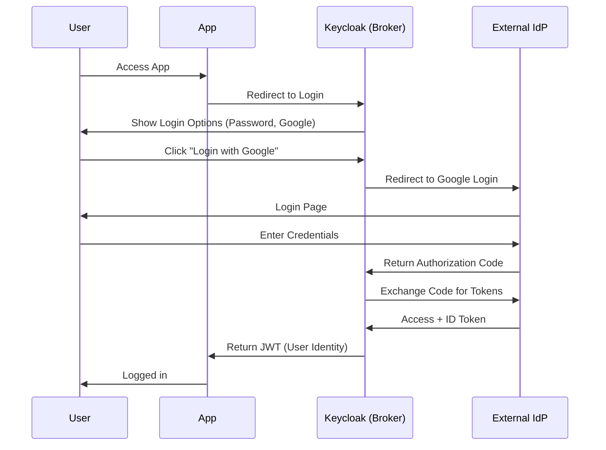

Configure Keycloak to use an external Identity Provider (IdP)** (e.g., Google, Azure AD, Okta, another Keycloak). This is called **Identity Brokering** in Keycloak.

---

#  Setup External IdP in Keycloak

### 1. Log in to Keycloak Admin Console

* Go to your Keycloak Admin Console (`http://<keycloak-host>/auth/admin/`).
* Select the **realm** where you want to enable external login.

---

### 2. Add Identity Provider

* Navigate: **Identity Providers → Add provider**.
* You’ll see multiple options:

  * **OpenID Connect v1.0** (Google, Azure AD, Keycloak, Okta).
  * **SAML v2.0** (enterprise apps like AD FS).
  * **Social Providers** (Google, Facebook, GitHub, LinkedIn).

---

### 3. Configure External IdP

* Fill in provider details:

  * **Alias** → Unique name for the provider (e.g., `google`).
  * **Client ID** → From external IdP (registered app).
  * **Client Secret** → From external IdP.
  * **Authorization URL / Token URL / User Info URL** → Usually auto-filled for well-known IdPs (Google, Azure).
* Save the configuration.

---

### 4. Configure Redirect URI in External IdP

* Go to the **external IdP’s developer console** (e.g., Google Cloud Console, Azure Portal).
* Add **Keycloak redirect URI**:

```
http://<keycloak-host>/auth/realms/<your-realm>/broker/<provider-alias>/endpoint
```

Example for realm `demo` and provider `google`:

```
http://localhost:8080/auth/realms/demo/broker/google/endpoint
```

---

### 5. Test Login

* Go to your **Keycloak login page**.
* You’ll now see a new button (e.g., "Login with Google").
* On click → Keycloak redirects user to external IdP.
* After authentication → external IdP returns tokens to Keycloak → Keycloak creates a user session.

---

#  External IdP in Keycloak



---

#  Key Points

* Keycloak acts as a **broker** between your apps and external IdP.
* Your app **does not need to talk to Google/Azure/Okta** directly.
* You can mix multiple IdPs (Google, LDAP, SAML enterprise).
* User identities can be **federated** (auto-created in Keycloak on first login).

---

