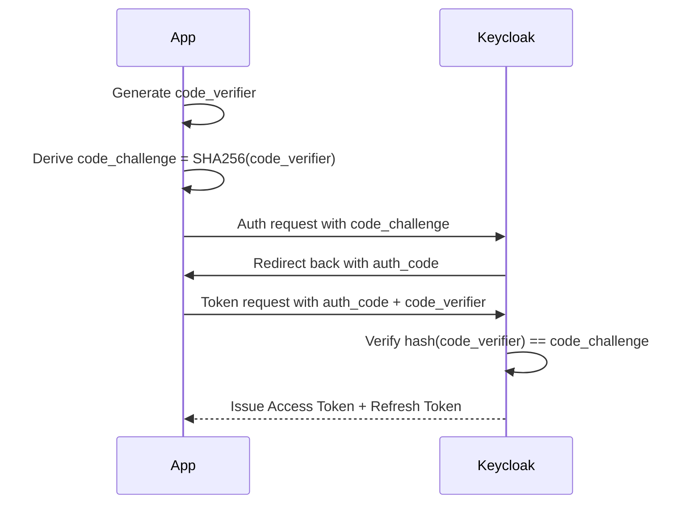

Great question 👍 — let’s break it down simply.

---

# ✅ What is **PKCE**?

**PKCE (Proof Key for Code Exchange)** is an extension to the **OAuth 2.0 Authorization Code flow**, designed to **prevent interception attacks**.

It was originally created for **mobile and public clients** (apps that can’t keep a secret, like a browser SPA or iOS/Android app). Now, many security experts recommend using PKCE **everywhere**, even for web apps.

---

# 🔎 Why is it needed?

In a **regular OAuth2 Authorization Code flow**:

1. App redirects the user to Keycloak (or another IdP).
2. After login, Keycloak redirects back with an **authorization code**.
3. The app exchanges that code for **tokens**.

🚨 Problem: If an attacker steals the authorization code (e.g., via a malicious app, network sniffing, or redirect hijack), they could exchange it for tokens.

---

# 🔐 How PKCE solves this

With PKCE, the client generates a **secret per request**, so even if the code is stolen, it’s useless without the secret.

Steps:

1. Client generates a **code verifier** (a random string).
2. Client hashes it into a **code challenge** (usually SHA256).
3. Client starts the flow by sending the **code challenge** to Keycloak.
4. After login, Keycloak gives back the **authorization code**.
5. Client exchanges code for tokens **but must also send the original code verifier**.
6. Keycloak compares it with the challenge and only issues tokens if they match.

So:
👉 An attacker with only the **authorization code** can’t do anything.
👉 Only the original app (holding the code verifier) can exchange it for tokens.

---

# 🔄 PKCE Flow with Keycloak (simplified)

---

# ✅ Summary

* PKCE = **extra layer of security** for OAuth Authorization Code flow.
* Protects against **authorization code interception**.
* Mandatory for **public clients** (mobile, SPA).
* Recommended for **all clients** now.

---

👉 Do you want me to show you **how to enable PKCE in Keycloak for a client** (step by step in the admin console)?
