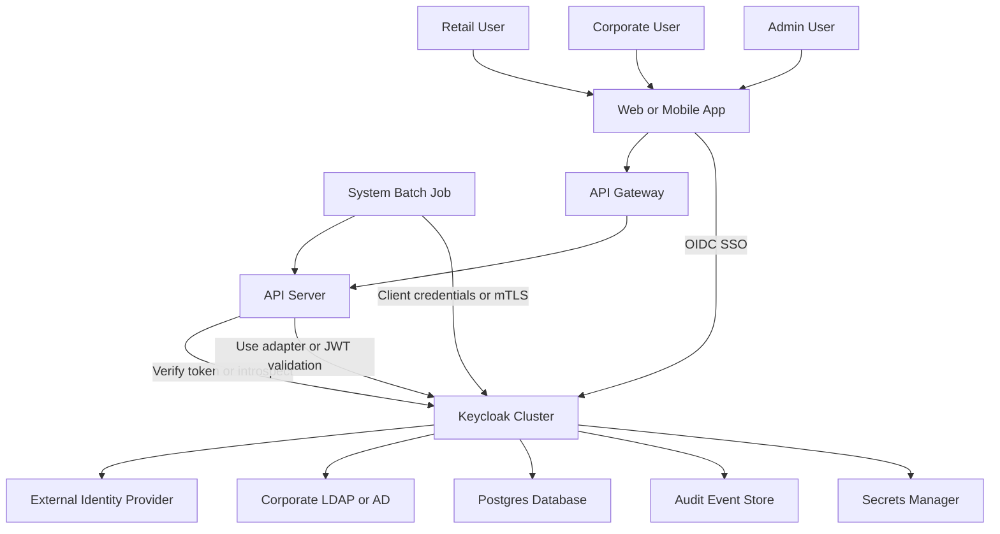
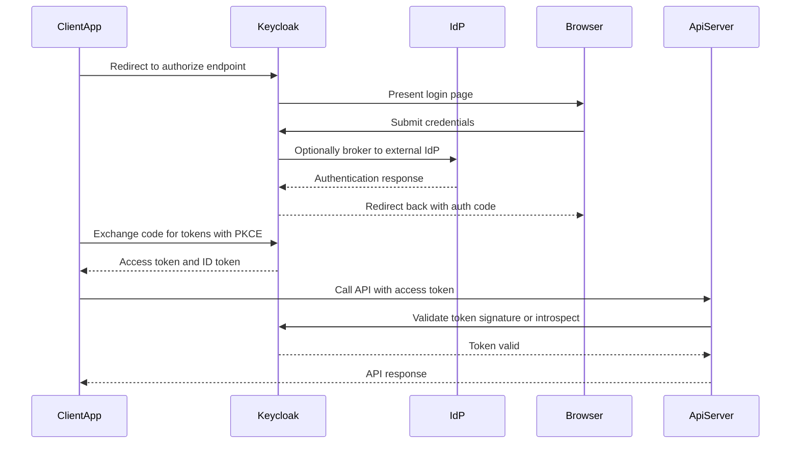
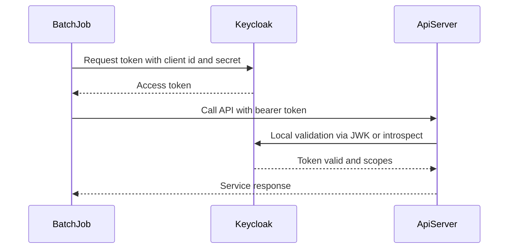
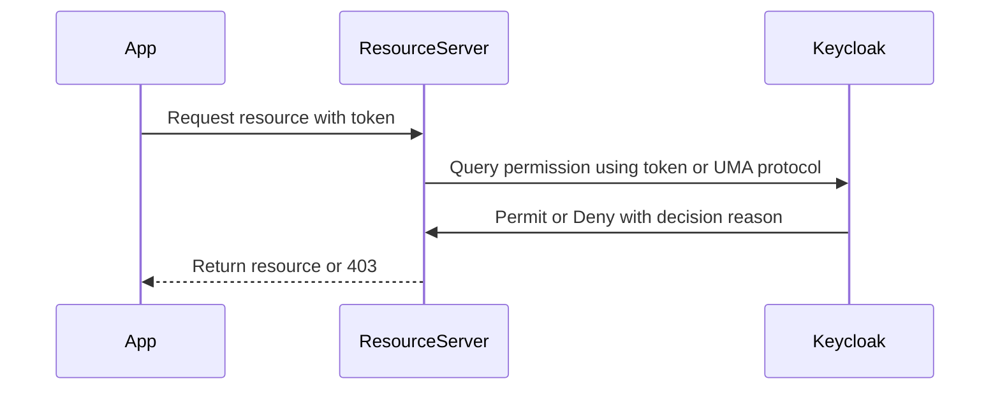

# Authentication and Authorization System
---

# Overview and goals

* Provide single sign on and centralized identity management.
* Support different authentication flows per user type.
* Enforce fine grained authorization (RBAC and policy based).
* Secure machine to machine credentials for system jobs.
* High availability, auditability, and easy user federation with corporate directories.

---

# Key components

* Keycloak cluster
* Admin console and admin REST API
* Identity providers for social login and corporate SSO
* User federation such as LDAP or Active Directory
* Clients representing apps and APIs
* Roles, groups, client scopes, and protocol mappers
* Authorization services and policy engine
* Resource servers and adapters for enforcement
* Token introspection endpoint and revocation APIs
* Persistent database for Keycloak (Postgres)
* Event stream and audit logs
* Secrets manager for client credentials
* Optional API Gateway or Authz proxy in front of services

---

# High level architecture diagram

---

# How each user type is handled

## Retail user

* Typical consumer login flow:

  * Browser app initiates OIDC Authorization Code flow with PKCE.
  * Keycloak performs local authentication or social login via identity brokering.
  * Optional MFA via authenticator app or SMS.
  * Keycloak issues ID token and Access token (JWT).
  * Client uses Access token to call APIs. APIs validate token locally (JWKs) or via introspection.
* Recommended Keycloak settings:

  * Client type confidential for web backends, public for mobile (use PKCE).
  * Short access token lifetime (eg 5-15 minutes).
  * Refresh token rotation enabled.
  * Email verification enabled on registration.
  * Rate limit login attempts, enable brute force detection.

## Corporate user

* Enterprise flow:

  * Keycloak uses user federation to LDAP or Active Directory or acts as SAML/OIDC broker to corporate IdP.
  * Single sign on across internal apps.
  * Map LDAP groups to Keycloak roles or groups.
  * Use SAML or OIDC backchannel logout support for session termination.
  * Enforce corporate MFA (via IdP or Keycloak).
* Recommended:

  * Sync user attributes to Keycloak via federation.
  * Use role mapping and group membership for authorization.

## Admin user

* Admins access Keycloak admin console using elevated roles.
* Protect admin console behind network access controls and require step-up authentication (MFA).
* Implement separation of duties: create realm admin, user manager, auditor roles.
* Logging and audit events must be enabled for all admin actions.

## System user and batch job

* Machine to machine communication:

  * Use OAuth2 client credentials flow or mTLS for highest security.
  * Create a confidential client in Keycloak with restricted scopes and service account enabled.
  * Use short lived tokens when possible and rotate client secrets via Secrets Manager.
  * For long running offline tasks that need persistent access, use offline tokens with extreme caution or use service account token rotation.
* Recommended:

  * Use client credentials, or mutual TLS, or signed JWT assertion authentication.
  * Store secrets in a secrets manager, not in code.

---

# Authorization model

* **Roles**: Global roles and client roles mapped to resources.
* **Groups**: Assign common role bundles to many users.
* **Client scopes and protocol mappers**: Decide which claims appear in tokens.
* **Fine grained Authorization**: Use Keycloak Authorization Services for resource based policies (users, clients, resources, scopes, policies, permissions).
* **Policies**: Role based, attribute based, time based, or JS policy.
* **Decision flow**: Resource server consults Keycloak to evaluate policies or performs local checks using token claims.

---

# Token handling and validation

* Use **Authorization Code flow with PKCE** for public clients.
* Use **Client Credentials** for system jobs.
* Access token as JWT signed by Keycloak. Validate signature and claims at API gateway or resource server.
* Use **introspection endpoint** for opaque tokens or extra checks.
* Employ **Refresh token rotation** and short lived access tokens.
* Revoke tokens via Keycloak admin API on suspicious events.

---

# Security best practices

* Enforce TLS for all traffic to Keycloak.
* Enable MFA for high privilege accounts.
* Use RBAC and least privilege for clients and roles.
* Use secrets manager for client secrets.
* Monitor events and set alerts for brute force or token misuse.
* Rotate keys and secrets regularly.
* Use signed and encrypted tokens if extra confidentiality is needed.

---

# Scaling, HA, and persistence

* Run Keycloak in cluster mode across multiple nodes behind a load balancer.
* Use an external Postgres DB configured for high availability.
* Use Keycloak internal Infinispan clustering for session replication or use stateless tokens so sessions are minimized.
* Persist audit events to external store or stream to Kafka for processing.
* Use autoscaling groups with health checks.

---

# Detailed flows with diagrams

## 1 User interactive login flow for retail and corporate users

## 2 System user flow using client credentials

## 3 Authorization check with Keycloak Authorization Services

---

# Example Keycloak configuration blueprint

* **Realm**: organization-realm
* **Clients**:

  * client retail web public with PKCE enabled
  * client mobile public with PKCE
  * client api backend confidential with service accounts enabled
  * client batch confidential with client credentials grant only
  * client admin console restricted to admin roles
* **Identity Providers**:

  * Google for retail social login
  * Corporate SAML or OIDC for corporate users
* **User Federation**:

  * LDAP/AD sync for corporate employees
* **Roles and Groups**:

  * realm roles: admin, auditor
  * client roles per API: retail\_user, corporate\_user, system\_job
  * groups: retail\_customers, corporate\_employees
* **Policies**:

  * policy to allow admin actions only for admin role plus MFA
  * attribute policy based on user department or account status
* **Token policy**:

  * Access token lifespan 10 minutes
  * Refresh token 30 days but rotating
  * Offline tokens disabled unless required

---

# Operational notes and monitoring

* Enable Keycloak events and stream to an audit sink for SIEM.
* Monitor metrics: login latency, token issuance rate, failed logins, CPU/memory.
* Backup database and Keycloak configs regularly.
* Automate client secret rotation and certificate renewal.

---

# Quick decision guidance

* Use Keycloak to centralize both authentication and authorization across apps.
* Use Authorization Services in Keycloak for resource based fine grained access control when decisions depend on attributes.
* Use JWT validation at edge for low latency checks and introspection for high trust decisions.

---

