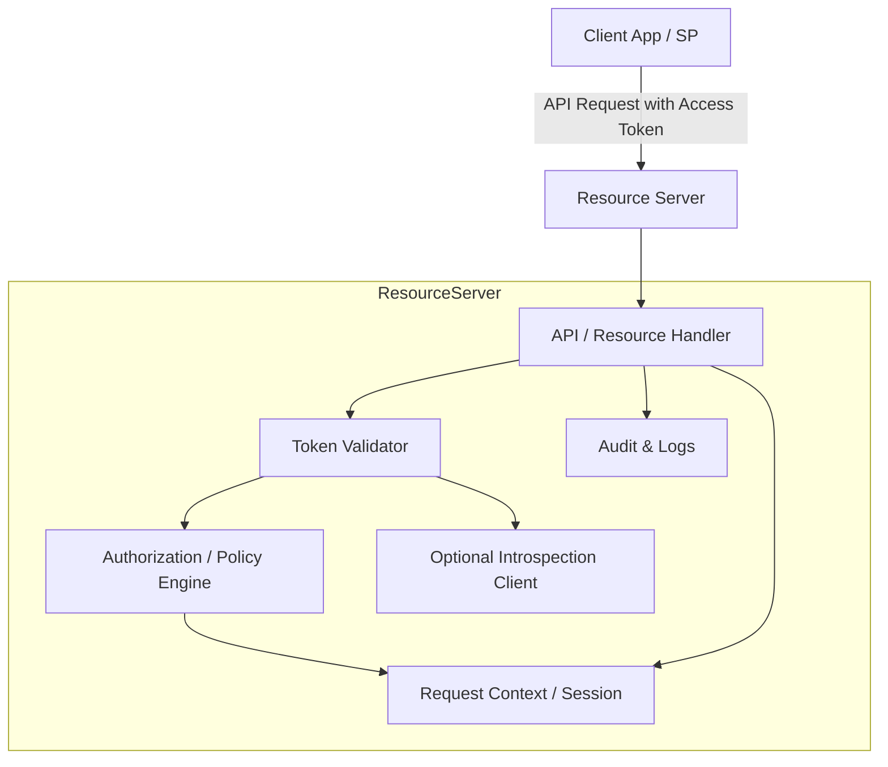
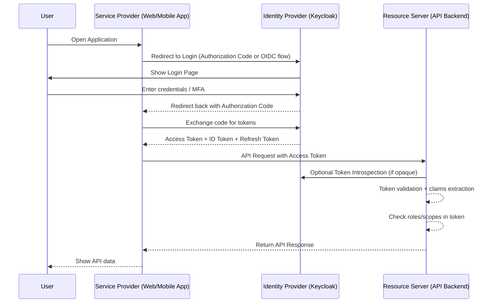
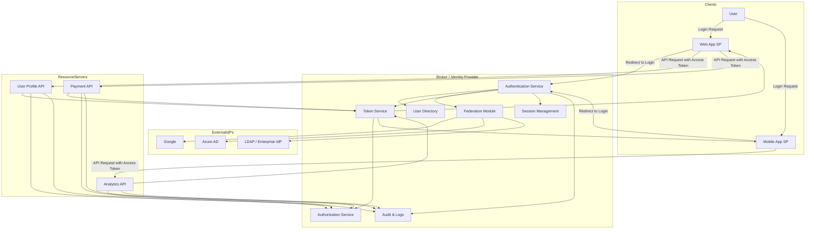

Perfect 👍 — let’s clarify **Resource Server** and its design.

---

# 🔑 What is a Resource Server (RS)?

A **Resource Server** is a server that **hosts protected resources (APIs, data, or services)** and **relies on an OAuth2 / OpenID Connect token issued by an Identity Provider** to authorize access.

* It **does not authenticate users** itself.
* It **validates access tokens** (JWT or opaque) sent by clients.
* Once the token is validated, it enforces **authorization policies** (roles, scopes, permissions).

**Key difference from SP**:

* **Service Provider (SP)** = the application user interacts with (can be web app or API).
* **Resource Server (RS)** = the backend API / data provider that the SP or client calls, secured by tokens.

---

# 🏗️ Core Components of a Resource Server

| Component                         | Purpose                                                       |
| --------------------------------- | ------------------------------------------------------------- |
| **API / Resource Handler**        | Exposes protected resources (REST / GraphQL / gRPC).          |
| **Token Validator**               | Validates JWT signature, expiry, issuer, and audience.        |
| **Authorization / Policy Engine** | Enforces access control based on roles, scopes, or claims.    |
| **Session / Request Context**     | Tracks authenticated request metadata.                        |
| **Audit & Logging**               | Logs requests, token validation, and access decisions.        |
| **Optional Introspection Client** | Calls IdP introspection endpoint for opaque token validation. |

---

# 📊 Mermaid Diagram – Resource Server Design

---

# 🔎 Flow Explanation

1. **Client App** calls **Resource Server API** with **Bearer token**.
2. **Token Validator** checks:

   * Signature (if JWT)
   * Expiry
   * Issuer
   * Audience
     *(Or uses Introspection endpoint if token is opaque)*
3. **Authorization Engine** enforces **scopes, roles, or claims**.
4. **Session / Request Context** keeps metadata for auditing or logging.
5. **Audit Logs** record every access event.
6. If everything is valid, API returns the **protected resource**.

---

# ✅ Example Use Case

* **SP / Web App** calls backend **User Profile API**.
* **Resource Server** verifies the token issued by **Keycloak**.
* Only users with `scope=profile.read` or `role=admin` can access the API.
* Audit logs capture access for compliance.

---

⚡ Summary:

* **Service Provider** = app the user interacts with.
* **Resource Server** = backend API or data service.
* **IdP / OAuth2 Server** issues tokens that both SP and RS trust.

---

If you want, I can draw a **complete system design diagram showing IdP, Service Provider, and Resource Server together** in **one flow** using Mermaid — so you can see the full authentication + authorization picture.

Do you want me to do that?

Perfect 👍 Let’s design a **complete system showing Identity Provider (IdP), Service Provider (SP), and Resource Server (RS)** together, so you can see how authentication and authorization flows end-to-end.

---

# 📊 Mermaid Diagram – Complete IdP + SP + RS Flow

---

# 🔎 Flow Explanation

1. **User → SP**: Opens app (browser/mobile).
2. **SP → IdP**: Redirects user for login.
3. **IdP → User**: Authenticates using local credentials, MFA, or federated login.
4. **IdP → SP**: Issues **tokens** (JWT for SP and RS).
5. **SP → RS**: Calls backend API using **access token**.
6. **RS → IdP (optional)**: Introspects token if opaque.
7. **RS**: Validates token signature, expiry, issuer, and enforces **roles/scopes**.
8. **RS → SP → User**: Returns protected resources.

---

# ✅ Key Takeaways

* **IdP** = Central authentication authority (Keycloak, Okta).
* **SP** = Frontend app that interacts with user.
* **RS** = Backend API that serves protected resources.
* **Tokens** (JWT or opaque) are the glue: SP and RS trust IdP.
* **Authorization** can happen at SP (UI level) or RS (API/data level).
* **Optional token introspection** is used for opaque tokens or revocation checks.

---

If you want, I can also draw a **detailed diagram with external IdPs (federation/brokering), SP, and multiple Resource Servers** to show a **full enterprise authentication architecture**.

Do you want me to do that next?

Perfect 👍 Let’s design a **full enterprise authentication architecture** showing:

* **Multiple external Identity Providers** (Google, Azure AD, LDAP)
* **Keycloak as a broker/federated IdP**
* **Service Providers** (web apps, mobile apps)
* **Multiple Resource Servers** (APIs, microservices)
* **Token validation, introspection, and role mapping**

---

# 📊 Mermaid Diagram – Enterprise Authentication Architecture

---

# 🔎 Flow Explanation

1. **User → SP**: User opens web or mobile app.
2. **SP → Keycloak**: Redirects for login.
3. **Keycloak Auth Service** checks **local User Directory** or **federates login** to external IdPs (Google, Azure AD, LDAP).
4. **Token Service** issues **JWT / OAuth2 tokens** after successful login.
5. **Authorization Service** maps roles/scopes from external IdP claims to internal roles.
6. **Session Manager** handles SSO and session lifecycle.
7. **SP receives tokens** and calls multiple Resource Servers with the token.
8. **Resource Servers** validate tokens and check authorization.
9. **Audit & Logging** captures all login, token issuance, and API access events.

---

# ✅ Key Advantages of This Architecture

* Supports **multiple external IdPs** without changing client apps.
* **Centralized authentication** via Keycloak (broker/federation).
* SP and Resource Servers **trust the broker**, simplifying integration.
* **Token-based access** ensures stateless and scalable APIs.
* **SSO** across multiple apps.
* **Fine-grained authorization** with roles and scopes.
* Audit and compliance tracking is centralized.

---

If you want, I can create a **sequence diagram** showing **step-by-step login + API call flow** in this enterprise setup, including **federated login and token exchange**, which makes it very clear for developers and architects.

Do you want me to do that?
