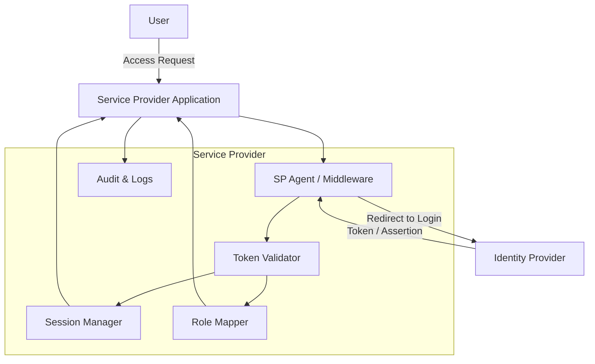

---

# 🔑 What is a Service Provider (SP)?

A **Service Provider (SP)** is an application or system that consumes **authentication and identity information** from an **Identity Provider (IdP)**.

* The SP does **not authenticate users directly**.
* Instead, it **trusts the IdP** for authentication.
* Once authenticated, the SP uses the **assertions/tokens** (SAML, JWT, OIDC) provided by the IdP to authorize and provide access.

---

# 🏗️ Core Components of a Service Provider

| Component                          | Purpose                                                               |
| ---------------------------------- | --------------------------------------------------------------------- |
| **SP Application / Web App / API** | The actual service (e.g., HR system, payment gateway, SaaS app).      |
| **SP Agent / Middleware**          | Library or plugin to handle SAML/OIDC/OAuth flows.                    |
| **Token Validator**                | Validates tokens (JWT signature, SAML assertions).                    |
| **Session Manager**                | Maintains user session once authenticated.                            |
| **Role Mapper / Policy Engine**    | Maps IdP roles/claims into SP-specific permissions.                   |
| **SP Metadata**                    | Configuration about the SP (callback URLs, certificates, client IDs). |
| **Audit / Logs**                   | Tracks authentication and authorization actions.                      |

---

# 📊 Mermaid Diagram – Service Provider Design

---

# 🔎 Flow Explanation

1. **User accesses SP (App)** → SP doesn’t handle login itself.
2. **SP Agent** redirects user to **IdP**.
3. **IdP authenticates the user** and sends back a **token/assertion**.
4. **SP Token Validator** checks token integrity (signature, expiry, issuer).
5. **Session Manager** creates a local session for the user.
6. **Role Mapper** maps IdP roles → SP-specific permissions.
7. **Audit Logs** record the authentication event.
8. User is granted access to SP resources.

---

# ✅ Example of Service Provider

* A **cloud SaaS product** (like Salesforce, Slack, or an internal HR portal).
* Instead of managing usernames and passwords, it integrates with an **IdP (Okta, Keycloak, Azure AD)**.
* The **SP trusts the IdP** to verify users and just consumes the **assertions/tokens**.

---

👉 Would you like me to also compare **Service Provider (SP)** vs **Resource Server (OAuth2 APIs)** with a diagram, since they’re often confused but serve different purposes?
