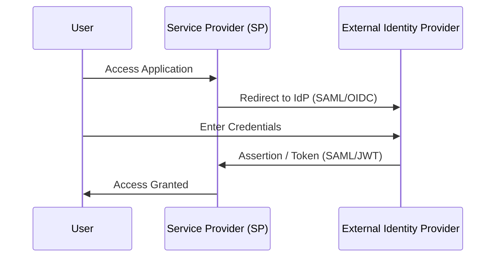
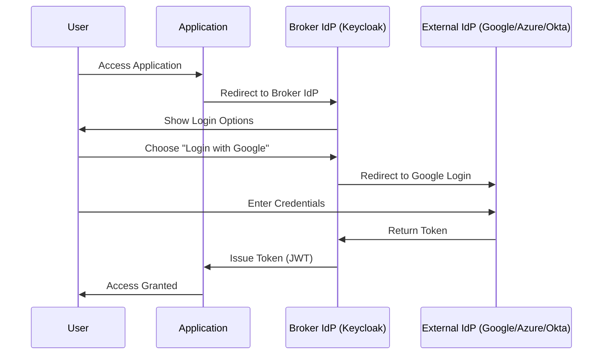

 **Identity Federation** and **Identity Brokering** are often used interchangeably, but there’s a subtle difference. 

---

# **Identity Federation**

* **Definition**: The process of **linking a user’s identity across multiple systems/domains** so the user can authenticate once and access services in different organizations.
* **Trust relationship**: Direct trust is established between the **Identity Provider (IdP)** and the **Service Provider (SP)**.
* **Standards used**: SAML, OAuth2, OpenID Connect.
* **Key Point**: It’s about **users having a single identity** across multiple domains.

✅ Example:

* A university student logs into their university account and gets access to digital library services hosted by an external vendor (without a separate login).

---

# 🔑 **Identity Brokering**

* **Definition**: When an **intermediate IdP (broker)** sits between the client app and external IdPs, handling authentication delegation.
* **Trust relationship**: The client apps only trust the **broker IdP**, which in turn manages trust with multiple external IdPs.
* **Key Point**: It’s about the **middle layer mediating between multiple IdPs and your applications**.

✅ Example:

* Keycloak acts as a **broker**.
* Your apps connect only to Keycloak.
* Keycloak allows login via Google, Facebook, LDAP, or another SAML IdP.
* Apps don’t need to manage multiple IdP integrations.

---

# Quick Comparison Table

| Aspect                  | Identity Federation                                        | Identity Brokering                                            |
| ----------------------- | ---------------------------------------------------------- | ------------------------------------------------------------- |
| **What it does**        | Links user identity across multiple domains                | Acts as a middle IdP between apps and external IdPs           |
| **Trust model**         | Direct trust: SP ↔ IdP                                     | Indirect trust: App ↔ Broker ↔ External IdPs                  |
| **Complexity for apps** | Each app must integrate with external IdPs                 | Apps only integrate with broker IdP                           |
| **Example**             | SAML federation between a university and a digital library | Keycloak brokering login via Google and Azure AD              |
| **Best fit**            | Long-term trusted relationships between organizations      | Flexibility to connect multiple IdPs with minimal app changes |

---

 In simple words:

* **Federation = Linking identities across orgs directly**.
* **Brokering = Using a middle IdP to outsource the federation complexity**.

---

#  Identity Federation Flow

✅ Here, the **App (SP)** directly trusts the **IdP**.

---

#  Identity Brokering Flow

Here, the **App only trusts the Broker (Keycloak)**, and the Broker manages **integration with external IdPs**.

---

# Key Takeaway

* **Federation**: Direct trust → SP ↔ IdP.
* **Brokering**: Indirect trust → App ↔ Broker ↔ External IdPs.

---

