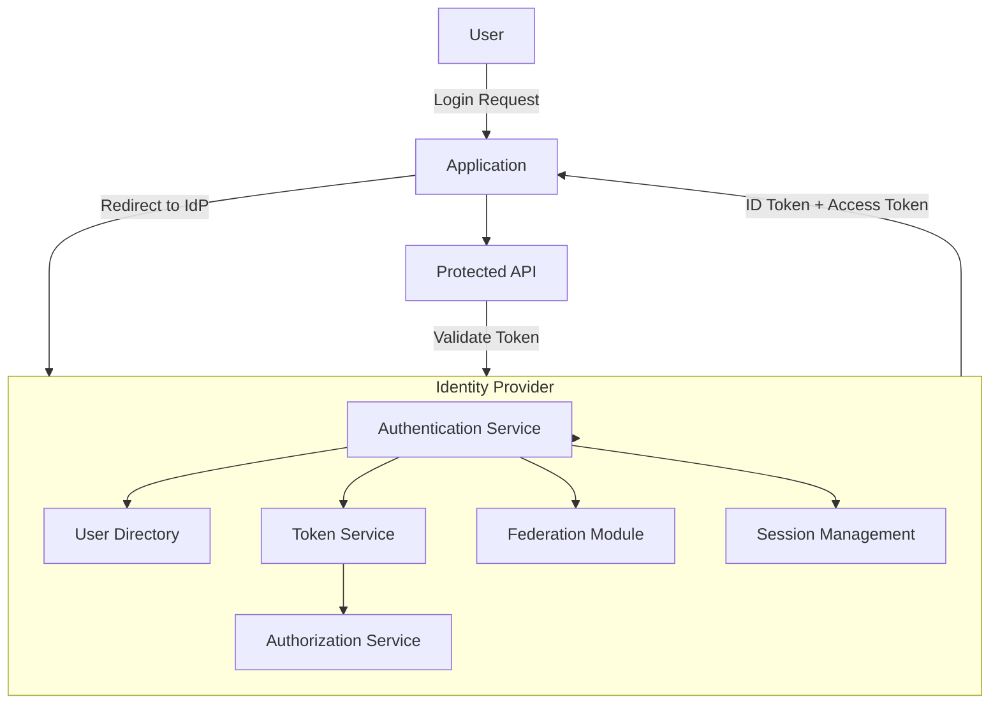

 Identity Provider (**IdP**) is at the **heart of authentication and authorization** in modern systems. 

---

# Identity Provider (IdP)

An **Identity Provider** is a trusted service that:

* Authenticates users (who are you?)
* Issues security tokens (asserting identity + claims)
* Provides single sign-on (SSO)
* Works with apps and APIs using standards like **SAML, OAuth2, OpenID Connect**

Examples: Keycloak, Okta, Auth0, AWS Cognito, Azure AD.

---

# 🏗️ Core Components of an IdP

| Component                    | Purpose                                                                                    |
| ---------------------------- | ------------------------------------------------------------------------------------------ |
| **Authentication Service**   | Validates user credentials (passwords, OTP, biometrics, federated login like Google/LDAP). |
| **Authorization Service**    | Assigns roles, permissions, scopes, and policies.                                          |
| **Token Service (STS)**      | Issues tokens (JWT, SAML assertions, opaque tokens).                                       |
| **User Directory**           | Stores user identities (internal DB, LDAP, or external IdP).                               |
| **Federation Module**        | Connects to external IdPs (e.g., Google, Facebook, enterprise SAML IdP).                   |
| **Session Management**       | Maintains active sessions, supports SSO, logout propagation.                               |
| **Admin Console**            | For managing users, roles, clients, and policies.                                          |
| **Introspection/Revocation** | For checking and revoking tokens.                                                          |

---

# 📌 Identity Provider Flow (OAuth2 + OIDC)

1. **User tries to access an application.**
2. App redirects user to IdP login page.
3. User authenticates (password, MFA, social login).
4. IdP issues tokens (ID Token, Access Token, Refresh Token).
5. App/API uses tokens to validate identity and authorize.
6. If federated, IdP delegates to another IdP (Google, LDAP, etc.).

---

# Identity Provider System Design

---

# ✅ Example Use Case – Retail Banking Portal

* **Problem:** Multiple apps (Retail, Corporate, Admin) need a single login.
* **Solution:**

  * Central **IdP (Keycloak)** handles authentication.
  * Users log in once (SSO).
  * Apps receive tokens to call APIs.
  * Authorization is handled with **roles** (retail\_user, corporate\_user, admin).

---

# 🔥 Key Takeaways

* An IdP centralizes **authentication** and **token issuance**.
* Supports **federation** (Google, SAML, LDAP).
* Enables **SSO** across apps.
* Works via standards: **OAuth2, OpenID Connect, SAML**.
* Plays critical role in **modern microservice and enterprise systems**.

---

