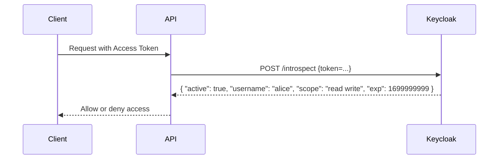

Good one 👍 — let’s go into **OAuth2 / Keycloak introspection**.

---

# 🔎 What is **Introspection**?

**Token Introspection** is an OAuth 2.0 standard (RFC 7662) that allows a **resource server (API)** to check whether an access token (or refresh token) is:

* ✅ Active (valid and not expired)
* ⛔ Inactive (expired, revoked, or invalid)
* 🔐 And get extra metadata (like username, client, scopes, expiration time)

It’s basically a way for your **API to “ask Keycloak: is this token still valid?”**.

---

# 📌 Why is it needed?

If your API receives a **JWT access token**, it can usually **validate locally** (check signature, expiry, audience).
But if:

* You use **opaque tokens** (random strings instead of JWTs)
* Or you want to check if a token was **revoked early** (before expiry, e.g., user logout)

👉 Then you need the **introspection endpoint**.

---

# 🔐 Introspection Flow



---

# 🛠 Example Introspection Request (Keycloak)

Your API can call:

```
POST /realms/{realm-name}/protocol/openid-connect/token/introspect
Authorization: Basic base64(clientId:clientSecret)
Content-Type: application/x-www-form-urlencoded

token=eyJhbGciOiJSUzI1NiIsInR5cCI6IkpXVCJ9...
```

Response:

```json
{
  "active": true,
  "exp": 1723456789,
  "iat": 1723451234,
  "client_id": "my-app",
  "username": "alice",
  "scope": "profile email"
}
```

---

# ✅ Summary

* **Introspection** = API asking Keycloak if a token is valid.
* Used when:

  * Tokens are **opaque** (not JWT).
  * You want **real-time validation** (revocation, logout).
* JWTs usually don’t need introspection (local validation is faster).

---

⚡ Since you’re building with **Kafka + AWS stack + Keycloak**, you’ll likely:

* Use **JWTs** for stateless validation in APIs (fast).
* Use **introspection** only when you need **revocation awareness** or **opaque tokens**.

---

👉 Do you want me to compare **JWT validation vs introspection** (when to choose which)?
