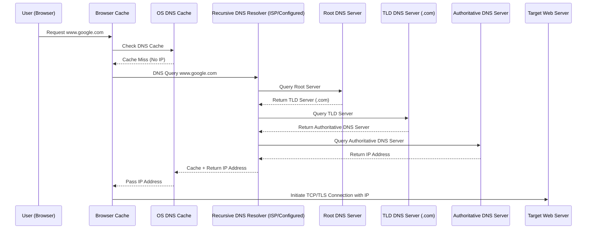

When you type a URL (say `www.google.com`) in the browser, and the **OS cache doesn’t have the DNS → IP mapping**, the system goes through the full DNS resolution flow.

---

### 🔹 Steps Involved (DNS Lookup without OS Cache)

1. **Browser Check** – Browser checks its own DNS cache.
2. **OS Cache Check** – OS checks local DNS resolver cache (empty in this case).
3. **DNS Resolver (usually ISP/Configured DNS)** – Request is forwarded to the recursive DNS resolver.
4. **Root DNS Server** – Resolver queries root server to find the responsible TLD server (e.g., `.com`).
5. **TLD DNS Server** – TLD server responds with the authoritative DNS server for the domain (`google.com`).
6. **Authoritative DNS Server** – Resolver queries it to get the actual IP address of `www.google.com`.
7. **Resolver Caching** – Resolver caches the response for future use.
8. **OS Caching** – OS caches the IP for TTL (time-to-live).
9. **Browser Proceeds** – Browser uses the IP to initiate TCP/TLS connection with the server.

---

### 🔹 Mermaid Diagram

---

Would you like me to also extend this diagram to **show caching hierarchy visually** (Browser → OS → Resolver → Root → TLD → Authoritative) as a **flowchart-style diagram**, or keep it strictly sequence-based?
