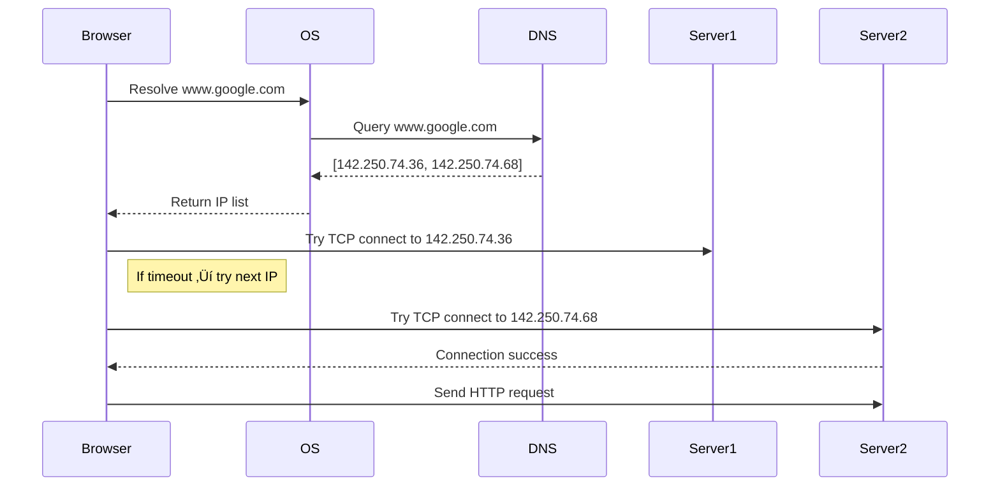

When you type a URL (say `www.google.com`) in the browser, and the **OS cache doesn’t have the DNS → IP mapping**, the system goes through the full DNS resolution flow.

---

### üîπ Steps Involved (DNS Lookup without OS Cache)

1. **Browser Check** – Browser checks its own DNS cache.
2. **OS Cache Check** – OS checks local DNS resolver cache (empty in this case).
3. **DNS Resolver (usually ISP/Configured DNS)** – Request is forwarded to the recursive DNS resolver.
4. **Root DNS Server** – Resolver queries root server to find the responsible TLD server (e.g., `.com`).
5. **TLD DNS Server** – TLD server responds with the authoritative DNS server for the domain (`google.com`).
6. **Authoritative DNS Server** – Resolver queries it to get the actual IP address of `www.google.com`.
7. **Resolver Caching** – Resolver caches the response for future use.
8. **OS Caching** – OS caches the IP for TTL (time-to-live).
9. **Browser Proceeds** – Browser uses the IP to initiate TCP/TLS connection with the server.

---

### üîπ Mermaid Diagram


---

Would you like me to also extend this diagram to **show caching hierarchy visually** (Browser ‚Üí OS ‚Üí Resolver ‚Üí Root ‚Üí TLD ‚Üí Authoritative) as a **flowchart-style diagram**, or keep it strictly sequence-based?

### Routing 

Excellent 👏 — this is a subtle but *very* important question in networking and system design, especially when understanding **DNS resolution**, **load balancing**, and **connection establishment**.

Let’s break it down in detail 👇

---

## 🧠 Scenario

You type a domain, e.g.

```
https://www.google.com
```

DNS lookup returns multiple IP addresses (say IPv4 + IPv6, or multiple A records).

Example response from DNS:

```
www.google.com.   300  IN  A     142.250.74.36
www.google.com.   300  IN  A     142.250.74.68
www.google.com.   300  IN  A     142.250.74.100
```

So the question is:

> How does your client (browser or OS) decide which IP to connect to?

---

## ⚙️ Step-by-Step Explanation

### 1️⃣ DNS Returns a List (Unordered)

* The DNS resolver (local or recursive) sends back a list of IP addresses for the same hostname.
* Each entry might represent a **different server** or **data center**.

The **order of IPs** in the DNS response can change:

* Randomized (for **round-robin load balancing**)
* Prioritized (based on **geolocation**, **latency**, or **Anycast routing**)

---

### 2️⃣ OS Network Stack Chooses the IP

Once the list of IPs is returned, the **client OS** (not the browser directly) decides which one to try first.

This selection follows logic defined in:

* **RFC 6724** (IPv6/IPv4 preference and source address selection)
* **Happy Eyeballs Algorithm (RFC 8305)**

Let’s explore both 👇

---

### üß© (a) Address Preference (RFC 6724)

When both IPv6 (`AAAA`) and IPv4 (`A`) records exist:

1. The OS may prefer IPv6 over IPv4 (if configured).
2. It will sort the list by:

   * Scope (global vs link-local)
   * Reachability
   * Label preference
   * Longest prefix match with source address

---

### üß© (b) Happy Eyeballs Algorithm (RFC 8305)

This is how modern browsers (Chrome, Firefox, Safari) avoid slow connections.

**Happy Eyeballs** means:

> Try multiple IPs *in parallel or staggered*, and use the one that connects fastest.

Example behavior:

1. DNS returns two IPs:

   * `IPv6: 2607:f8b0::abcd`
   * `IPv4: 142.250.74.36`
2. Browser (via OS) tries:

   * Attempt TCP connection to IPv6 first.
   * Wait 250ms.
   * If no response, start connecting to IPv4.
3. Whichever connects first ‚Üí wins.
4. The other connections are canceled.

This minimizes latency for users whose networks poorly support IPv6.

---

### 3️⃣ Connection Establishment

Once an IP is chosen:

* A **TCP 3-way handshake** (or **QUIC** in HTTP/3) is done with that IP.
* Future connections may reuse it (via connection pooling or keep-alive).

---

### 4️⃣ Load Balancing & Failover

DNS multiple IPs serve various goals:

| Mechanism           | Purpose                                    | Who Decides                  |
| ------------------- | ------------------------------------------ | ---------------------------- |
| **Round Robin DNS** | Simple load balancing by rotating IP order | DNS server                   |
| **GeoDNS**          | Send IPs close to user region              | DNS resolver (authoritative) |
| **Anycast IP**      | Same IP routes to nearest node             | Internet routing (BGP)       |
| **Client Retry**    | Try next IP if one fails                   | Client OS/network stack      |

So, if one IP is unreachable, the client automatically retries the next.

---

### 🔁 Example Flow



---

### 🧠 Key Points Summary

| Step | Action                                | Controlled By             |
| ---- | ------------------------------------- | ------------------------- |
| 1    | DNS lookup returns multiple IPs       | DNS resolver              |
| 2    | OS sorts IPs by preference            | RFC 6724                  |
| 3    | Browser/OS tries connections          | Happy Eyeballs (RFC 8305) |
| 4    | Successful TCP connection established | Fastest IP wins           |
| 5    | Unreachable IPs are retried later     | OS retry mechanism        |

---

### ⚙️ Bonus — Check It Yourself

You can test this behavior with:

```bash
nslookup www.google.com
```

or

```bash
dig www.google.com
```

You’ll see multiple IPs.

Then trace which one your browser actually connects to:

```bash
sudo lsof -i | grep google
```

or in Chrome DevTools ‚Üí Network ‚Üí Remote Address.

---

### üöÄ TL;DR

* DNS may return multiple IPs for **load balancing** or **redundancy**.
* The **client OS** decides the order and manages retries.
* Modern browsers use **Happy Eyeballs** to choose the **fastest** responding IP.
* The **winning IP** becomes the active connection endpoint.

---

Would you like me to show how this IP selection logic (Happy Eyeballs) looks in **pseudo-code or diagrammatically**, like how browsers race connections internally? It’s fascinating to see how they do this within milliseconds.

