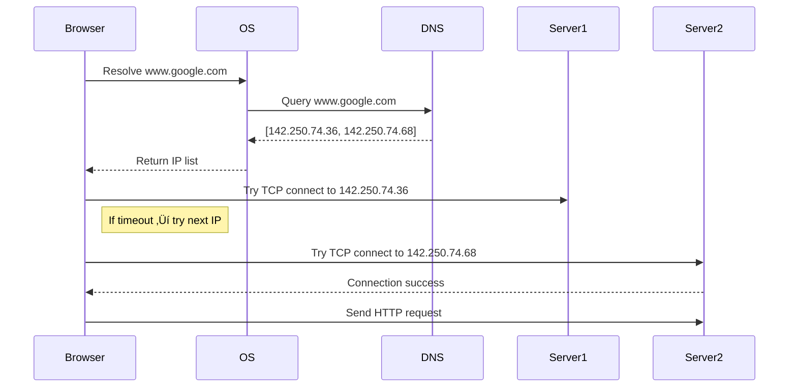

When you type a URL (say `www.google.com`) in the browser, and the **OS cache doesn’t have the DNS → IP mapping**, the system goes through the full DNS resolution flow.

---

### üîπ Steps Involved (DNS Lookup without OS Cache)

1. **Browser Check** – Browser checks its own DNS cache.
2. **OS Cache Check** – OS checks local DNS resolver cache (empty in this case).
3. **DNS Resolver (usually ISP/Configured DNS)** – Request is forwarded to the recursive DNS resolver.
4. **Root DNS Server** – Resolver queries root server to find the responsible TLD server (e.g., `.com`).
5. **TLD DNS Server** – TLD server responds with the authoritative DNS server for the domain (`google.com`).
6. **Authoritative DNS Server** – Resolver queries it to get the actual IP address of `www.google.com`.
7. **Resolver Caching** – Resolver caches the response for future use.
8. **OS Caching** – OS caches the IP for TTL (time-to-live).
9. **Browser Proceeds** – Browser uses the IP to initiate TCP/TLS connection with the server.

---

### üîπ Mermaid Diagram


---

Would you like me to also extend this diagram to **show caching hierarchy visually** (Browser ‚Üí OS ‚Üí Resolver ‚Üí Root ‚Üí TLD ‚Üí Authoritative) as a **flowchart-style diagram**, or keep it strictly sequence-based?

### Routing 

Excellent 👏 — this is a subtle but *very* important question in networking and system design, especially when understanding **DNS resolution**, **load balancing**, and **connection establishment**.

Let’s break it down in detail 👇

---

## 🧠 Scenario

You type a domain, e.g.

```
https://www.google.com
```

DNS lookup returns multiple IP addresses (say IPv4 + IPv6, or multiple A records).

Example response from DNS:

```
www.google.com.   300  IN  A     142.250.74.36
www.google.com.   300  IN  A     142.250.74.68
www.google.com.   300  IN  A     142.250.74.100
```

So the question is:

> How does your client (browser or OS) decide which IP to connect to?

---

## ⚙️ Step-by-Step Explanation

### 1️⃣ DNS Returns a List (Unordered)

* The DNS resolver (local or recursive) sends back a list of IP addresses for the same hostname.
* Each entry might represent a **different server** or **data center**.

The **order of IPs** in the DNS response can change:

* Randomized (for **round-robin load balancing**)
* Prioritized (based on **geolocation**, **latency**, or **Anycast routing**)

---

### 2️⃣ OS Network Stack Chooses the IP

Once the list of IPs is returned, the **client OS** (not the browser directly) decides which one to try first.

This selection follows logic defined in:

* **RFC 6724** (IPv6/IPv4 preference and source address selection)
* **Happy Eyeballs Algorithm (RFC 8305)**

Let’s explore both 👇

---

### üß© (a) Address Preference (RFC 6724)

When both IPv6 (`AAAA`) and IPv4 (`A`) records exist:

1. The OS may prefer IPv6 over IPv4 (if configured).
2. It will sort the list by:

   * Scope (global vs link-local)
   * Reachability
   * Label preference
   * Longest prefix match with source address

---

### üß© (b) Happy Eyeballs Algorithm (RFC 8305)

This is how modern browsers (Chrome, Firefox, Safari) avoid slow connections.

**Happy Eyeballs** means:

> Try multiple IPs *in parallel or staggered*, and use the one that connects fastest.

Example behavior:

1. DNS returns two IPs:

   * `IPv6: 2607:f8b0::abcd`
   * `IPv4: 142.250.74.36`
2. Browser (via OS) tries:

   * Attempt TCP connection to IPv6 first.
   * Wait 250ms.
   * If no response, start connecting to IPv4.
3. Whichever connects first ‚Üí wins.
4. The other connections are canceled.

This minimizes latency for users whose networks poorly support IPv6.

---

### 3️⃣ Connection Establishment

Once an IP is chosen:

* A **TCP 3-way handshake** (or **QUIC** in HTTP/3) is done with that IP.
* Future connections may reuse it (via connection pooling or keep-alive).

---

### 4️⃣ Load Balancing & Failover

DNS multiple IPs serve various goals:

| Mechanism           | Purpose                                    | Who Decides                  |
| ------------------- | ------------------------------------------ | ---------------------------- |
| **Round Robin DNS** | Simple load balancing by rotating IP order | DNS server                   |
| **GeoDNS**          | Send IPs close to user region              | DNS resolver (authoritative) |
| **Anycast IP**      | Same IP routes to nearest node             | Internet routing (BGP)       |
| **Client Retry**    | Try next IP if one fails                   | Client OS/network stack      |

So, if one IP is unreachable, the client automatically retries the next.

---

### 🔁 Example Flow



---

### 🧠 Key Points Summary

| Step | Action                                | Controlled By             |
| ---- | ------------------------------------- | ------------------------- |
| 1    | DNS lookup returns multiple IPs       | DNS resolver              |
| 2    | OS sorts IPs by preference            | RFC 6724                  |
| 3    | Browser/OS tries connections          | Happy Eyeballs (RFC 8305) |
| 4    | Successful TCP connection established | Fastest IP wins           |
| 5    | Unreachable IPs are retried later     | OS retry mechanism        |

---

### ⚙️ Bonus — Check It Yourself

You can test this behavior with:

```bash
nslookup www.google.com
```

or

```bash
dig www.google.com
```

You’ll see multiple IPs.

Then trace which one your browser actually connects to:

```bash
sudo lsof -i | grep google
```

or in Chrome DevTools ‚Üí Network ‚Üí Remote Address.

---

### üöÄ TL;DR

* DNS may return multiple IPs for **load balancing** or **redundancy**.
* The **client OS** decides the order and manages retries.
* Modern browsers use **Happy Eyeballs** to choose the **fastest** responding IP.
* The **winning IP** becomes the active connection endpoint.

---

Would you like me to show how this IP selection logic (Happy Eyeballs) looks in **pseudo-code or diagrammatically**, like how browsers race connections internally? It’s fascinating to see how they do this within milliseconds.


Perfect 👏 — this is a very deep and important area of **modern Internet infrastructure**.
When DNS returns **multiple IP addresses**, the *order* (or *selection*) of those IPs can be **prioritized** — not random — based on **geolocation, latency, or routing topology (Anycast)**.

Let’s go through each of these mechanisms systematically, with detailed architecture-level understanding 👇

---

## 🧭 1️⃣ Geolocation-based Prioritization (GeoDNS)

### 🧠 Concept

GeoDNS (Geographically-aware DNS) means the DNS server *does not give the same IP* to every client.
Instead, it detects **where the DNS query originates** (by IP of the resolver) and returns the **nearest or best regional server IP**.

So users in:

* India ‚Üí get an IP of a data center in Mumbai.
* Germany ‚Üí get an IP of a data center in Frankfurt.
* US ‚Üí get an IP of a data center in Virginia.

---

### ⚙️ How It Works (Step by Step)

1. **User’s browser/OS** queries `www.example.com`.
2. The query goes to the **Recursive Resolver** (like Google DNS `8.8.8.8`).
3. The **Authoritative DNS Server** (managed by the service provider or CDN) receives the query.
4. The authoritative server checks:

   * The **source IP** of the resolver.
   * Looks up its **geolocation** using IP-to-location databases (e.g., MaxMind, IP2Location).
5. It chooses the **closest data center’s IP** and sends that back as the A/AAAA record.

---

### üåç Example

| Client Location | DNS Resolver IP | Returned Server IP | Server Location |
| --------------- | --------------- | ------------------ | --------------- |
| India           | 49.207.x.x      | 13.250.112.1       | Singapore       |
| France          | 81.65.x.x       | 35.180.12.9        | Paris           |
| US              | 8.8.8.8         | 34.117.59.81       | Virginia        |

---

### 📦 Use Cases

* CDNs (Cloudflare, Akamai, AWS CloudFront)
* Multi-region web apps
* Reducing latency by serving users from the nearest node

---

### üß© Internals

GeoDNS services (e.g. AWS Route 53, Cloudflare DNS, NS1) use **routing policies**:

* **Geolocation routing policy** → based on user’s country or continent.
* **Latency-based routing policy** ‚Üí based on network measurements.
* **Failover policy** ‚Üí automatically reroute traffic if a region goes down.
* **Weighted policy** ‚Üí distribute by percentage (e.g., 70% US-East, 30% US-West).

---

### ‚úÖ Advantage

* Low latency.
* Load distribution.
* Regional redundancy.

### ⚠️ Challenge

* DNS resolver location ≠ actual client location (e.g., Google Public DNS may hide real user region).
* Cached DNS responses may serve distant IPs if resolver is far away.

---

## ⚡ 2️⃣ Latency-based Prioritization

### 🧠 Concept

Instead of static geographic rules, latency-based DNS measures *real network performance* between the **client region** and **servers**.
The DNS provider continuously tracks which region gives the lowest **RTT (Round Trip Time)** and dynamically serves that IP.

---

### ⚙️ How It Works

1. DNS provider runs **health checks** or **ping probes** to all data centers.
2. Each DNS edge node keeps a **latency table**:

   ```
   India ‚Üí Singapore (45 ms)
   India ‚Üí Sydney (120 ms)
   India ‚Üí Frankfurt (250 ms)
   ```
3. When a DNS query arrives from India, it chooses **Singapore** since it has the best latency.
4. TTL (Time To Live) for DNS is kept short (e.g., 60s) so that changes propagate quickly.

---

### üß© Example (AWS Route 53 Latency Routing)

AWS measures the latency between users and AWS regions using its global network.
When a user queries a domain:

* Route 53 identifies which AWS region gives the *lowest network latency*.
* Returns IPs from that region.

---

### ‚úÖ Advantage

* Performance-optimized routing.
* Automatically adjusts as Internet congestion changes.
* User always connects to the fastest responding server.

### ⚠️ Challenge

* Relies on accurate and updated latency metrics.
* Sudden network changes might temporarily misroute traffic.

---

## 🌐 3️⃣ Anycast Routing

### 🧠 Concept

Anycast is **not DNS-based prioritization** — it’s **IP routing–level prioritization**.
Multiple servers around the world **share the same IP address**.
Routers (via BGP) automatically direct users to the **nearest or best network path**.

In short:

> “One IP, many servers — routed to the nearest one.”

---

### ⚙️ How It Works (Simplified)

1. Multiple data centers announce the *same IP address* using **BGP (Border Gateway Protocol)**.
2. Internet routers propagate these routes.
3. When a client sends a packet to that IP, routers send it to the **nearest** or **lowest-cost** path based on **AS path length** and **network policies**.

---

### üß© Example

Imagine `1.1.1.1` (Cloudflare DNS):

| Location | Server   | Announced IP |
| -------- | -------- | ------------ |
| Mumbai   | Server A | 1.1.1.1      |
| London   | Server B | 1.1.1.1      |
| New York | Server C | 1.1.1.1      |

When an Indian user pings `1.1.1.1`, their ISP routes it to Mumbai.
When a US user pings the same IP, it goes to New York.
No DNS change is needed — routing automatically adjusts.

---

### üß∞ Use Cases

* Global CDNs (Cloudflare, Google Global Load Balancer)
* DNS resolvers (1.1.1.1, 8.8.8.8)
* DDoS mitigation (traffic automatically dispersed)

---

### ‚úÖ Advantage

* True global routing efficiency.
* Fault tolerance — if one region goes down, BGP withdraws the route.
* No need for multiple IPs in DNS.

### ⚠️ Challenge

* Requires deep BGP control and infrastructure.
* Harder to debug routing issues.
* More expensive setup (requires ASN, IP ownership, peering agreements).

---

## 🕸️ Combined Real-world Example: Cloudflare or Google

Cloudflare uses **all three mechanisms** together:

| Layer           | Mechanism              | Function                                  |
| --------------- | ---------------------- | ----------------------------------------- |
| DNS             | GeoDNS / latency-based | Returns nearest data center IPs           |
| Network Routing | Anycast                | Same IP advertised globally               |
| Application     | Load Balancing         | Balances across servers within the region |

When you type `https://www.cloudflare.com`:

1. DNS gives IPs prioritized to your region (GeoDNS).
2. The IP itself is Anycast — routes to the closest data center.
3. Within that data center, internal load balancers distribute traffic among servers.

---

### 🧠 Visual Summary

```mermaid
graph LR
A[User in India] -->|DNS Query| B[GeoDNS / Route 53]
B -->|Return IP of Singapore Data Center| C[DNS Response]
C -->|Route to 13.250.112.1 (Anycast IP)| D[Nearest Server]
D -->|Internal Load Balancing| E[Application Node]
```

---

## üß© Summary Table

| Prioritization Type   | Layer         | Decision Criteria          | Managed By        | Example Provider         |
| --------------------- | ------------- | -------------------------- | ----------------- | ------------------------ |
| **GeoDNS**            | DNS           | User’s geographic region   | Authoritative DNS | Route 53 Geolocation     |
| **Latency-based DNS** | DNS           | Network latency metrics    | DNS Provider      | Route 53 Latency Routing |
| **Anycast**           | Network (BGP) | Shortest AS path / routing | ISP Routers       | Cloudflare, Google DNS   |

---

Would you like me to draw a **Mermaid architecture diagram** showing all three layers (GeoDNS ‚Üí Latency Routing ‚Üí Anycast ‚Üí Local Load Balancer) working together in a global content delivery scenario?
It’s a great way to visualize the prioritization hierarchy end-to-end.


### **Authoritative vs Non-Authoritative DNS responses** 

Let’s go step-by-step — from the top-level concept to the deep technical details.

---

## üåç DNS Overview

When you type a domain like `www.example.com`, your computer must translate that **domain name** into an **IP address** (like `93.184.216.34`).
This process involves several layers of DNS servers:

1. **Recursive Resolver (Local / ISP / Google DNS)**
2. **Root Name Server**
3. **TLD Name Server** (.com, .org, etc.)
4. **Authoritative Name Server** (owned by the domain’s provider)

---

## 🧠 The Core Difference

| Type                         | What it means                                                            | Who provides the data                  | Accuracy / Trust level                     |
| ---------------------------- | ------------------------------------------------------------------------ | -------------------------------------- | ------------------------------------------ |
| **Authoritative Answer**     | The DNS server *owns* the record — it’s the final source of truth.       | The domain’s authoritative DNS server. | 100% authoritative (official).             |
| **Non-Authoritative Answer** | The server *does not own* the record — it’s returning a **cached** copy. | Recursive or local DNS resolver.       | May be stale or outdated depending on TTL. |

---

## üß© Step-by-Step Example

Let’s trace a lookup for `www.example.com`.

### Step 1️⃣ — Client Queries Local Resolver

Your computer (or OS) first checks:

* Local DNS cache
* Router’s cache
* ISP / configured resolver (e.g., 8.8.8.8)

If not found ‚Üí the resolver begins **recursive resolution**.

---

### Step 2️⃣ — Recursive Resolution

The resolver queries a chain of DNS servers:

1. **Root DNS Server** ‚Üí tells it where the `.com` TLD servers are.
2. **TLD DNS Server** ‚Üí tells it which authoritative server holds `example.com`.
3. **Authoritative Server** ‚Üí returns the final A/AAAA record (IP address).

✅ That last server gives an **authoritative answer** — because it **owns** the zone file.

---

### Step 3️⃣ — Caching and Non-Authoritative Responses

The resolver caches that IP with its **TTL (Time to Live)**.

When the next user asks for `www.example.com`:

* The resolver *doesn’t query the authoritative server again*.
* It returns the cached result immediately.

That cached reply is a **non-authoritative answer**, because:

> The resolver didn’t ask the real owner — it just reused cached data.

---

## üß© Example from `nslookup`

### üîπ Authoritative response

```bash
nslookup
> server ns1.exampledns.com
> www.example.com
Name: www.example.com
Address: 93.184.216.34
Authoritative answer: Yes
```

### üîπ Non-authoritative response

```bash
nslookup
> www.example.com
Non-authoritative answer:
Name: www.example.com
Address: 93.184.216.34
```

Why?
Because your resolver (like `8.8.8.8`) cached it from the real source — it didn’t contact the authoritative server directly.

---

## üß© Internal Structure of an Authoritative Server

An **Authoritative DNS Server** stores and serves the **zone file** for a domain.

Example zone file for `example.com`:

```
$TTL 3600
@   IN SOA ns1.exampledns.com. admin.example.com. (
        2025100601 ; serial
        3600       ; refresh
        900        ; retry
        1209600    ; expire
        86400 )    ; minimum TTL
@   IN NS  ns1.exampledns.com.
@   IN NS  ns2.exampledns.com.
www IN A   93.184.216.34
api IN A   93.184.216.35
```

This server can authoritatively respond for all those records.

---

## üß≠ How Recursive Resolvers and Authoritative Servers Interact


---

## üß© TTL and Caching Logic

* **Authoritative server** sets TTL in its zone file.
* **Recursive resolvers** cache that response for TTL duration.
* After TTL expires, resolver must requery authoritative server.

This balance reduces:

* Latency (by caching)
* Load on authoritative servers

---

## üß± Summary Table

| Feature        | Authoritative DNS            | Non-Authoritative DNS       |
| -------------- | ---------------------------- | --------------------------- |
| Source         | Domain’s official DNS server | Recursive resolver or cache |
| Data ownership | Owns zone file               | Uses cached copy            |
| TTL expiration | Defines TTL                  | Expires cached entry        |
| Reliability    | Highest                      | Depends on freshness        |
| Example        | `ns1.cloudflare.com`         | `8.8.8.8`, `1.1.1.1`        |

---

## ⚙️ Real-world Analogy

Think of DNS like getting a **company’s address**:

| Role                     | Equivalent                   | Description                  |
| ------------------------ | ---------------------------- | ---------------------------- |
| Authoritative DNS        | Company’s official HR office | Has the source records.      |
| Recursive Resolver       | Local agent / phonebook      | Gives you cached info.       |
| Non-Authoritative Answer | Cached phonebook entry       | Quick but might be outdated. |

---

Would you like me to show how **recursive and authoritative servers** interact inside a **CDN with multiple authoritative regions** (e.g., Cloudflare or AWS Route 53 latency routing)?
That shows how global DNS infrastructure optimizes authoritative responses per region.

