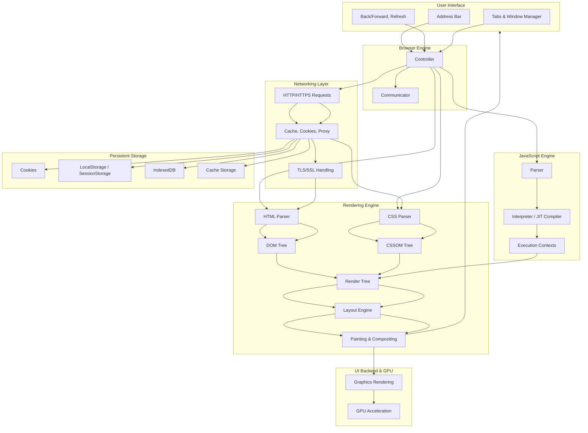

# **Modern Browser** 

### High Level Components

* **User Interface Layer** (address bar, tabs, buttons, bookmarks)
* **Browser Engine** (manages communication between UI and rendering engine)
* **Rendering Engine** (parses HTML/CSS, builds DOM + CSSOM, renders layout + painting)
* **JavaScript Engine** (parses and executes JS, e.g. V8 in Chrome, JavaScriptCore in Safari)
* **Networking** (handles HTTP/HTTPS, caching, cookies, proxy, TLS/SSL)
* **Data Storage** (cookies, localStorage, IndexedDB, cache, service workers)
* **UI Backend** (compositing, rendering graphics, GPU acceleration)

---

###  Flow :

1. **UI Layer** → User interacts (type URL, click buttons).
2. **Browser Engine** → Acts as the coordinator, passing tasks to the rendering engine or JS engine.
3. **Rendering Engine**

   * Parses HTML into **DOM**.
   * Parses CSS into **CSSOM**.
   * Combines them into a **Render Tree**, then calculates **layout** and **paints** pixels.
4. **JavaScript Engine**

   * Parses and executes JS code.
   * Updates the DOM/CSSOM dynamically (causing re-render).
5. **Networking**

   * Manages requests (HTTP/HTTPS), caching, cookies, and SSL.
6. **Storage**

   * Manages local data like cookies, localStorage, IndexedDB.
7. **UI Backend + GPU**

   * Handles actual rendering of graphics, fonts, images, accelerated by GPU.

---

👉 Do you want me to also show a **multi-process architecture** (like Chrome’s separate processes for each tab, renderer, GPU, network), or keep it at this single-process conceptual level?
